# RESOLUCIÓN PRÁCTICA 2 - HTTP

## Introducción

1. ¿Cuál es la función de la capa de aplicación?

La capa de aplicación es donde residen las aplicaciones de red y sus protocolos de nivel de aplicación, en ella existen muchos protocolos los cuales permiten la transferencia de documentos web, la transferencia de mensajes de correo electrónico y la transferencia de archivos entre 2 sistemas terminales.

---
2. Si dos procesos deben comunicarse:
    a) ¿Cómo podrían hacerlo si están en diferentes máquinas?
    b) Y si están en la misma máquina, ¿qué alternativas existen?

Un proceso es un programa que se ejecuta en un sistema terminal, **(b)** cuando los procesos se ejecutan en el mismo sistema terminal, los mismos pueden comunicarse entre sí mediante sistemas de comunicación inter-procesos, siguiendo las reglas descriptas por el sistema operativo. **(a)** Cuando los procesos se encuentran en sistemas terminales diferentes, se comunican entre si intercambiando mensajes a través de la red de computadoras. El proceso emisor crea y envía un mensaje a la red y un proceso receptor recibe estos mensajes, a los que posiblemente responda devolviendo otros mensajes.

---
3. Explique brevemente cómo es el modelo Cliente/Servidor. Dé un ejemplo de un sistema Cliente/Servidor en la “vida cotidiana” y un ejemplo de un sistema informático que siga el modelo Cliente/Servidor. ¿Conoce algún otro modelo de comunicación?

El modelo cliente/servidor consta de parejas de procesos que intercambian mensajes entre sí a través de una red. Se designa a uno de los procesos como *cliente* y al otro proceso como *servidor* el cual tiene una dirección IP fija. El proceso cliente es el que se encarga de envíar una petición al servidor y el proceso servidor se encarga de responder a esta petición devolviendo lo solicitado por el cliente.

Un sistema informático típico que se puede tomar como ejemplo es el browser o navegador de internet, ya que uno como usuario introduce en el buscador lo que desea y el servidor de ese buscador, se encarga de devolvernos lo solicitado.

Otro modelo de comunicación podría ser el Peer-to-peer (P2P). En este tipo de comunicación puede no existir (o si existe es mínima) una dependencia de una infraestructura de servidores, ya que explota la comunicación directa entre parejas de hosts conectados de forma intermitente, los cuales se conocen como pares (peers). Estos pares se comunican entre si, sin pasar por un servidor dedicado, el proceso que solicita un archivo se lo denomina servidor y el proceso que le envía lo solicitado se denomina cliente, pero algo característico de este modo de comunicación es que el servidor puede también actuar como cliente y el cliente como servidor.

---
4. Describa la funcionalidad de la entidad genérica “Agente de usuario” o “User agent”.

User agent o Agente de usuario hace referencia al browser con el cual el usuario se conecta a internet y hace la solicitud del requermiento.

---
5. ¿Qué son y en qué se diferencian HTML y HTTP?

**HTML HyperText Markup Language:** Es el formato en el que se escribe la estructura de una página web.
**HTTP Hypertext Transfer Protocol:** Es un protocolo de la capa de aplicación que utiliza TCP como protocolo de transporte subyacente, el cual define cómo los clientes solicitan páginas web a los servidores y cómo estos servidores web transfieren esas páginas a los clientes. 

---
6. HTTP tiene definido un formato de mensaje para los requerimientos y las respuestas.
    (Ayuda: apartado “Formato de mensaje HTTP”, Kurose).
    a) ¿Qué información de la capa de aplicación nos indica si un mensaje es de requerimiento o de respuesta para HTTP? ¿Cómo está compuesta dicha información? ¿Para qué sirven las cabeceras?
    b) ¿Cuál es su formato? (Ayuda: https://developer.mozilla.org/es/docs/Web/HTTP/Headers) 
    c) Suponga que desea enviar un requerimiento con la versión de HTTP 1.1 desde curl/7.74.0 a un sitio de ejemplo como www.misitio.com para obtener el recurso /index.html. En base a lo indicado, ¿qué información debería enviarse mediante encabezados? Indique cómo quedaría el requerimiento.

**a)**
La primer línea de un mensaje de solicitud denominada *línea de solicitud* consta de 3 campos: método, URL y versión HTTP. En el caso de un mensaje de respuesta la primer línea denominada *línea de estado* consta de 3 campos: versión del protocolo, código de estado (2xx, 3xx, 4xx, 5xx) y el mensaje explicativo del estado.

**b)**
**FORMATO DE MENSJE DE SOLICITUD HTTP**
```
    GET /unadireccion/pagina.html HTTP/1.1
    Host: www.unaEscuela.edu
    Connection: close
    User-agent: Mozilla/5.0
    Accept-language: es
```

**FORMATO DE MENSAJE DE RESPUESTA HTTP**
```
    HTTP/1.1 200 OK
    Conncetion: close
    Date: Wed, 27 Mar 2024 15:44:04 GMT
    Server: Apache/2.2.3 (CentOS)
    Last-Modified: Wed, 27 Mar 2024 15:11:04 GMT
    Content-Length: 6821
    Content-Type: text/html
```

**c)**
En los encabezados debería enviarse la información del host al que se le está haciendo la solicitud, el tipo de conexión (si va a ser o no persistente), el agente de usuario desde el cual se realiza la solicitud (en este caso sería el curl) y el lenguaje aceptado.

```
    GET www.misitio.com/index.html HTTP/1.1
    Host: www.misitio.com
    Connection: close
    User-agent: curl/7.74.0
    Accept-language: es
```

---
## HTTP

7. Utilizando la VM, abra una terminal e investigue sobre el comando curl. Analice para qué sirven los siguientes parámetros (-I, -H, -X, -s).

CURL es una herramienta de línea de comandos que permite transferir datos desde o hacia un servidor sin interacción del usuario.

**-I:** Permite obtener información del encabezado de un sitio web. En caso de que se use en FTP solamente muestra el tamaño del archivo y la fecha de la última modificación.
**-H:** Permite incluir cualquier cantidad de encabezados extra en una solicitud HTTP.
**-X:** Especifica un método de solicitud personalizado cuando queremos comunicarnos con un servidor HTTP. Esto quiere decir que en vez de usar el default (GET) podemos indicarle que queremos comunicarnos con el servidor HTTP usando el método POST por ejemplo.
**-s:** Es como un modo silencioso, no muestra el progreso de la comunicación ni tampoco los mensjes de error, pero sí muestra la iformación que fue solicitada.

---
8. Ejecute el comando curl sin ningún parámetro adicional y acceda a www.redes.unlp.edu.ar. Luego responda:
    a) ¿Cuántos requerimientos realizó y qué recibió? Pruebe redirigiendo la salida (>) del comando curl a un archivo con extensión html y abrirlo con un navegador.
    b) ¿Cómo funcionan los atributos href de los tags link e img en html?
    c) Para visualizar la página completa con imágenes como en un navegador, ¿alcanza con realizar un único requerimiento?
    d) ¿Cuántos requerimientos serían necesarios para obtener una página que tiene dos CSS, dos Javascript y tres imágenes? Diferencie cómo funcionaría un navegador respecto al comando curl ejecutado previamente.

**a)** Realizó un único requerimiento y lo que se recibió es el código HTML de la página web. 
Al enviar lo recibido a un archivo y abriendolo con el navegador podemos ver la página web correspondiente a www.redes.unlp.edu.ar.

**b)** En los tags *link* de HTML el atributo href indica a qué dirección debe rededirigir al usuario cuando el usuario haga click en él. En los tags *img* especifica la ruta donde se encuentra la imagen que se quiere cargar en la página web.

**c)** Depende del tipo de conexión, en caso de que se utilice HTTP sin conexiones persistentes, no alcanza con un único requerimiento, se deben hacer tantos requerimientos como imágenes tenga la página web.

**d)** Para poder obtener todo lo solicitado, se deberían hacer en total 8 requerimientos (1 html, 2 css, 2 javascript, 3 imagenes). Curl hace únicamente 1 requerimiento, el resto deben hacerse de forma manual, en cambio el browser se encarga de hacer todos los requerimientos necesarios automáticamente para obtener todo lo que se necesita.

---
9. Ejecute a continuación los siguientes comandos:
    ```
        curl -v -s www.redes.unlp.edu.ar > /dev/null
        curl -I -v -s www.redes.unlp.edu.ar
    ```
    a) ¿Qué diferencias nota entre cada uno?
    b) ¿Qué ocurre si en el primer comando se quita la redirección a /dev/null? ¿Por qué no es necesaria en el segundo comando?
    c) ¿Cuántas cabeceras viajaron en el requerimiento? ¿Y en la respuesta?

**a)** La principal diferencia que podemos ver es que en el primer comando realiza una solicitud con el método GET y en la segunda la solicitud es realizada con el método HEAD. También se puede ver que al redirigir la salida /dev/null, este descarta la salida estándar del comando.
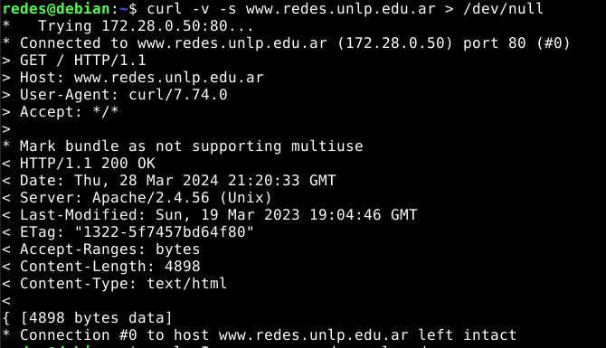
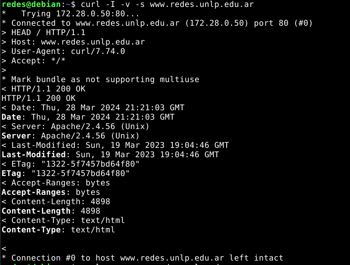

**b)** Si al primer comando se le saca la redirección devuelve no solo el mensaje de solicitud y de respuesta, si no que también muestra en la consola todo el código HTML utilizado para construir la página web.
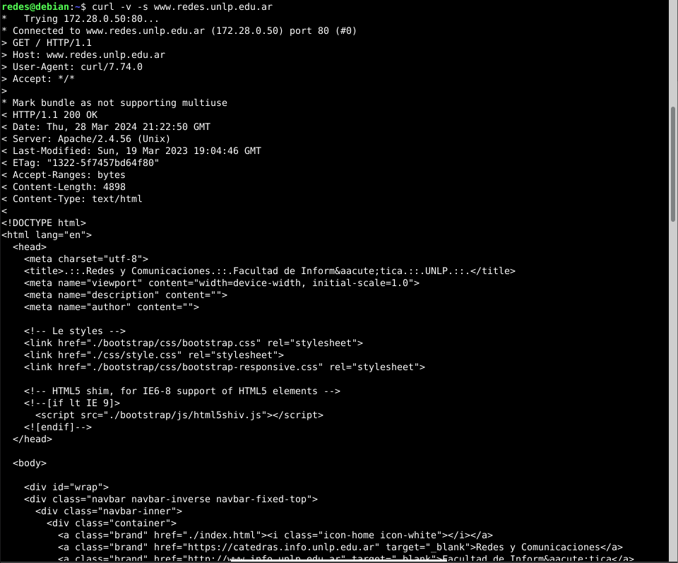

**c)** En el requerimiento viajaron 3 cabeceras y en la respuesta 7.

---
10. ¿Qué indica la cabecera Date?

La cabecera *Date* indica la hora y la fecha en la que se creó la respuesta HTTP y fue enviada por el servidor.

---
11. En HTTP/1.0, ¿cómo sabe el cliente que ya recibió todo el objeto solicitado de manera completa? ¿Y en HTTP/1.1?

En HTTP 1.0 el cliente sabe que ya recibió todo el objeto debido a que se cierra la conexión, esto es porque HTTP 1.0 no trabaja con conexiones persistentes.

HTTP 1.1 introdujo mejoras incluyendo el uso de la transferencia de chunked y la persistencia de la conexión para mejorar la eficiencia y la confiabilidad de la comunicación. 

<strong style="color:red">Preguntar</strong>
¿Puede ser que en HTTP 1.1 se sepa por los códigos de estado?

---
12. Investigue los distintos tipos de códigos de retorno de un servidor web y su significado. Considere que los mismos se clasifican en categorías (2XX, 3XX, 4XX, 5XX).

En HTTP los codigos de estado de respuesta indican si se ha completado satisfactoriamente una solicitud HTTP.

**Clasificación**
**100-199:** Repuestas informativas
**200-299:** Respuestas satisfactorias
**300-399:** Redirecciones
**400-499:** Errores de los clientes
**500-599:** Errores de los servidores

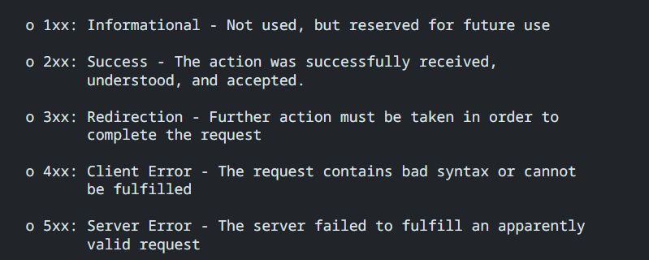


---
13. Utilizando curl, realice un requerimiento con el método HEAD al sitio www.redes.unlp.edu.ar e indique:
    a) ¿Qué información brinda la primera línea de la respuesta?
    b) ¿Cuántos encabezados muestra la respuesta?
    c) ¿Qué servidor web está sirviendo la página?
    d) ¿El acceso a la página solicitada fue exitoso o no?
    e) ¿Cuándo fue la última vez que se modificó la página?
    f) Solicite la página nuevamente con curl usando GET, pero esta vez indique que quiere obtenerla sólo si la misma fue modificada en una fecha posterior a la que efectivamente fue modificada. ¿Cómo lo hace? ¿Qué resultado obtuvo? ¿Puede explicar para qué sirve?
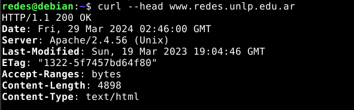
```
    curl --head www.redes.unlp.edu.ar
```
**a)** La primer línea de respuesta muestra la versión de HTTP utilizada, el código de estado y el mensaje explicativo del estado.
En este caso la versión de HTTP es 1.1, el código es 200 y el mensaje es "OK".

**b)** La respuesta muestra 7 encabezados (Date, Server, Last-Modified, ETag, Accept-Ranges, Content-Length y Content-Type).

**c)** El servidor que está sirviendo la página es *Apache/2.6.56 (Unix)*

**d)** Si, debido a que el código de estado recibido es 200.

**e)** La página fue modificada por última vez el 19 de marzo de 2023 a las 19:04:46 GMT.

**f)** 
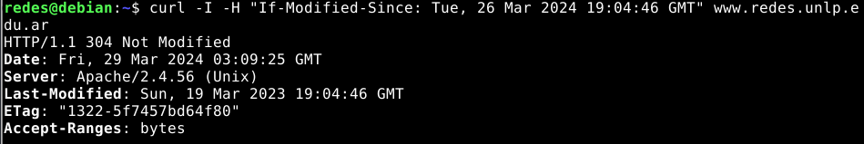
```
    curl -I -H "If-Modified-Sience: Tue, 26 Mar 2024 19:04:46 GMT" www.redes.unlp.edu.ar
```
El resultado obtenido es 304 "Not Modified", esto significa que la página no volvió a ser modificada.

El campo "Last-modified-Sience" se utiliza para poder realizar un GET Condicional, el cual permite saber si el archivo se encuentra almacenado en la caché y en su última versión, para así ver si tiene que solicitar nuevamente el objeto o no.

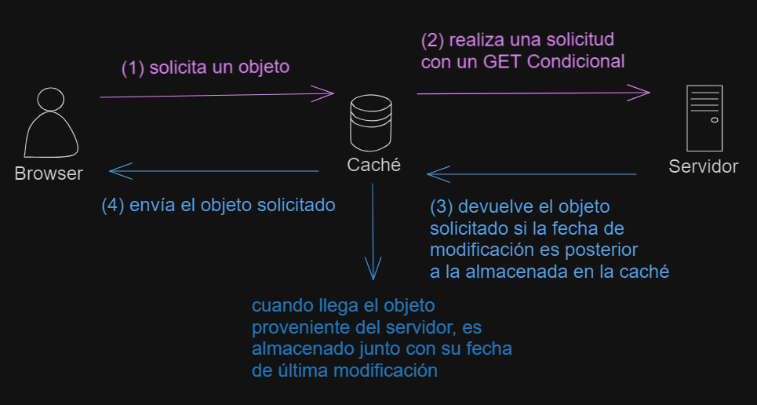

---
14. Utilizando curl, acceda al sitio www.redes.unlp.edu.ar/restringido/index.php y siga las instrucciones y las pistas que vaya recibiendo hasta obtener la respuesta final. Será de utilidad para resolver este ejercicio poder analizar tanto el contenido de cada página como los encabezados.

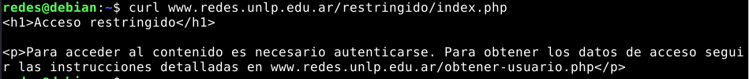
```
   curl -v www.redes.unlp.edu.ar/restringido/index.php 
```
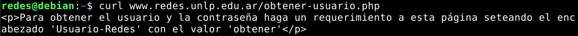
```
    curl -v www.redes.unlp.edu.ar/obtener-usuario.php
```
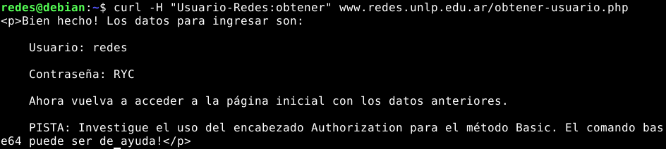
```
   curl -v -H "Usuario-Redes:obtener" www.redes.unlp.edu.ar 
```
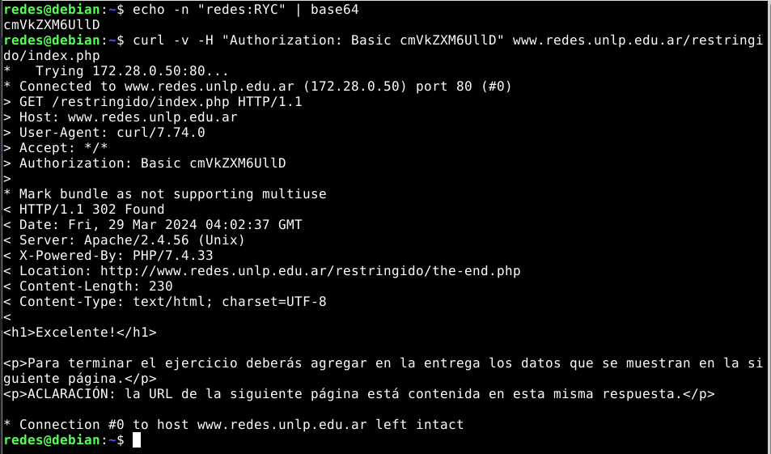
```
    echo "usuario:contraseña" | base64 -> devuelve un string
   curl -v -H "Authorization: Basic string" www.redes.unlp.edu.ar/restringido/index.php 
```
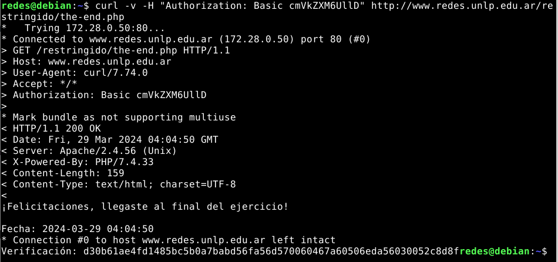
```
    curl -v -H "Authorization: Basic string" www.redes.unlp.edu.ar/restringido/the-end.php
```
---
15. Utilizando la VM, realice las siguientes pruebas:
    a) Ejecute el comando ’curl www.redes.unlp.edu.ar/extras/prueba-http-1-0.txt’ y copie la salida completa (incluyendo los dos saltos de línea del final).
    b) Desde la consola ejecute el comando telnet www.redes.unlp.edu.ar 80 y luego pegue el contenido que tiene almacenado en el portapapeles. ¿Qué ocurre luego de hacerlo?
    c) Repita el proceso anterior, pero copiando la salida del recurso /extras/prueba-http-1-1.txt. Verifique que debería poder pegar varias veces el mismo contenido sin tener que ejecutar el comando telnet nuevamente.
**a)** 
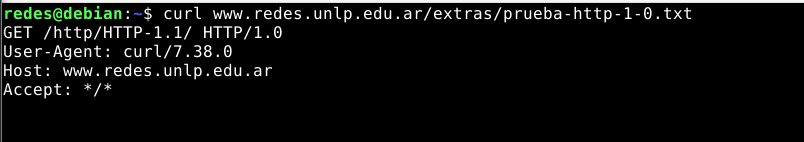

**b)**
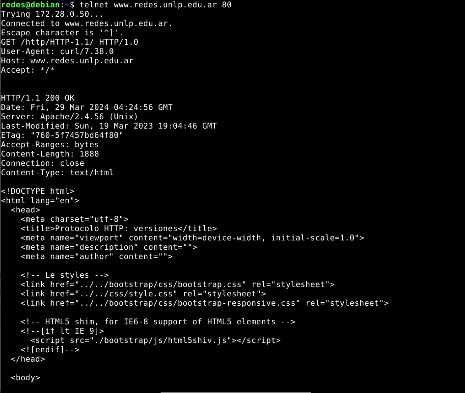
Luego de hacerlo, podemos ver el código HTML correspondiente a la página solicitada y una vez que obtenemos este HTML, la conexión se cierra, debido a que HTML 1.0 no trabaja con una conexión persistente.

**c)**
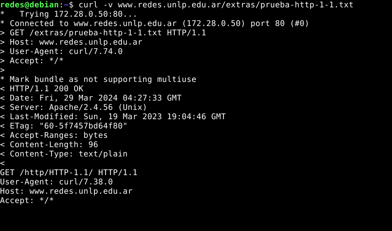
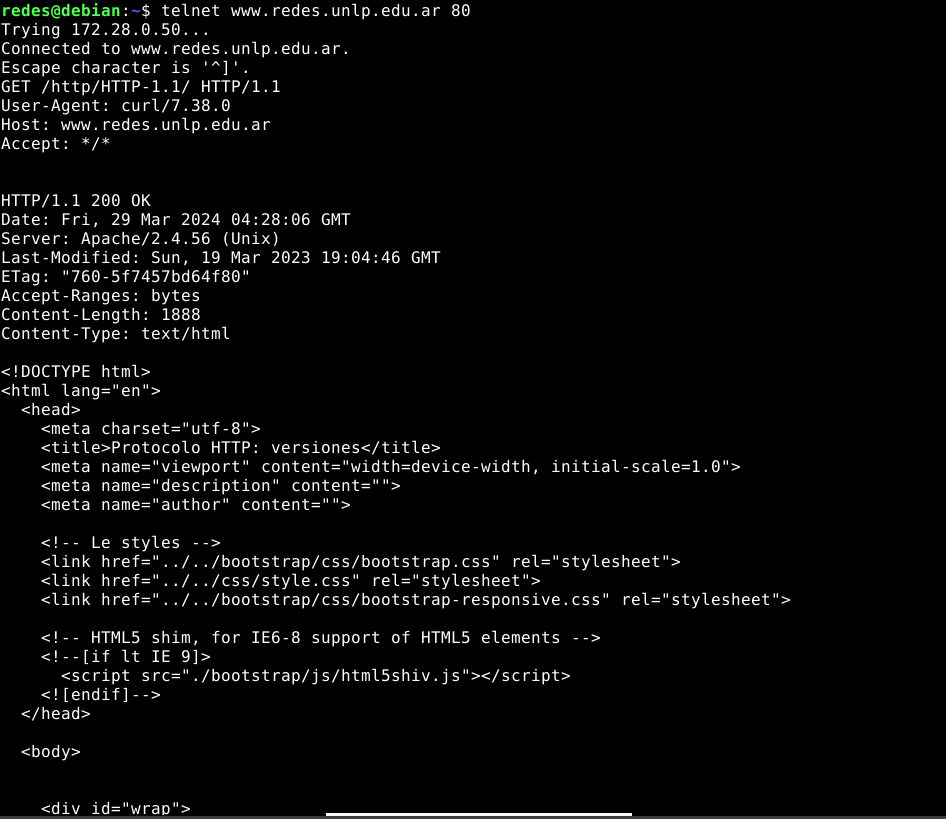
En este inciso, realmente pasa que podemos pegar lo copiado varias veces ejecutando una única vez el comando telnet, debido a que en este caso HTTP 1.1 trabaja con una conexión persistente.

---
16. En base a lo obtenido en el ejercicio anterior, responda:
    a) ¿Qué está haciendo al ejecutar el comando telnet?
    b) ¿Qué método HTTP utilizó? ¿Qué recurso solicitó?
    c) ¿Qué diferencias notó entre los dos casos? ¿Puede explicar por qué?
    d) ¿Cuál de los dos casos le parece más eficiente? Piense en el ejercicio donde analizó la cantidad de requerimientos necesarios para obtener una página con estilos, javascripts e imágenes. El caso elegido, ¿puede traer asociado algún problema?

**a)** Al ejecutar el comando *telent* lo que se hace es establecer una conexión a la página solicitada.

**b)** El método HTTP utilizado fue GET y se solicitó el archivo *prueba-http-1-0.txt* en el primer caso y *prueba-http-1-1.txt* en el segundo caso.

**c)** La principal diferencia es que en el primer caso, una vez que devuelve el objeto solicitado, la conexión se cierra, esto sucede porque la solicitud se realiza utilizando HTTP en su versión 1.0 y el mismo no trabaja con conexiones persistentes. En cambio en el segundo caso, una vez que devuelve el objeto se queda esperando (sin cerrar la conexión) que se solicite un nuevo objeto, esto se debe a que se trabaja con HTTP 1.1 utilizando conexiones persistentes.

**d)** Me parece más eifiente el segundo caso, ya que si se quiere realizar la solicitud de otro objeto, no se debe iniciar nuevamente una conexión, si no que esta nueva solicitud se realiza sobre una conexión ya existente.

---
17. En el siguiente ejercicio veremos la diferencia entre los métodos POST y GET. Para ello, será necesario utilizar la VM y la herramienta Wireshark. Antes de iniciar considere:
    - Capture los paquetes utilizando la interfaz con IP 172.28.0.1. (Menú “Capture ->Options”. Luego seleccione la interfaz correspondiente y presione Start).
    - Para que el analizador de red sólo nos muestre los mensajes del protocolo http introduciremos la cadena ‘http’ (sin las comillas) en la ventana de especificación de filtros de visualización (display-filter). Si no hiciéramos esto veríamos todo el tráfico que es capaz de capturar nuestra placa de red. De los paquetes que son capturados, aquel que esté seleccionado será mostrado en forma detallada en la sección que está justo debajo. Como sólo estamos interesados en http ocultaremos toda la información que no es relevante para esta práctica (Información de trama, Ethernet, IP y TCP). Desplegar la información correspondiente al protocolo HTTP bajo la leyenda “Hypertext Transfer Protocol”.
    - Para borrar la cache del navegador, deberá ir al menú “Herramientas->Borrar historial reciente”. Alternativamente puede utilizar Ctrl+F5 en el navegador para forzar la petición HTTP evitando el uso de caché del navegador.
    - En caso de querer ver de forma simplificada el contenido de una comunicación http, utilice el botón derecho sobre un paquete HTTP perteneciente al flujo capturado y seleccione la opción Follow TCP Stream.
        a) Abra un navegador e ingrese a la URL: www.redes.unlp.edu.ar e ingrese al link en la sección “Capa de Aplicación” llamado “Métodos HTTP”. En la página mostrada se visualizan dos nuevos links llamados: Método GET y Método POST. Ambos muestran un formulario como el siguiente:
            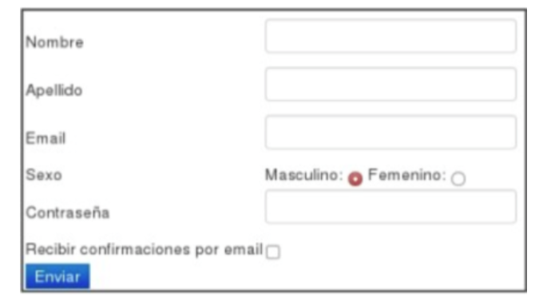
        b) Analice el código HTML
        c) Utilizando el analizador de paquetes Wireshark capture los paquetes enviados y recibidos al presionar el botón Enviar.
        d) ¿Qué diferencias detectó en los mensajes enviados por el cliente?
        e) ¿Observó alguna diferencia en el browser si se utiliza un mensaje u otro?

En el caso del formulario que utiliza el método GET podemos ver que los valores ingresados en los inputs son envíados como parámetros en la URL y en el caso del formulario que utiliza el método POST, los valores ingresados son envíados como parámetro en el cuerpo de la solicitud.

Esto también puede verse en la barra del browser dedicada a la búsqueda (donde ingresamos la URL del sitio a donde nos queremos dirigir), ya que al enviar el formulario con el método GET, podemos ver como todos los valores de los inputs aparecen como parámetros en la URL. En cambio en el formulario que utiliza el método POST, no podemos ver los valores ingresados en los inputs en la barra de navegación.

---
18. Investigue cuál es el principal uso que se le da a las cabeceras Set-Cookie y Cookie en HTTP y qué relación tienen con el funcionamiento del protocolo HTTP.

La cabecera Set-Cookie sirve para poder indicar en la misma el número de identificación que le corresponde a un usuario en particular, esto permite que se pueda conocer identificar a un usuario. Las cookies son utilizadas en HTTP ya que HTTP es un protocolo el cual no tiene memoria del estado de la conexión, entonces, al utilizar cookies, se puede de alguna forma seguir el rastro del usuario.

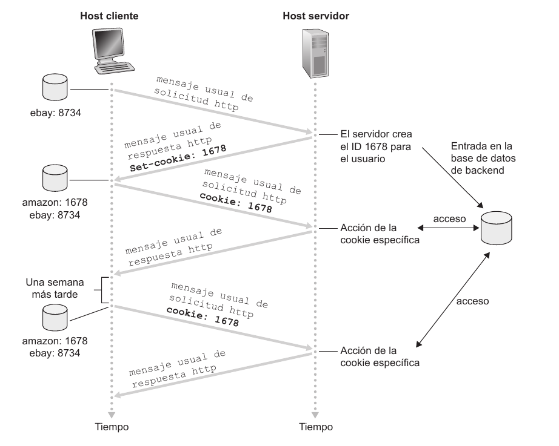

---
19. ¿Cuál es la diferencia entre un protocolo binario y uno basado en texto? ¿De qué tipo de protocolo se trata HTTP/1.0, HTTP/1.1 y HTTP/2?

**Protocolo binario:** En este tipo de protocolos la información se representa en forma de ceros y unos (su forma más básica), esto los hace más eficiente en términos de uso de ancho de banda y procesamiento. Son utilizados en aplicaciones donde se requiere alta velocidad y eficiencia en la comunicación.
**Protocolo de texto:** La información se codifica utilizando caracteres alfanuméricos. Este tipo de protocolos son más fáciles de entender y depurar para los humanos, pero pueden ser menos eficientes en términos de ancho de bande y de procesamiento si se los compara con los protocolos binarios.

En el caso de HTTP 1.0 y 1.1 son protocolos de texto y HTTP 2.0 es un protocolo binario.

---
20. Responder las siguientes preguntas:
    a) ¿Qué función cumple la cabecera Host en HTTP 1.1? ¿Existía en HTTP 1.0? ¿Qué sucede en HTTP/2? (Ayuda: https://undertow.io/blog/2015/04/27/An-in-depth-overview-of-HTTP2.html para HTTP/2)
    b) ¿Cómo quedaría en HTTP/2 el siguiente pedido realizado en HTTP/1.1 si se está usando https?
    ```
    GET /index.php HTTP/1.1
    Host: www.info.unlp.edu.ar
    ```
**a)** En la cabecera host en HTTP 1.0 y 1.1 se especifica el host donde reside el objeto que fue solicitado. En HTTP 2.0, la cabecera Host, recibe el nombre "Authority", pero cumple la misma función.

**b)**
```
    :method: GET
    :path: /index.php
    :scheme: https
    :authority: www.info.unlp.edu.ar
```

# EJERCICIO DE PARCIAL

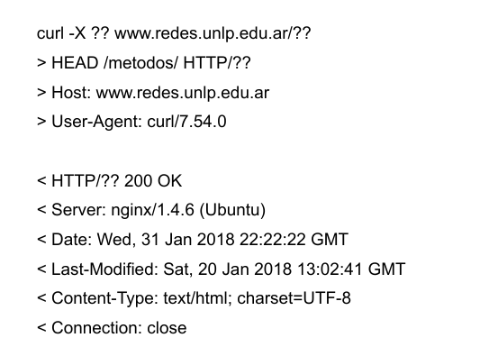

<span style="color:red">PREGUNTAR TODAS LAS RESPUESTAS</span>

a) ¿Qué versión de HTTP podría estar utilizando el servidor?

El servidor podría estar utilizando HTTP 1.1 porque permite en el caso de que se desee trabajar con una conexión persistente.

---
b) ¿Qué método está utilizando? Dicho método, ¿retorna el recurso completo solicitado?

En la solicitud se está utilizando el método HEAD, el cual retorna solamente la cabecera del recurso solicitado.

---
c) ¿Cuál es el recurso solicitado?

El recurso solicitado es la página métodos.

---
d) ¿El método funcionó correctamente?

Si, funcionó correctamente, debido a que el código de estado es un 200.

---
e) Si la solicitud hubiera llevado un encabezado que diga: *If-Modified-Since: Sat, 20 Jan 2018 13:02:41 GMT* ¿Cuál habría sido la respuesta del servidor web? ¿Qué habría hecho el navegador en este caso?

En caso de que la página estuviese cacheada, servidor hubiese respondido solamente con las cabeceras del método, sin devolver ningun objeto.

---


