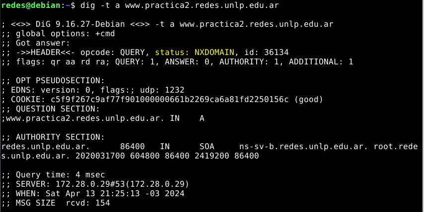
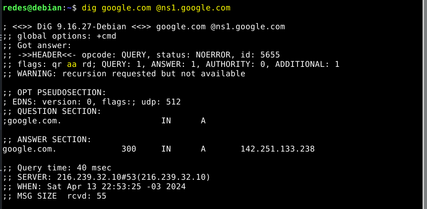

# Práctica 3 - Capa de Aplicación DNS (Domain Name Server)

## Introducción

1. Investigue y describa cómo funciona el DNS. ¿Cuál es su objetivo?

DNS es un sistema distribuido de forma jerárquica,conformado por muchos servidores al rededor del mundo.
El objetivo principal del DNS es traducir nombres de dominio a direcciones IP, permitiendo lograr una abstracción de las direcciones de red utilizadas internamente por los protocolos.

Cuando un cliente DNS recibe un nombre de host, lo pasa a su servidor DNS, el cual es el encargado de devolverle al cliente DNS la dirección IP correspondiente al nombre del host solicitado. Una vez que el navegador, recibe la dirección IP del servidor DNS, puede iniciar una conexión TCP.

---
2. ¿Qué es un root server? ¿Qué es un generic top-level domain (gtld)?

**gTLD (Generic Top-Level Domain):** son aquellos que contienen dominios con propósitos particulares.

**Root Server:** son aquellos encargados de atender la raíz del servicio y se encargan de delegar cada una de las zonas generadas para los TLD (gTLD y ccTLD). Lqa delegación consiste en saber las direcciones IP correspondientes a los servidores que se encargan de resolver las zonas de manera autoritativa.

*Servidor autoritativo: tiene toda la información para una zona, por lo cual puede producir cambios sobre la misma y tiene siempre la última versión.*

---
3. ¿Qué es una respuesta del tipo autoritativa?

Una *respuesta autoritativa* se produce cuando un *servidor autoritativo* recibe una consulta de un nombre sobre el cual tiene autoridad y la responde desde su base de datos de nombres.

---
4. ¿Qué diferencia una consulta DNS recursiva de una iterativa?

**Consulta recursiva:** es aquella donde el servidor DNS debe ponerse en contacto con otros servidores DNS (los que sean necesarios para resolver la solicitud)

**Consulta iterativa:**es aquella en la que se espera que el servidor DNS responda con la información local que tiene almacenada de lo que conoce de la zona local o de la caché.

---
5. ¿Qué es el resolver?

El resolver es un agente encargado de resolver los nombres a solicitud del cliente, el cual generalmente no se implementa como un servicio activo, si no, más bien como un conjunto de rutinas encapsuladas en una biblioteca de funciones.

---
6. Describa para qué se utilizan los siguientes tipos de registros de DNS:
    a. **A (Address):** son registros que mapean de nombre de dominio a una dirección IP (IPv4). Pueden existir varios registros A con el mismo nombre:
    b. **MX (Mail Exchanger):** indican para un nombre de dominio, cuáles son los servidores de mail encargados de recibir los mensajes para ese dominio.
    c. **PTR (Pointer):** son registros que mapean direcciones IP a nombres de dominio (al contario que los registros A).
    d. **AAAA:** igual que el registro A, es decir, se encargan de mapear el nombre de dominio a una dirección IP, pero en este caso, en su versión v6 (IPv6)
    e. **SRV (Service):**un registro de servicio, especifica un servidor y un puerto para servicios específicos (ej. mensajería instantanea).
    f. **NS (Name Server):** indican los servidores de nombre autoritativos para una zona o sub-domunio.
    g. **CNAME (Canonical Name):** también conocidos como aliases, se encargan de mapear un nombre de dominio a otros nombres al nombre original (nombre canónico).
    h. **SOA (Start of Authority):**se crean por cada zona o sub-zona que brinda el servicio de DNS, en ellos se especifican los parámetros globales para todos los registros del dominio o zona.
    i. **TXT (Textual):** mapena un nombre de dominio a información extra asociada con el equipo que tiene dicho nombre.

---
7. En Internet, un dominio suele tener más de un servidor DNS, ¿por qué cree que esto es así?

Esto es para poder responder las solicitudes de la forma más rápida posible y no colapsar en caso de que le lleguen demasiadas solicitudes al mismo tiempo, ya que esto les permite redirigir el tráfico.

---
8. Cuando un dominio cuenta con más de un servidor, uno de ellos es el primario (o maestro) y todos los demás son secundarios (o esclavos). ¿Cuál es la razón de que sea así?

Esto es así debido a que hace que sea más fácil actualizar el servidor en caso de que se requiera porque solamente debemos actualizar el servidor primerio y luego los servidores secundarios obtendrán una copia de la base de datos del servidor primario.

---
9. Explique brevemente en qué consiste el mecanismo de transferencia de zona y cuál es su finalidad.

El mecanismo de transferencia de zona se da cuando un servidor primario fue actualizado y da la señal para que los servidores secundarios re-copian la base de datos desde el servidor maestro. Esta comunicación entre los servidores se realiza sobre TPC vía el mismo protolo DNS.

---
10. Imagine que usted es el administrador del dominio de DNS de la UNLP (unlp.edu.ar). A su vez, cada facultad de la UNLP cuenta con un administrador que gestiona su propio dominio (por ejemplo, en el caso de la Facultad de Informática se trata de info.unlp.edu.ar).
Suponga que se crea una nueva facultad, Facultad de Redes, cuyo dominio será redes.unlp.edu.ar, y el administrador le indica que quiere poder manejar su propio dominio. ¿Qué debe hacer usted para que el administrador de la Facultad de Redes pueda gestionar el dominio de forma independiente? (Pista: investigue en qué consiste la delegación de dominios). Indicar qué registros de DNS se deberían agregar.

´´´
    Delegación de dominios: es la configuración de DNS que debe asociarse a un nombre de dominio para relacionarlo con un servicio de hosting que almacenará la información del sitio web, correo electrónico, etc...
´´´

se debe registrar el nombre de dominio *redes.unlp.edu.ar* (esto se hace mediante un registrador, el cual se encarga de verificar la unicidad del nombre de dominio). Una vez que se registra el nombre de dominio hay que proporcionarle los nombres y direcciones IP de sus servidores DNS autoritativos principal y secundarios. El registrador se asegura de que se introduzca un registro de tipo **NS (dns1.redes.unlp.edu.ar y dns2.redes.unlp.edu.ar)** y un registro de tipo A **(www.redes.unlp.edu.ar; dn1.redes.unlp.edu.ar, una_direccion_IP y dns2.redes.unlp.edu.ar, una_direccion_IP2)** en los servidores TLD *.ar*. Y también agregar un registro de tipo **MX (mail.redes.unlp.edu.ar)** para definir el servidor de correo donde se recibirán los mensajes.


## DNS

11. Responda y justifique los siguientes ejercicios.
    a. En la VM, utilice el comando dig para obtener la dirección IP del host www.redes.unlp.edu.ar y responda:
        i. ¿La solicitud fue recursiva? ¿Y la respuesta? ¿Cómo lo sabe?
        ii. ¿Puede indicar si se trata de una respuesta autoritativa? ¿Qué significa que lo sea?
        iii. ¿Cuál es la dirección IP del resolver utilizado? ¿Cómo lo sabe?

    en caso de que se tenga activado el flag rd, pero no el ra, esto quiere decir que la consulta fue recursiva, pero la respuesta fue iterativa.
    
    i. Debido a que se encuentra activado el flag **rd** podemos decir que la consulta es recursiva y como además está activado el flag **ra**, la respuesta a la consulta también es recursiva.
    ii. Debido a que viene activado el flag **aa**, se puede decir que la respuesta es autoritativa.
    iii. La dirección IP del resolver utilizado es 172.28.0.29, esto lo podemos ver en el apartado SERVER al final de la respuesta.
    
    
    ---
    b. ¿Cuáles son los servidores de correo del dominio redes.unlp.edu.ar? ¿Por qué hay más de uno y qué significan los números que aparecen entre MX y el nombre? Si se quiere enviar un correo destinado a redes.unlp.edu.ar, ¿a qué servidor se le entregará? ¿En qué situación se le entregará al otro?

    El número que aparece, indica la prioridad, el de valor más bajo es el de mayor prioridad, el más alto el de menor prioridad. cuando el servidor se conecta para mandar un mail a redes.unlp.edu.ar, debe ir probando desde el servidor de mayor prioridad al de menor, hasta ver a cual le puede enviar el mail.
    En este caso al primer servidor al que se lo intentará entregar es a mail.redes.unlp.edu.ar, en caso de que no pueda conectarse con el primero, se lo entregará al otro que es mail2.redes.unlp.edu.ar.

    
    
    ---
    c. ¿Cuáles son los servidores de DNS del dominio redes.unlp.edu.ar?

    Los servidores DNS del dominio solicitado son: ns-sv-b.redes.unlp.edu.ar y ns-sv-a.redes.unlp.edu.ar

    
    ---
    d. Repita la consulta anterior cuatro veces más. ¿Qué observa? ¿Puede explicar a qué se debe?

    Se puede observar que al ejecutar la consulta 4 veces, cambian los valores de los campos: id (debido a que cada consulta DNS tiene un id único), cookie, when (se modifican los segundos, ya que se está haciendo una consulta por segundo) y query time (debido a que luego de hacer la consulta, la respuesta se encuentra cacheada, al repetir la misma consulta, se busca el valor de la respuesta directamente en la caché).
    Lo que no cambia es el valor del TTL de los registros NS y A.
    
    ---
    e. Observe la información que obtuvo al consultar por los servidores de DNS del dominio. En base a la salida, ¿es posible indicar cuál de ellos es el primario?

    No es posible indicar cuál de los dos es el servidor primerio, para poder saber cuál es el servidor primario, se debe hacer una consulta al registro SOA de la siguiente forma:
    ´´´
        dig -t soa redes.unlp.edu.ar
    ´´´
    
    ---
    f. Consulte por el registro SOA del dominio y responda.
        i. ¿Puede ahora determinar cuál es el servidor de DNS primario?
        ii. ¿Cuál es el número de serie, qué convención sigue y en qué casos es importante actualizarlo?
        iii. ¿Qué valor tiene el segundo campo del registro? Investigue para qué se usa y cómo se interpreta el valor.
        iv. ¿Qué valor tiene el TTL de caché negativa y qué significa?

    
    i. Ahora sí es posible determinar cuál es el servidor DNS primario y es: ns-sv-b.redes.unlp.edu.ar 
    ii. El número de serie es *2020031700* sigue la convención *YYYYMMDDSS* y se sugiere actualizarlo cada vez que se hace alguna modificación al dominio. 
    iii. El segundo campo es el Refresh Time y tiene el valor 604800, este campo indica cada cuanto se deben actualizar los servidores secundarios desde el servidor maestro.
    iv. El valor de la *TTL de caché negativa* tiene el valor *86400*, significa que si se pregunto por algún valor y el servidor autoritativo respondió que no lo tiene, no se va a volver a preguntar por el tiempo de este valor (en este caso 86400 segundos).

    ---
    g. Indique qué valor tiene el registro TXT para el nombre saludo.redes.unlp.edu.ar. Investigue para qué es usado este registro.

    

    El registro TXT es utilizado para indicar información extra de un nombre de dominio, como por ejemplo, pueden indicar finalidad, usuarios, etc.
    
    ---
    h. Utilizando dig, solicite la transferencia de zona de redes.unlp.edu.ar, analice la salida y responda.
        i. ¿Qué significan los números que aparecen antes de la palabra IN? ¿Cuál es su finalidad?
        ii. ¿Cuántos registros NS observa? Compare la respuesta con los servidores de DNS del dominio redes.unlp.edu.ar que dio anteriormente. ¿Puede explicar a qué se debe la diferencia y qué significa?
    

    i. Los números que aparecen antes de la palabra IN hacen referencia al tiempo de vida del registro, esto indica el tiempo que se mantendrá almacenado el valor del registro en la caché.

    ii. Se pueden observar 4 registros NS, ya que se están obteniendo todos los registros NS del dominio **redes.unlp.edu.ar** y aparecen los registros NS del sub-dominio **practica.redes.unlp.edu.ar**. 
    
    ---
    i. Consulte por el registro A de www.redes.unlp.edu.ar y luego por el registro A de www.practica.redes.unlp.edu.ar. Observe los TTL de ambos. Repita la operación y compare el valor de los TTL de cada uno respecto de la respuesta anterior. ¿Puede explicar qué está ocurriendo? (Pista: observar los flags será de ayuda).

    

    

    Al hacer reiteradas consultas a los 2 servidores, algo que podemos observar es que el TTL de **www.practica.redes.unlp.edu.ar** va disminuyendo, pero el de **www.redes.unlp.edu.ar** no. Esto se debe a que la respuesta del servidor www.redes.unlp.edu.ar es autoritativa y la de www.practica.redes.unlp.edu.ar no lo es.

    ---
    j. Consulte por el registro A de www.practica2.redes.unlp.edu.ar. ¿Obtuvo alguna respuesta? Investigue sobre los códigos de respuesta de DNS ¿Para qué son utilizados los mensajes NXDOMAIN y NOERROR?

    

    Se obtuvo una respuesta, pero en la misma no aparece la dirección IP de www.practica2.redes.unlp.edu.ar, debido a que el status indica un **NXDOMAIN**, el cual indica que el dominio ha sido solicitado pero no pudo ser resuelto a una dirección IP válida.
    **NOERROR** quiere decir que la consulta fue completada correctamente.


---
12. Investigue los comandos nslookup y host. ¿Para qué sirven? Intente con ambos comandos obtener:
    - Dirección IP de www.redes.unlp.edu.ar.
    - Servidores de correo del dominio redes.unlp.edu.ar.
    - Servidores de DNS del dominio redes.unlp.edu.ar.

**nslookup (name server look up):** es una herramienta de línea de comandos que permite encontrar la dirección IP de un equipo determinado o realizar una búsqueda DNS inversa (estos son alguno ejemplos). Tiene un *modo no interactivo* el cual solamente inspecciona las entradas en la memoria caché y un *modo interactivo* el cual permite llevar a cabo un proceso de resolución/búsqueda más complejo.
 

**host:** es una utilidad simple para realizar buquedas DNS. Es normalmente utilizado para convertir nombres de dominio a IPs o viceversa.


---
13. ¿Qué función cumple en Linux/Unix el archivo /etc/hosts o en Windows el archivo \WINDOWS\system32\drivers\etc\hosts?

Estos archivos locales contienen los nombres de dominios y sus direcciones IP correspondientes. Cada vez que querramos visitar un sitio web, primero se realiza una comparación en este archivo de hosts para ver si la información de la dirección IP a la que deseamos conectarnos se encuentra ahí, en caso de que no se encuentre, el proveedor de internet buscará en el DNS los recursos para cargar el sitio.

---
14. Abra el programa Wireshark para comenzar a capturar el tráfico de red en la interfaz con IP 172.28.0.1. Una vez abierto realice una consulta DNS con el comando dig para averiguar el registro MX de redes.unlp.edu.ar y luego, otra para averiguar los registros NS correspondientes al dominio redes.unlp.edu.ar. Analice la información proporcionada por dig y compárelo con la captura.


---
15. Dada la siguiente situación: “Una PC en una red determinada, con acceso a Internet, utiliza los servicios de DNS de un servidor de la red”. Analice:
    a. ¿Qué tipo de consultas (iterativas o recursivas) realiza la PC a su servidor de DNS?

    La PC le realiza una consulta recursiva a su servidor DNS local.
    
    ---
    b. ¿Qué tipo de consultas (iterativas o recursivas) realiza el servidor de DNS para resolver requerimientos de usuario como el anterior? ¿A quién le realiza estas consultas?

    Para resolver el requerimiento el servidor DNS local, realiza todas las consultar iterativas que sean necesarias hasta llegar al servidor DNS autoritativo para el dominio.

    

---
16. Relacione DNS con HTTP. ¿Se puede navegar si no hay servicio de DNS?

Si se puede, pero sería más tedioso, ya que si no hay DNS no se puede navegar, debido a que internet lo único que conoce son IP y las personas si bien podemos conocer IPs, sería mucho más difícil la navegación, es por esto que DNS es muy importante.

---
17. Observar el siguiente gráfico y contestar:
    
    a. Si la PC-A, que usa como servidor de DNS a "DNS Server", desea obtener la IP de www.unlp.edu.ar, cuáles serían, y en qué orden, los pasos que se ejecutarán para obtener la respuesta.

    1) Primero realiza una consulta a su resolver local por la IP del host redes.unlp.edu.ar, para en caso de tener la información almacenada en la caché, ya resolverla.
    2) En caso de que no la tenga almacenada en caché, le realizará una consulta recursiva a su servidor DNS local (DNS server - 192.168.10.2) y se fijará si tiene la información necesaria almacenada en la caché.
    3) Si no lo tiene en caché, realizará una consulta iterativa al root server más cercano, que en este caso es A.Root-Server (205.10.100.10).
    4) El Root-Server le responderá también de forma iterativa con el registro NS y A de .ar a.dns.ar (200.108.145.50)
    5) Ahora el DNS Server le realizará una consulta iterativa a a.dns.ar (200.108.145.50), el cual le responderá con los NS de edu.ar, que en este caso es ns1.riu.edu.ar (170.210.0.18).
    6) DNS Server ahora le realizará una consulta iterativa a ns1.riu.edu.ar, el cual le devolverá el registro NS del servidor autoritativo unlp.unlp.edu.ar (163.10.0.67) del dominio unlp.edu.ar.
    7) Ahora DNS server le realizará una consulta a unlp.unlp.edu.ar quién le responderá con la IP de www.unlp.edu.ar (163.10.0.54).
    8) En este momento, el DNS Server cacheará la respuesta y le responderá al resolver de la PC-A con la IP de www.unlp.edu.ar, el resolver también cacheará la respuesta.
    
    ---
    b. ¿Dónde es recursiva la consulta? ¿Y dónde iterativa?

    La consulta es recursiva entre el resolver privado de PC-A y el DNS server; y entre el DNS Server y los servidores de la jerarquía es iterativa.

---
18. ¿A quién debería consultar para que la respuesta sobre www.google.com sea autoritativa?

Para poder hacer esto, primero debemos obtener los registros ns de google.com ejecutando el comando 
´´´
    dig -t ns google.com
´´´
luego de eso, agarramos cualquiera de ellos y como son los servidores DNS de google.com, procedemos a realizar la siguiente consulta que es 
´´´
    dig google.com @ns1.google.com
´´´
la cual nos dará una respuesta autoritativa.



---
19. ¿Qué sucede si al servidor elegido en el paso anterior se lo consulta por www.info.unlp.edu.ar? ¿Y si la consulta es al servidor 8.8.8.8?

En el primer caso, podemos ver que nos da como resultado un estado REFUSE y por ende no nos devuelve ninguna respuesta; y en el segundo caso nos da un estado NOERROR y nos devuelvé la IP correspondiente a www.info.unlp.edu.ar


## EJERCICIO DE PARCIAL

20. En base a la siguiente salida de dig, conteste las consignas. Justifique en todos los
casos.
```c

;; flags: qr rd ra; QUERY: 1, ANSWER: 2, AUTHORITY: 4, ADDITIONAL: 4
;; QUESTION SECTION:
;ejemplo.com. IN _A_
;; ANSWER SECTION:
ejemplo.com. 1634 IN _MX_ 10 srv01.ejemplo.com. (1)
ejemplo.com. 1634 IN _MX_ 5 srv00.ejemplo.com. (2)
;; AUTHORITY SECTION:
ejemplo.com. 92354 IN _NS_ ss00.ejemplo.com.
ejemplo.com. 92354 IN _NS_ ss02.ejemplo.com.
ejemplo.com. 92354 IN _NS_ ss01.ejemplo.com.
ejemplo.com. 92354 IN _NS_ ss03.ejemplo.com.
;; ADDITIONAL SECTION:
srv01.ejemplo.com. 272 IN _A_ 64.233.186.26
srv01.ejemplo.com. 240 IN _AAAA_ 2800:3f0:4003:c00::1a
srv00.ejemplo.com. 272 IN _A_ 74.125.133.26
srv00.ejemplo.com. 240 IN _AAAA_ 2a00:1450:400c:c07::1b

```
a. Complete las líneas donde aparece __ con el registro correcto.
b. ¿Es una respuesta autoritativa? En caso de no serlo, ¿a qué servidor le preguntaría para obtener una respuesta autoritativa?
c. ¿La consulta fue recursiva? ¿Y la respuesta?

Debido a que se encuentran activados los flags rd y ra, la consulta y la respuesta fueron iterativas.

---
d. ¿Qué representan los valores 10 y 5 en las líneas (1) y (2).

Los valores 10 y 5 representan prioridad, en este caso srv00.ejemplo.com que tiene como prioridad el número 5, será el servidor de mail de mayor prioridad.


´´´
NOTAS
 el numero que aparece entre el nombre del registro y el tipo de registro, hace referencia al tiempo de vida del registro, es decir, cuando va a durar ese valor almacenado en la cache. el tiempo de vida lo especifica el servidor autoritativo.

 Las transferencias de zona sirven para que los servidores secundarios puedan actualizar la información proveniente de los servidores primarios.
´´´