# PRÁCTICA 4 - CORREO ELECTRÓNICO

## INTRODUCCIÓN
1. ¿Qué protocolos se utilizan para el envío de mails entre el cliente y su servidor de
correo? ¿Y entre servidores de correo?

El protocolo que se utiliza para el envío de mails entre cliente-servidor (emisor-receptor) es el protocolo SMTP.

---
2. ¿Qué protocolos se utilizan para la recepción de mails? Enumere y explique características y diferencias entre las alternativas posibles.

Pra la recepción de mail se utilizan los protocolos POP3 e IMAP.

* POP3: es un protocolo de fácil implementación, debido a que tiene una funcionalidad limitada. Cosnta de 3 fases (autorización: donde el usuario se loguea mediante usuario y contraseña; transacción: donde el usuario recupera los correos, puede generar marcas de borrados y obtener estadísticas; y por último actualización: ocurre luego de que se ejecute el comando *quit*, donde se finaliza la sesión POP3). Este protocolo puede estar configurado en modo "descargar-borar" o "descargar-guardar". La información de una sesión se mantiene durante el tiempo que dure la misma, una vez que se cierra la sesión se pierde todo lo que no se haya "guardado", ya que POP3 tiene una falta de estado de memoria y no mantiene la información entre sesiones.

* IMAP: ofrece más funcionalidades que POP3, por ende es más complejo de implementar. Asocia cada mensaje con una carpeta, permite a los usuarios crear nuevas carpetas, mover los mensajes a las diferentes carpetas y realizar búsquedas de correos en carpetas remotas.
A diferencia de POP3, IMAP mantiene información del estado a lo largo de las sesiones (como los nombres de las carpetas y los mensajes relaciondos con ellas). También posee ciertos comandos que permiten al usuario obtener partes componentes de los mensajes (como por ejemplo, obtener solamente la cabecera de un mensaje).

---
## CORREO ELECTRÓNICO
3. Utilizando la VM y teniendo en cuenta los siguientes datos, abra el cliente de correo (Thunderbird) y configure dos cuentas de correo. Una de las cuentas utilizará POP para solicitar al servidor los mails recibidos para la misma mientras que la otra utilizará IMAP. Al crear cada una de las cuentas, seleccionar Manual config y luego de configurar las mismas según lo indicado, ignorar advertencias por uso de conexión sin cifrado.
    ● Datos para POP
        Cuenta de correo: alumnopop@redes.unlp.edu.ar
        Nombre de usuario: alumnopop
        Contraseña: alumnopoppass
        Puerto: 110
    ● Datos para IMAP
        Cuenta de correo: alumnoimap@redes.unlp.edu.ar
        Nombre de usuario: alumnoimap
        Contraseña: alumnoimappass
        Puerto: 143
    ● Datos comunes para ambas cuentas
        Servidor de correo entrante (POP/IMAP):
            • Nombre: mail.redes.unlp.edu.ar
            • SSL: None
            • Autenticación: Normal password
        Servidor de correo saliente (SMTP):
            • Nombre: mail.redes.unlp.edu.ar
            • Puerto: 25
            • SSL: None
            • Autenticación: Normal password
    a) Verificar el correcto funcionamiento enviando un email desde el cliente de una cuenta a la otra y luego desde la otra responder el mail hacia la primera.
    b) Análisis del protocolo SMTP
        i. Utilizando Wireshark, capture el tráfico de red contra el servidor de correo mientras desde la cuenta alumnopop@redes.unlp.edu.ar envía un correo a alumnoimap@redes.unlp.edu.ar
        ii. Utilice el filtro SMTP para observar los paquetes del protocolo SMTP en la captura generada y analice el intercambio de dicho protocolo entre el cliente y el servidor para observar los distintos comandos utilizados y su correspondiente respuesta. 
        *Ayuda: filtre por protocolo SMTP y sobre alguna de las líneas del intercambio haga click derecho y seleccione Follow TCP Stream. . .*

    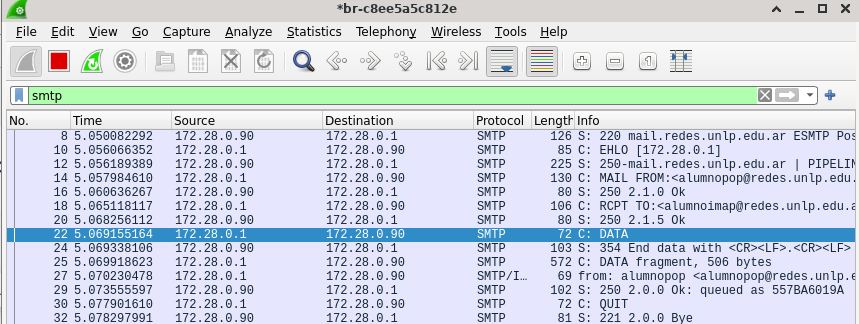
    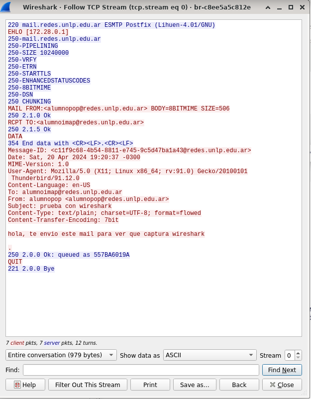
    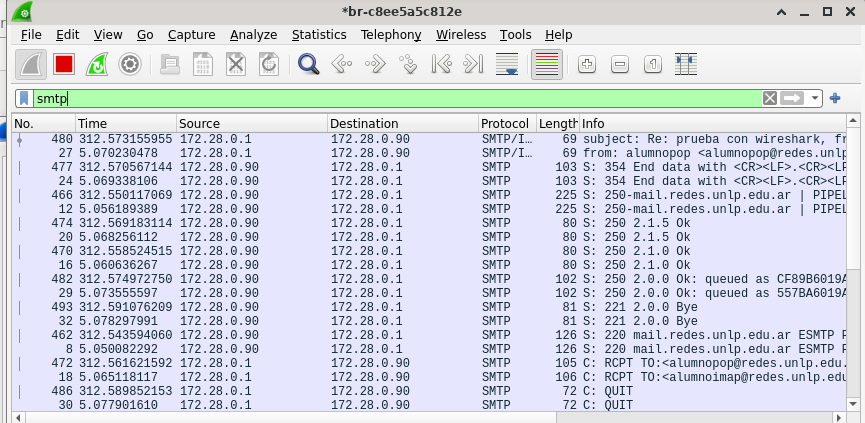
    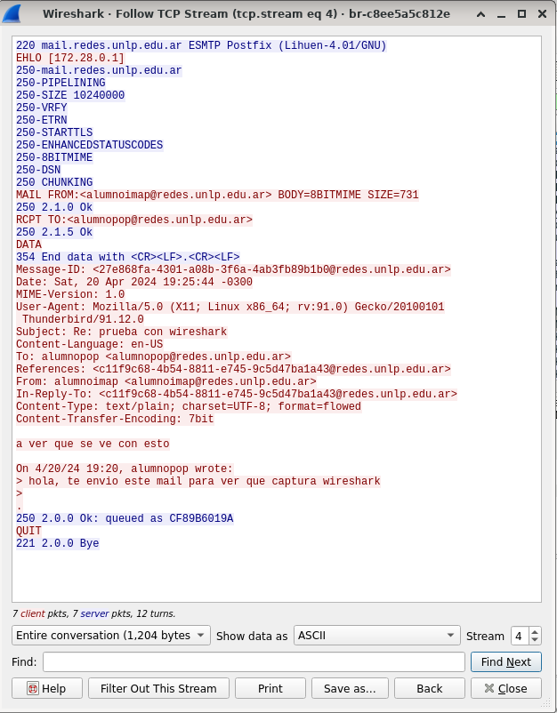

    ---
    c) Usando el cliente de correo Thunderbird del usuario alumnopop@redes.unlp.edu.ar envíe un correo electrónico alumnoimap@redes.unlp.edu.ar el cual debe tener: un asunto, datos en el body y una imagen adjunta.
        i. Verifique las fuentes del correo recibido para entender cómo se utiliza el header “Content-Type: multipart/mixed“ para poder realizar el envío de distintos archivos adjuntos.
        ii. Extraiga la imagen adjunta del mismo modo que lo hace el cliente de correo a partir de los fuentes del mensaje.

    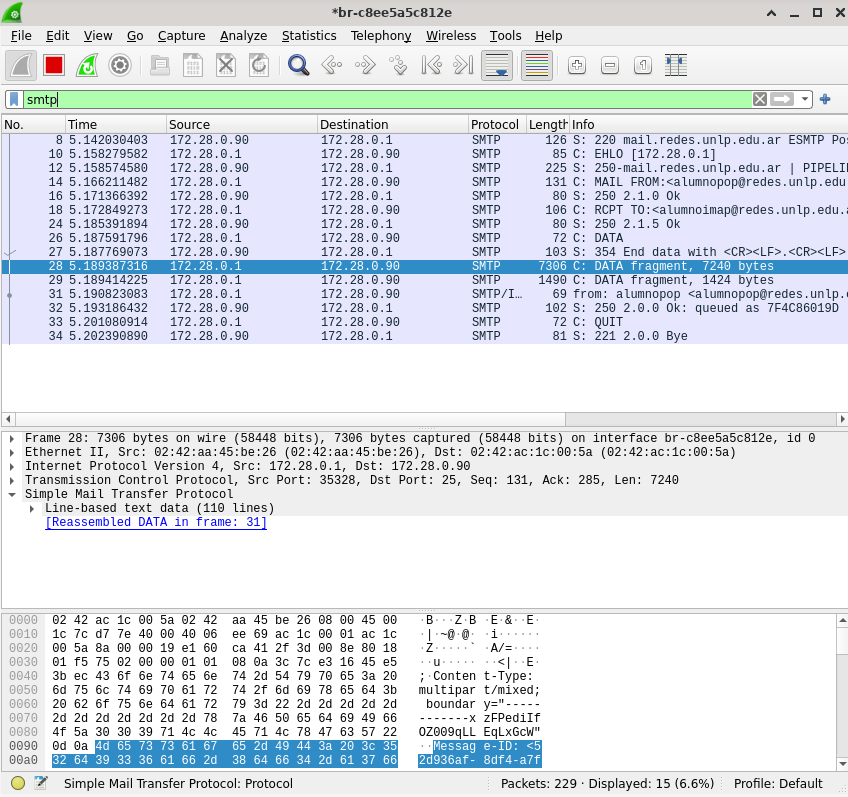
    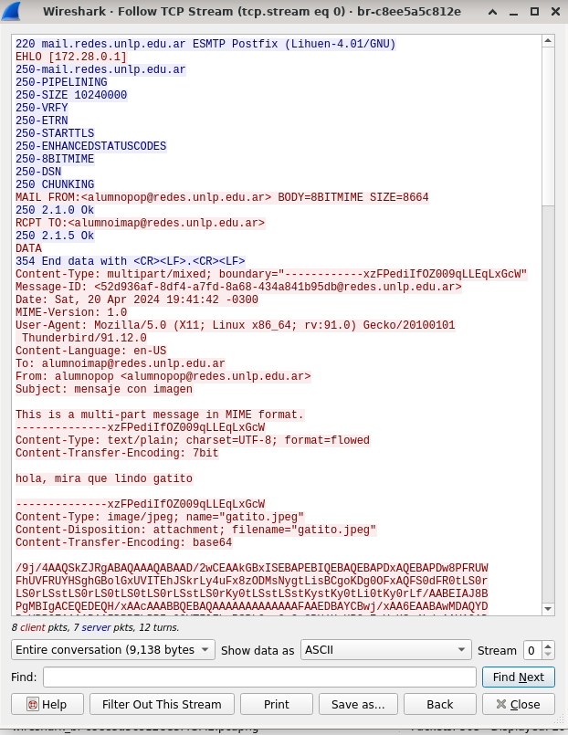
    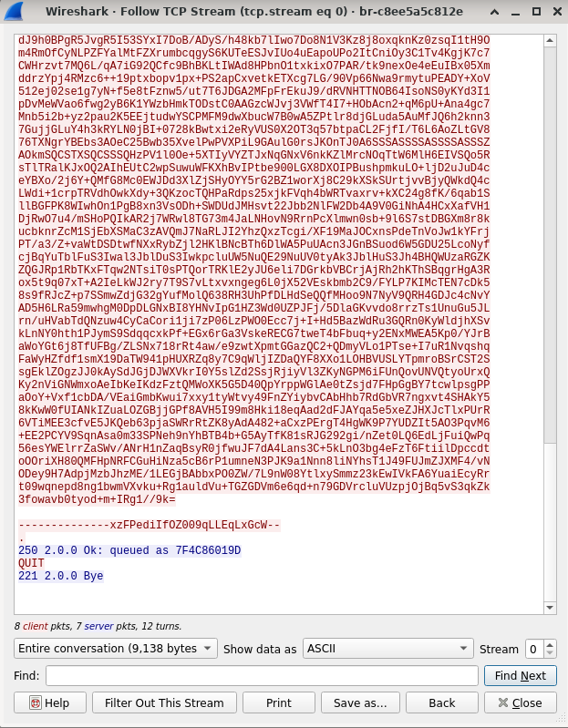

    Para extraer la imagen utilizar el comano base64 -d nfr > imagen

---
4. Análisis del protocolo POP
    a) Utilizando Wireshark, capture el tráfico de red contra el servidor de correo mientras desde la cuenta alumnoimap@redes.unlp.edu.ar le envía una correo a alumnopop@redes.unlp.edu.ar y mientras alumnopop@redes.unlp.edu.ar recepciona dicho correo.
    b) Utilice el filtro POP para observar los paquetes del protocolo POP en la captura generada y analice el intercambio de dicho protocolo entre el cliente y el servidor para observar los distintos comandos utilizados y su correspondiente respuesta.

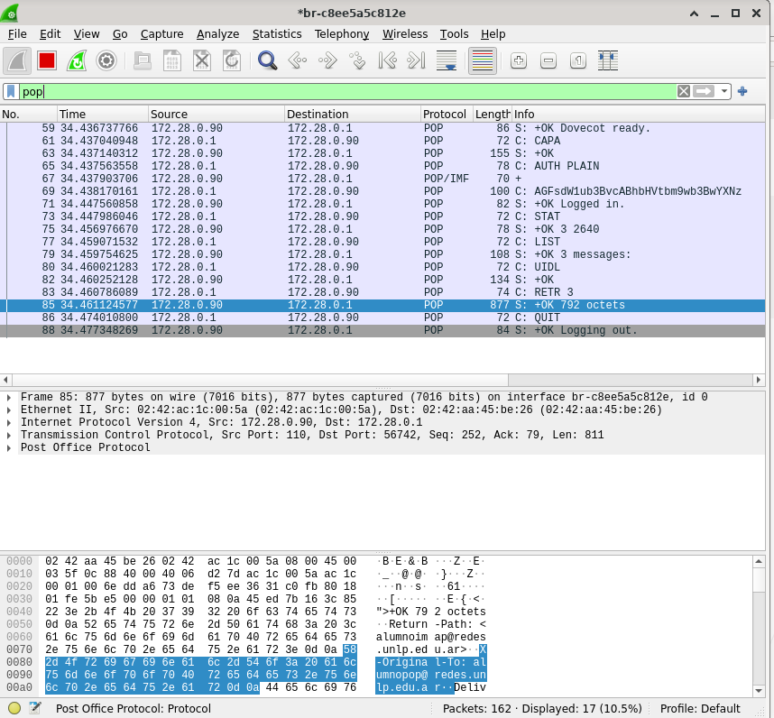
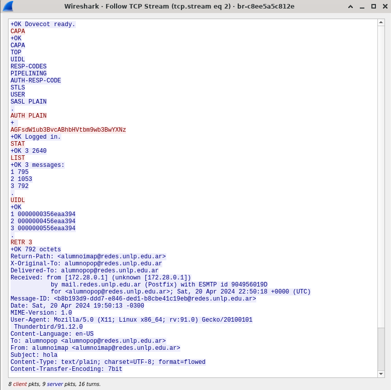
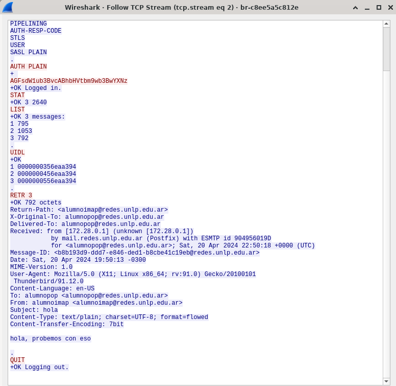

---
5. Análisis del protocolo IMAP
    a) Utilizando Wireshark, capture el tráfico de red contra el servidor de correo mientras desde la cuenta alumnopop@redes.unlp.edu.ar le envía un correo a alumnoimap@redes.unlp.edu.ar y mientras alumnoimap@redes.unlp.edu.ar recepciona dicho correo.
    b) Utilice el filtro IMAP para observar los paquetes del protocolo IMAP en la captura generada y analice el intercambio de dicho protocolo entre el cliente y el servidor para observar los distintos comandos utilizados y su correspondiente respuesta.

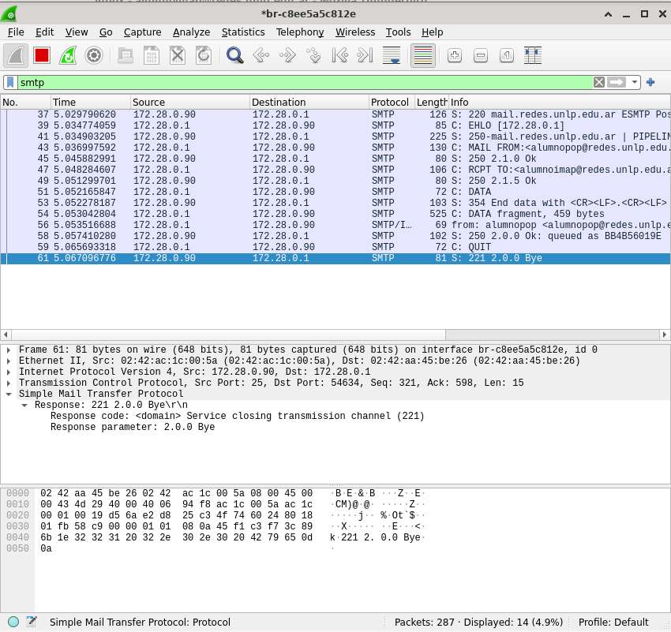
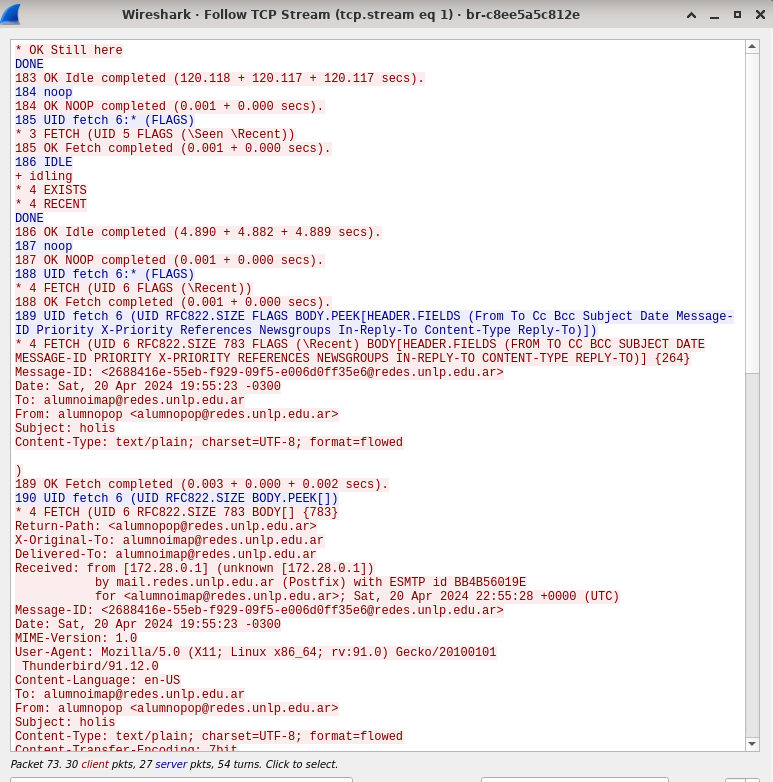
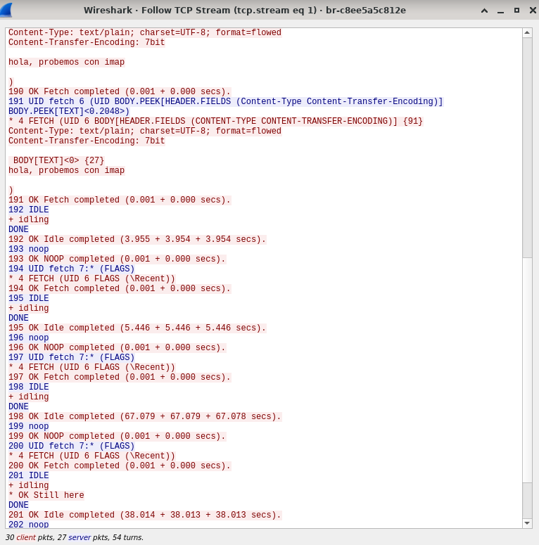
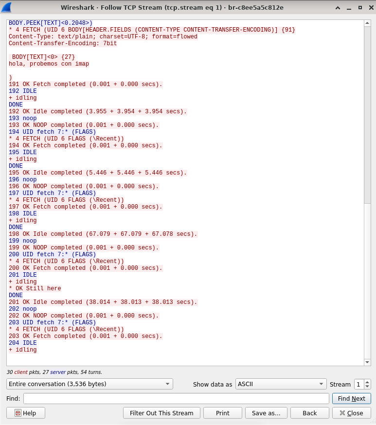

---
6. IMAP vs POP
    a) Marque como leídos todos los correos que tenga en el buzón de entrada de alumnopop y de alumnoimap. Luego, cree una carpeta llamada POP en la cuenta de alumnopop y una llamada IMAP en la cuenta de alumnoimap. Asegúrese que tiene mails en el inbox y en la carpeta recientemente creada en cada una de las cuentas.
    b) Cierre la sesión iniciada e ingrese nuevamente identificándose como usuario root y password packer, ejecute el cliente de correos. De esta forma, iniciará el cliente de correo con el perfil del superusuario (diferente del usuario con el que ya configuró las cuentas antes mencionadas). Luego configure las cuentas POP e IMAP de los usuarios alumnopop y alumnoimap como se describió anteriormente pero desde el cliente de correos ejecutado con el usuario root. Responda:
        i. ¿Qué correos ve en el buzón de entrada de ambas cuentas? ¿Están marcados como leídos o como no leídos? ¿Por qué?
        ii. ¿Qué pasó con las carpetas POP e IMAP que creó en el paso anterior?

    En el caso de **alumnopop** los mensajes se ven como recibidos y no leídos, debidoa a que en POP3 los mails se descargan del servidor al cliente y se marcan como leídos en el cliente. Y en el caso de **alumnoimap** los mensajes se ven como recibidos y leídos, esto se debe a que en IMAP los correos se almacenan en el servidor y se reflejan en el cliente, y porque IMAP sincroniza el estado de los correos electrónicos entre el cliente y el servidor.

    En cuanto a las carpetas, podemos observar que en el caso de POP3 al no admitir la sincronización de carpetas, la carpeta creada no aparece. Caso contrario sucede en IMAP, ya que como este protocolo admite la sincronización y el acceso a carpetas, se muesta la carpeta creada.
     
    ---
    c) En base a lo observado. ¿Qué protocolo le parece mejor? ¿POP o IMAP? ¿Por qué? ¿Qué protocolo considera que utiliza más recursos del servidor? ¿Por qué?

    IMAP es mejor porque aunque utiliza más recursos mantiene en memoria lo que sucede entre las sesiones y permite saber siempre la relación que hay entre los mails y sus respectivas carpetas.

---
7. ¿En algún caso es posible enviar más de un correo durante una misma conexión TCP?
Considere:
    ● Destinatarios múltiples del mismo dominio entre MUA-MSA y entre MTA-MTA
    ● Destinatarios múltiples de diferentes dominios entre MUA-MSA y entre MTA-MTA

*MUA MSA MTA*
```
    MTA (Mail Transport Agent): tiene la tarea de transportar un mail desde el servidor de correo del emisor hasta el servidor de correo del receptor. Se comunican entre sí utilizando el protocolo SMTP. 
    MUA (Mail User Agent): es un programa de software el cual permite la recuperación de correos, es decir, es la aplicación que utilizamos para ver los mails recibidos.
    MDA (Mail Delivery Agent): almacena el mail mientras espera que el usuario receptor lo acepte, acá entran los protocolos POP3 e IMAP.
    MSA (Mail Submission Agent): es un programa de computadora que recibe los mails desde un MUA y coopera con el MTA para enviar un mail.
```

En caso de que los receptores pertenezcan al mismo dominio y que sean manejados por el mismo MSA, un MUA puede enviar más de un mail durante la misma conexión TCP, esto pude darse debido a que un MSA puede aceptar varios mail en una misma conexión TCP.

Pero en caso de que los destinatarios sean distintos (cambia la dirección de correo del receptor), pueden utilizarse varias conexiones TCP para enviar los mails. Esto se debe a que cada conexión TCP puede estar asociada con un MSA o MTA diferente, esto depende de como fue enrutado el mail hacia el destino final.

**CASO MTA-MTA (según yo, osea, fuentes de agua)**
En ambos casos, es decir, si los destinatarios pertenecen al mismo dominio o a diferente dominio, debido a que el que se encarga de hacer estas tranferencias es el protocolo SMTP, el cual trabaja con conexiones persistenetes, se pueden enviar varios mails en una misma conexión.

---
8. Indique sí es posible que el MSA escuche en un puerto TCP diferente a los convencionales y qué implicancias tendría.

Es posible que un MSA escuche en un puerto TCP diferente, eso sí, se debe avisar a todos los MUA del dominio que el MSA cambió de puerto para que cada uno de los MUA configuren el nuevo puerto.

---
9. Indique sí es posible que el MTA escuche en un puerto TCP diferente a los convencionales y qué implicancias tendría.

Es posible, pero en caso de que se haga, se le debe avisar a todos los MTA del dominio del cambio de puerto, pero esto es prácticamente imposible.

---
10. Ejercicio integrador HTTP, DNS y MAIL Suponga que registró bajo su propiedad el dominio redes2024.com.ar y dispone de 4 servidores:
    ● Un servidor DNS instalado configurado como primario de la zona redes2024.com.ar. (hostname: ns1 - IP: 203.0.113.65).
    ● Un servidor DNS instalado configurado como secundario de la zona redes2024.com.ar. (hostname: ns2 - IP: 203.0.113.66).
    ● Un servidor de correo electrónico (hostname: mail - IP: 203.0.113.111). Permitirá a los usuarios envíar y recibir correos a cualquier dominio de Internet.
    ● Un servidor WEB para el acceso a un webmail (hostname: correo - IP: 203.0.113.8). Permitirá a los usuarios gestionar vía web sus correos electrónicos a través de la URL https://webmail.redes2024.com.ar
    
    a) ¿Qué información debería informar al momento del registro para hacer visible a Internet el dominio registrado?

    - Se deben informar el NS de los servidores autoritativos de redes2024.com.ar ns1 y ns2 y el registro A de ambos servidores autoritativos.

    b) ¿Qué registros sería necesario configurar en el servidor de nombres? Indique toda la información necesaria del archivo de zona. Puede utilizar la siguiente tabla de referencia (evalúe la necesidad de usar cada caso los siguientes campos): Nombre del registro, Tipo de registro, Prioridad, TTL, Valor del registro.

    - Se debe configurar registros:
        NS 
        ```
        redes2024.com.ar 86400 IN NS ns1.redes2024.com.ar
        redes2024.com.ar 86400 IN NS ns2.redes.2024.com.ar
        ```
        MX
        ```
        redes2024.com.ar 86400 IN MX 5 mail.redes2024.com.ar
        ```
        A
        ```
        ns1.redes2024.com.ar 86400 IN A 203.0.113.65
        ns1.redes2024.com.ar 86400 IN A 203.0.113.66
        mail.redes2024.com.ar 86400 IN A 203.0.113.111
        webmail.redes2024.com.ar 86400 IN A 203.0.113.8
        ```
        SOA
        ```
        redes2024.com.ar 86400 IN SOA ns1.redes2024.com.ar root.redes2024.com.ar
        2024041800 7290 86400 1209600 86400  
        ```

    c) ¿Es necesario que el servidor de DNS acepte consultas recursivas? Justifique.

    - No es necesario, porque el servidor es autoritativo para redes2024.com.ar, y no tendrá que resolver la petición consultando a otros servidores.

    d) ¿Qué servicios/protocolos de capa de aplicación configuraría en cada servidor?

    - En el servidor DNS protocolo DNS corriendo; servidor de correo protocolo SMTP e IMAP; para el acceso a webmail HTTPS.

    e) Para cada servidor, ¿qué puertos considera necesarios dejar abiertos a Internet?. A modo de referencia, para cada puerto indique: servidor, protocolo de transporte y número de puerto.

    - ns1/ns2 -> 53 (se utilizan los protocolos UDP o TCP en caso de que la respuesta contenga más de 512 bytes); correo -> TCP 80 o 400 (si usa HTTPS); mail -> 25(SMTP), 110(POP3) y 143(IMAP).

    f) ¿Cómo cree que se conectaría el webmail del servidor web con el servidor de correo? ¿Qué protocolos usaría y para qué?

    - El webmail actuaría como MUA y se conectaría con el MSA usando el protocolo SMTP, con el objetivo de pasarle el mail y que este se lo pase al MTA responsable de conectarse con el MTA del receptor. A la hora de recibir correos el webmail utilizaría los protocolos IMAP o POP3 los cuales permiten recuperar los mensajes del servidor de correo. Y los clientes se conectaría con el webmail por medio del protocolo HTTP o HTTPS.

    g) ¿Cómo se podría hacer para que cualquier MTA reconozca como válidos los mails provenientes del dominio redes2024.com.ar solamente a los que llegan de la dirección 203.0.113.111? ¿Afectaría esto a los mails enviados desde el Webmail? Justifique.

    - Para poder lograr esto, se debe configurar el registro SPF del servidor DNS (dominio: redes2024.com.ar IP: 203.0.113.111). Esto no afecta a los mails enviados desde el webmail, debido a que los mails son enviados al MSA, el MSA recibe del MUA y se los pasa al MTA cuya ip es 203.0.113.111, y se encarga de pasarselo a cualquier otro MTA el cual reconocerá como válido el mail proveniente de él.

    h) ¿Qué característica propia de SMTP, IMAP y POP hace que al adjuntar una imagen o un ejecutable sea necesario aplicar un encoding (ej. base64)?
    
    - Que solamente realizan transferencia de archivos en texto plano, por lo tanto se codifica la imagen en base64 para que quede en texto plano y así poder transferirla sin errores.
    
    i) ¿Se podría enviar un mail a un usuario de modo que el receptor vea que el remitente es un usuario distinto? En caso afirmativo, ¿Cómo? ¿Es una indicación de una estafa? Justifique
    
    - Si se puede, porque me puedo loguear como otra persona en SMTP (es decir, poner en el encabezado *from* una dirección de correo distinta a la mía), ya que este no posee un mecanismo integrado para poder verificar si la dirección del remitente coincide con quien realmente es. Puede no ser una indicación de estafa, pero se debe tener cuidado de igual forma.
    
    j) ¿Se podría enviar un mail a un usuario de modo que el receptor vea que el destinatario es un usuario distinto? En caso afirmativo, ¿Cómo? ¿Por qué no le llegaría al destinatario que el receptor ve? ¿Es esto una indicación de una estafa? Justifique.
    
    - Esto no es posible debido a que SMTP utiliza el encabezado *to* para indicar quién es el destinatario real del mensaje y esta informació no puede ser falsificada.
    
    k) ¿Qué protocolo usará nuestro MUA para enviar un correo con remitente redes@info.unlp.edu.ar? ¿Con quién se conectará? ¿Qué información será necesaria y cómo la obtendría?
    
    - Utilizará el protocolo SMTP, se conectará con el MSA. La información necesaria para el MUA es el puerto SMTP que se utilizará para esta comunicación con el MSA.

    **PREGUNTAR CÓMO OBTENER LA INFORMACIÓN**
    
    l) Dado que solo disponemos de un servidor de correo, ¿qué sucederá con los mails que intenten ingresar durante un reinicio del servidor?
    
    - Se quedarán encolados en el servidor de correo local(el cual intentará reiteradas veces enviar el mail) esperando a que nuestro servidor se levante y pueda enviarlo.
    
    m) Suponga que contratamos un servidor de correo electrónico en la nube para integrarlo con nuestra arquitectura de servicios.
        i. ¿Cómo configuraría el DNS para que ambos servidores de correo se comporten de manera de dar un servicio de correo tolerante a fallos?
    -  La configuración sería la siguiente:
    ```
    redes2024.com.ar 86400 IN MX 10 nube.redes2024.com.ar
    nube.redes2024.com.ar IN A ip_de_nube
    ```
    Esto nos daría como resultado cuando consultemos por los registros MX para el dominio redes2024.com.ar
    ```
    redes2024.com.ar IN MX 5 mail.redes2024.com.ar
    redes2024.com.ar IN MX 10 nube.redes2024.com.ar
    ```

---
11. Utilizando la herramienta Swaks envíe un correo electrónico con las siguientes características:
    ● Dirección destino: Dirección de correo de alumnoimap@redes.unlp.edu.ar
    ● Dirección origen: redesycomunicaciones@redes.unlp.edu.ar
    ● Asunto: SMTP-Práctica4
    ● Archivo adjunto: PDF del enunciado de la práctica
    ● Cuerpo del mensaje: Esto es una prueba del protocolo SMTP
    a) Analice tanto la salida del comando swaks como los fuentes del mensaje recibido para responder las siguientes preguntas:
        i. ¿A qué corresponde la información enviada por el servidor destino como respuesta al comando EHLO? Elija dos de las opciones del listado e investigue la funcionalidad de la misma.

    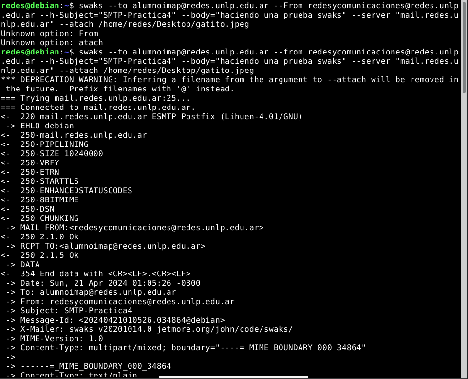
    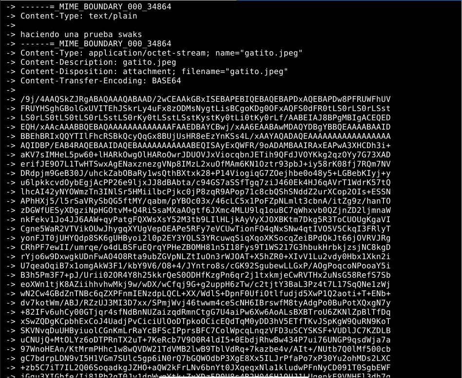
    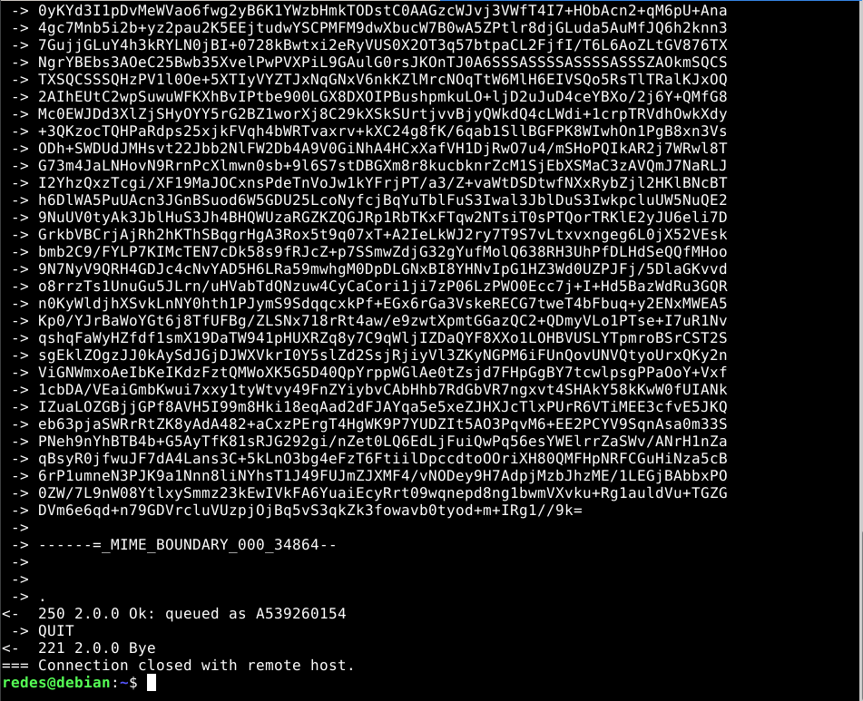
    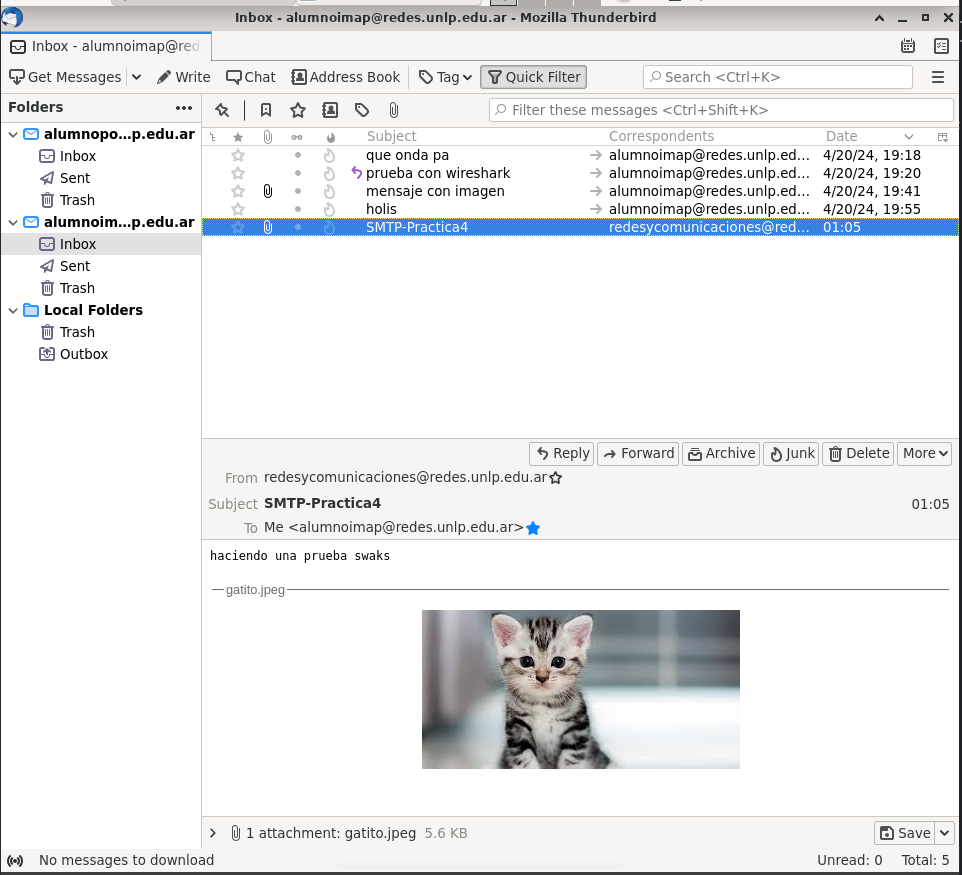

    **STARTTLS:** indica que emplea cifrado TLS para cifrar las comunicaciones, esto se debe a que SMTP se comunica en texto plano.
    **VRFY:** pregunta al servidor si un correo está disponible o registrado en el servidor.
    **CHUNKING:** indica que el servidor de correo permite la transmisión eficiente y segura de correos en fragmentos más pequeños.
    
        ii. Indicar cuáles cabeceras fueron agregadas por la herramienta swaks.

    Aunque las cabecera to, from y Subject fueron explicitadas a la hora de ejecutar el comando, swaks se encargó de armar un header completo con los encabezados: Date, To, From, Subject, Message-Id, X-Mailer, MIME-Version y Content-Type.

        iii. ¿Cuál es el message-id del correo enviado? ¿Quién asigna dicho valor?

    El Message-Id es: <20240421010526.034864@debian>. Este valor es asignado por el MUA, pero en caso de que este no lo asigne, el encargado de hacerlo será el MTA.

        iv. ¿Cuál es el software utilizado como servidor de correo electrónico?
    
    El software utilizado como servidor de correo electrónico es Postfix,

        v. Adjunte la salida del comando swaks y los fuentes del correo electrónico.
    b) Descargue de la plataforma la captura de tráfico smtp.pcap y la salida del comando swaks smtp.swaks para responder y justificar los siguientes ejercicios.
        i. ¿Por qué el contenido del mail no puede ser leído en la captura de tráfico?
    
    Esto se debe a que se está utilizando TLS lo cual lo que hace es cifrar la información.

    c) Realice una consulta de DNS por registros TXT al dominio info.unlp.edu.ar y entre dichos registros evalúe la información del registro SPF. ¿Por qué cree que aparecen muchos servidores autorizados?

    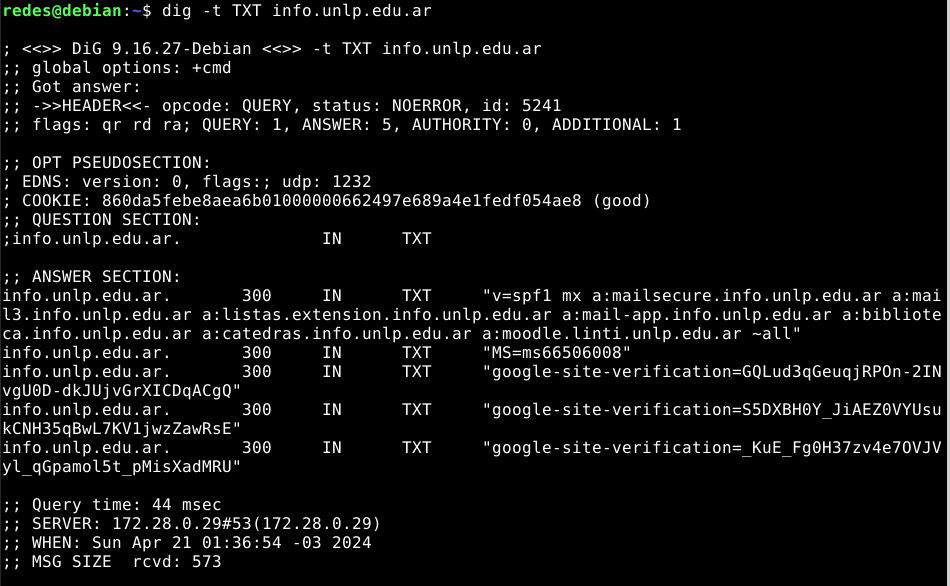

    El registro SPF determina qué servidores de correo y dominios tienen permitido enviar mails en nombre de un dominio. Estos servidores autorizados aparecen porque son los distintos servidores y dominios de la facultad de informática.
    El "a:" se utiliza para autorizar servidores por nombres de host.

    d) Realice una consulta de DNS por registros TXT al dominio outlook.com y analice el registro correspondiente a SPF. ¿Cuáles son los bloques de red autorizados para enviar mails?. Investigue para qué se utiliza la directiva "~all"

    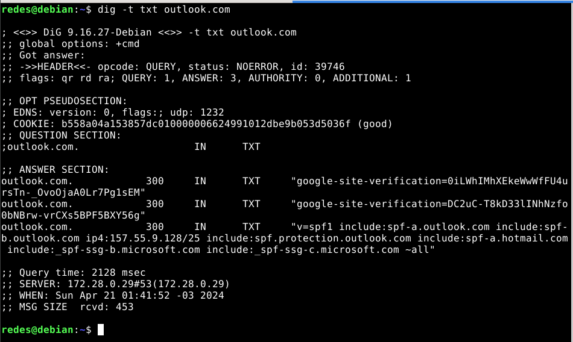

    Los bloques son:
    - a.outlook.com
    - b.outlook.com
    - protection-outlook.com
    - a.hotmail.com
    - _spf-ssg-b.microsoft.com
    - _spf-ssg-c.microsoft.com

    La directiva **~all** especifica una "falla suave" en la política SPF, esto quiere decir, que si el correo viene de otra dirección distinta a las detalladas anteriormente, el mismo no se rechazará automáticamente, pero podría ser marcado como sospechoso o de alguna otra manera para información al destinatario.

12. Observar el gráfico a continuación y teniendo en cuenta lo siguiente , responder:
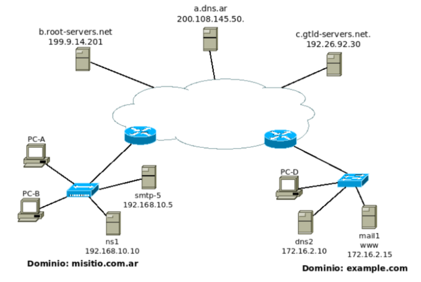
    ● El usuario juan@misitio.com.ar en PC-A desea enviar un mail al usuario alicia@example.com
    ● Cada organización tiene su propios servidores de DNS y Mail
    ● El servidor ns1 de misitio.com.ar no tiene la recursión habilitada
    a) El servidor de mail, mail1, y de HTTP, www, de example.com tienen la misma IP, ¿es posible esto? Si lo es, ¿cómo lo resolvería?

    Es posible que tengan la misma dirección IP, si ese fuera el caso se tiene que configurar a los servidores de correo y al servidor web para que escuchen puertos diferentes.

    ---
    b) Al enviar el mail, ¿por cuál registro de DNS consultará el MUA?
    
    El MUA no consultará por ningún registro DNS, esto se debe a que tiene configurado al servidor MSA (por parte del proveedor) al que le debe enviar los mails.

    ---
    c) Una vez que el mail fue recibido por el servidor smtp-5, ¿por qué registro de DNS consultará?
    
    Se consultará por el registro MX de example.com.

    ---
    d) Si en el punto anterior smtp-5 recibiese un listado de nombres de servidores de correo, ¿será necesario realizar una consulta de DNS adicional? Si es afirmativo, ¿por qué tipo de registro y de cuál servidor preguntaría?

    Si debería hacerse una consulta adicional por el registro A con el fin de obtener la IP de los nombres de los servidores dados.
    
    ---
    e) Indicar todo el proceso que deberá realizar el servidor ns1 de misitio.com.ar para obtener los servidores de mail de example."com".
    
        1. se debe consultar primero por el root server más cercano, en este caso es b.root-servers.net (199.9.14.201), el cual le proporcionará la dirección IP de un servidor DNS autoritativo para ".com".
        2. ahora con esta IP obtenida, se realiza la consulta al servidor autoritativo c.gtld.severs.net (192.26.92.30), el cual devuelve la IP de un servidor autoritativo para "example.com".
        3. ahora ns1 consultará con el servidor DNS autoritativo de example.com con el fin de obtener los registros MX específicos que indican los servidores de correo asociados a "example.com".

    ---
    f) Teniendo en cuenta el proceso de encapsulación/desencapsulación y definición de protocolos, responder V o F y justificar:
        ● Los datos de la cabecera de SMTP deben ser analizados por el servidor DNS para responder a la consulta de los registros MX

        FALSO: los datos de la cabecera de SMTP deben ser analizado por el MSA, esto con el fin de determinar si hay algún error o campo faltante que debe completarse.

        ● Al ser recibidos por el servidor smtp-5 los datos agregados por el protocolo SMTP serán analizados por cada una de las capas inferiores

        VERDADERO: esto se debe a que en el modelo de capas de protocolo cada capa es responsable de procesar y encapsular los datos antes de pasarlos a la capa inferior.

        ● Cada protocolo de la capa de aplicación agrega una cabecera con información propia de ese protocolo

        FALSO: no todos los protocolos agregan una cabecera con información propia del mismo.

        ● Como son todos protocolos de la capa de aplicación, las cabeceras agregadas por el protocolo de DNS puede ser analizadas y comprendidas por el protocolo SMTP o HTTP

        FALSO: cada protocolo es independiente del resto y tiene su propia estructura de datos y cabeceras, y por lo tanto no están necesariamente diseñados para interoperar entre sí de manera directa.

        ● Para que los cliente en misitio.com.ar puedan acceder el servidor HTTP www.example.com y mostrar correctamente su contenido deben tener el mismo sistema operativo.

        FALSO: esto se debe a que el protocolo HTTP provee abstracción y esto hace que no sea necesario que los clientes no necesiten tener el mismo sistema operativo para poder acceder al contenido.

    ---
    g) Un cliente web que desea acceder al servidor www.example.com y que no pertenece a ninguno de estos dos dominios puede usar a ns1 de misitio.com.ar como servidor de DNS para resolver la consulta.

    No, esto se debe a que ns1 no es un servidor autoritativo para example.com y no lo va a tener en ningún registro.
    
    ---
    h) Cuando Alicia quiera ver sus mails desde PC-D, ¿qué registro de DNS deberá consultarse?
    
    No se deberá consultar a ningún registro DNS, simplemente utilizará desde PC-D el protocolo IMAP o POP3.

    ---
    i) Indicar todos los protocolos de mail involucrados, puerto y si usan TCP o UDP, en el envío y recepción de dicho mail

    SMTP -> puerto 53 TCP
    POP3 -> puerto 110 TCP
    IMAP -> puerto 143 TCP