# PRÁCTICA 5 - CAPA DE TRANSPORTE (PARTE 1)

1. ¿Cuál es la función de la capa de transporte?

La capa de transporte es la encargada de proporcionar directamente servicios de comunicación a los procesos de aplicación que se ejecutan en hosts diferentes.
Cada protocolo de la capa de transporte proporciona una *Comunicación lógica (hace ver como que los hosts que se comunican están conectados directamente)* entre procesos de aplicación que se ejecutan en hosts diferentes.

---
2. Describa la estructura del segmento TCP y UDP.
    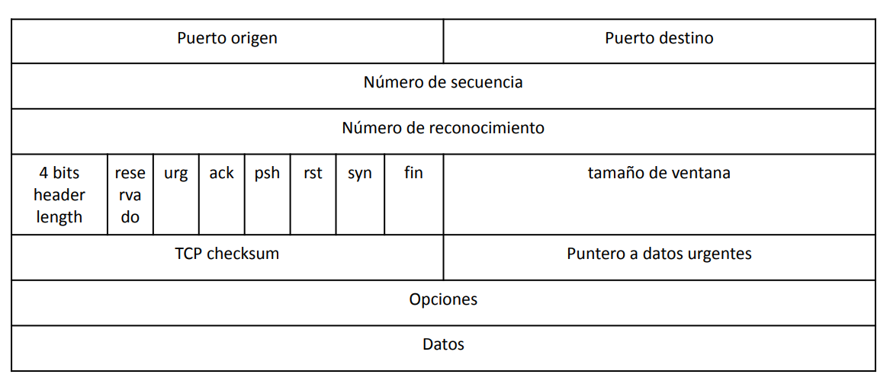
    
    <!-- TODO completar -->

    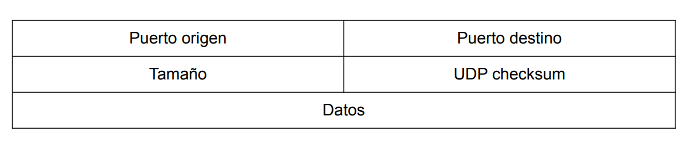

* Los datos de la aplicación ocupan el campo de datos del segmento UDP.
* La cabecera UDP solo tiene cuatro campos, y cada uno de ellos tiene una longitud de dos bytes.
* Los números de puerto permiten al host de destino pasar datos de la aplicación al proceso apropiado que está ejecutándose en el sistema terminal de destino.
* El campo de longitud especifíca el número de bytes del segmento UDP (la cabecera más los datos).
* El host receptor utiliza la suma de comprobación para detectar si se han introducido errores en el segmento.
  
---
3. ¿Cuál es el objetivo del uso de puertos en el modelo TCP/IP?

Los puertos se utilizan para distinguir las aplicaciones y los protocolos que están enviando/recibiendo datos.
Los puertos actúan como puntos finales en una comunicación y permiten que múltiples aplicaciones en una misma computadora/dispositivo se comuniquen simultáneamente a través de la red.

---
4. Compare TCP y UDP en cuanto a:
   a. Confiabilidad
   b. Multiplexación
   c. Orientado a la conexión
   d. Controles de congestión
   e. Utilización de puertos

---
a. Confiabilidad: 
TCP es un modelo confiable debido a que garantiza que los datos se entregue en el orden correcto y sin errores. En cambio, UDP es menos confiable debido a que no garantiza ni la entrega de los datos, ni que los mismos se entreguen en orden.
    
---
b. Multiplexación: 
En el caso de TCP, la multiplexación y demultiplexación es orientada a la conexión, cuando llega de la procedente de la red a un host un segmento TCP, el host emplea los valores de IP orígen, número de puerto de orígen, IP destino y número de puerto de destino para demultiplexar el segmento al socket apropiado.
En el caso de UDP la multiplexación y demultiplexación no es orientada a la conexión. El socket UDP queda identificado por la dirección IP destino y un número de puerto de destino, por lo tanto si dos segmentos UDPP con diferentes direcciones IP y puertos de orígen distintos, tienen el mismo puerto destino y la misma dirección IP destino, entonces el segmento se envía al mismo proceso de destino por medio  del mismo socket.

---
c. Orientado a la conexión: TCP establece una conexión antes de iniciar con la transmisión de los datos, para así asegurarse que ambas partes estén sincronizadas hablando de secuencia de datos y control de flujo. En el caso de UDP no se necesita una conexión para poder iniciar/finalizar una transferencia de datos.
    
---
d. Controles de congestión: TCP proporciona mecanismos de control de congestión, para así evitar que cualquier conexión TCP sature con una cantidad de tráfico considerable los enlaces y routers existentes entre los hosts. UDP no tiene su tráfico regulado, or lo tanto una aplicación que emplee el protocolo de transporte UDP puede enviar los datos que quiera a la velocidad que quiera, durante todo el tiempo que q

---
e. Utilización de puertos:  TCP establece una conexión punto a punto entre (únicamente) dos dispositivos. Utiliza números de puerto para identificar aplicaciones específicas. UDP permite que muchos clientes/procesos envíen datos por el mismo socket y al igual que TCP utiliza números de puerto para identificar aplicaciones específicas.

---
5. La PDU de la capa de transporte es el segmento. Sin embargo, en algunos contextos suele utilizarse el término datagrama. Indique cuando.
   
El término datagrama, se utiliza cuando se trata del protocolo UDP. 
Por lo tanto la PDU de la capa de transporte cuando se trata del protocolo UDP es datagrama.

---
6. Describa el saludo de tres vías de TCP. ¿UDP tiene esta característica?

El *"saludo de tres vías"* o *"acuerdo en tres fases"*, es un intercambio de segmentos especiales entre el cliente y el servidor, en el cual, primero el cliente le envía el segmento al servidor, el servidor le responde con un segundo segmento y por último el cliente le responde al servidor con un tercer segmento. De estos 3 segmentos que se intercambian, los 2 primeros no envían ningún tipo de carga útil, y el 3ro puede ser que sí lleve carga útil.

UDP al ser un protocolo que no está orientado a la conexión, no posee esta característica.

---
7. Investigue qué es el ISN (Initial Sequence Number). Relaciónelo con el saludo de tres vías.

El ISN es un número único de 32 bits el cual se asigna a cada nueva conexión TCP. Este ISN es único para cada conexión y separado por cada dispositivo.

Durante el inicio de una conexión TCP por medio del "acuerdo de tres fases" se establece un ISN. Este número es usado para rastrear la secuencia de los bytes envíados a travé de la conexión permitiendo que puedan volver a ensamblarse en el orden correcto en el extremo del receptor, garantizando así la integridad de los datos y una conexión fiable. 

---
8. Investigue qué es el MSS. ¿Cuándo y cómo se negocia?

El MSS (Maximum Segment Size o Tamaño Máximo del Segmento) es el encargado de limitar la cantidad de datos que pueden agarrarse y colocarse en un segmento.
El MSS queda determinado en primer lugar por la longitud de la trama más larga de la capa de enlace que el host emisor local puede enviary luego, el MSS se establece de manera que se garantice que un segmento TCP más la longitud de la cabecera TPC/IP (normalmente 40 bytes) se ajuste a una única trama de la capa de enlace.

---
9. Utilice el comando ss (reemplazo de netstat) para obtener la siguiente información de su PC:
    a. Para listar las comunicaciones TCP establecidas.
    b. Para listar las comunicaciones UDP establecidas.
    c. Obtener sólo los servicios TCP que están esperando comunicaciones
    d. Obtener sólo los servicios UDP que están esperando comunicaciones.
    e. Repetir los anteriores para visualizar el proceso del sistema asociado a la conexión.
    f. Obtenga la misma información planteada en los items anteriores usando el comando **netstat**.

a. 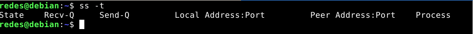
b. 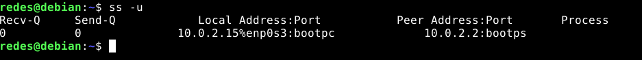
c.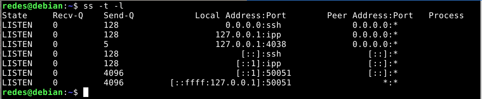
d.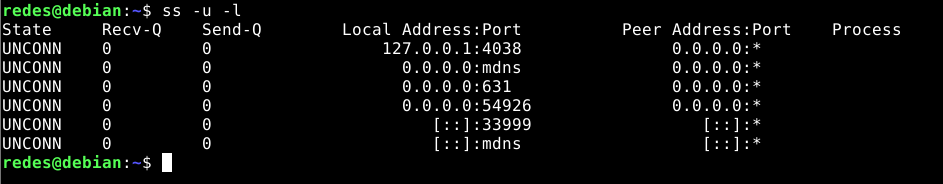
e.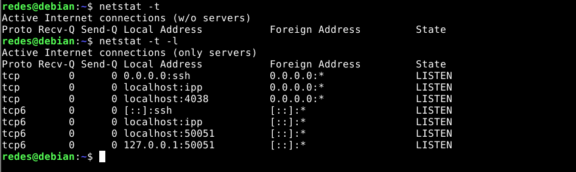
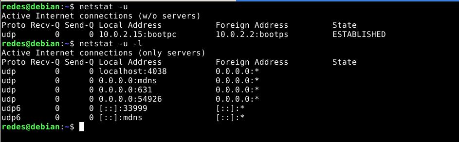

---
10.  ¿Qué sucede si llega un segmento TCP con el flag SYN activo a un host que no tiene ningún proceso esperando en el puerto destino de dicho segmento (es decir, el puerto destino no está en estado LISTEN)?
    a. Utilice hping3 para enviar paquetes TCP al puerto destino 22 de la máquina virtual con el flag SYN activado.
    b. Utilice hping3 para enviar paquetes TCP al puerto destino 40 de la máquina virtual con el flag SYN activado.
    c. ¿Qué diferencias nota en las respuestas obtenidas en los dos casos anteriores? ¿Puede explicar a qué se debe? (Ayuda: utilice el comando ss visto anteriormente).

Debido a que el host no tiene ningún proceso en estado de LISTEN, lo que hará será enviar un segmento con el flag RST (reset) activo indicando de esta forma que la conexión no se puede establecer en dicho puerto.
Con esto lo que hace es indicarle al remitente que no se puede establecer la conexión en ese moemento para que deje de enviarle segmentos.

*Nota: el comando hping3 se debe ejecutar en modo superusuario (admin - sudo su)*

a. 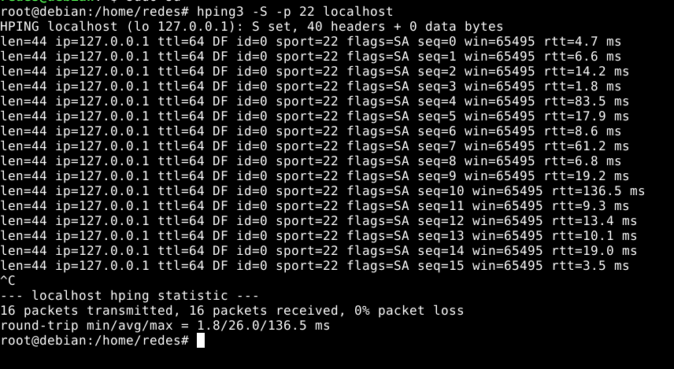
b.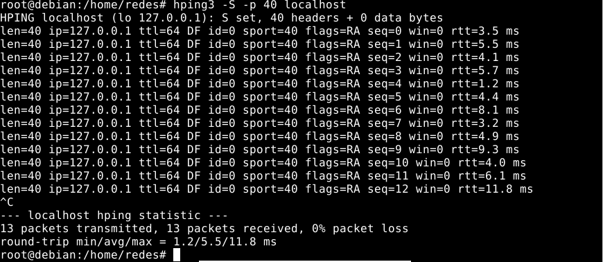
c. Se puede ver en la primer captura que los flags obtenidos son SA (SYN y ACK), esto quiere decir que la comunicación pudo establecerse debido a que ambos flags S y A se encontraban activados; en cambio en la segunda captura (correspondiente al puerto 40), los flags que se obtienen son RA (Reset y ACK), esto quiere decir que el puerto de destino se encuentra cerrado y no se pudo establecer la comunicación.

---
11.  ¿Qué sucede si llega un datagrama UDP a un host que no tiene ningún proceso esperando en el puerto destino de dicho datagrama (es decir, que dicho puerto no está en estado LISTEN)?
    a. Utilice hping3 para enviar datagramas UDP al puerto destino 5353 de la máquina virtual.
    b. Utilice hping3 para enviar datagramas UDP al puerto destino 40 de la máquina virtual.
    c. ¿Qué diferencias nota en las respuestas obtenidas en los dos casos anteriores? ¿Puede explicar a qué se debe? *(Ayuda: utilice el comando ss visto anteriormente)*.

En caso de que no haya un proceso en estado LISTEN, lo que sucede, es que el puerto de destino responderá con un ICMP "Destination Unreachable", el cual inica que el puerto o el host de destino, no están disponibles.
Otra cosa que puede pasar, al ser UDP un protocolo no orientado a la conexión, es que el paquete ICMP se pierda y por lo tant no se genere ninguna notificación.

a.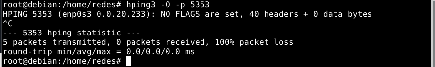
b.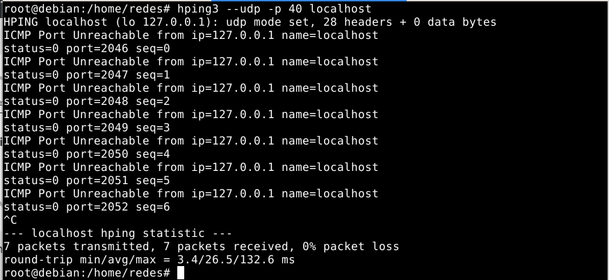
c.En el caso del puerto 5353, aunque el mismo tiene un proceso que está escuchando, no se indica que el datagrama haya llegado (tiene sentido por ser UDP). En el caso del puerto 40, no tiene un proceso que esté escuchando, y en este caso, sí recibimos el ICMP de que el puerto 40 es inalcanzable. 

---
12. Investigue los distintos tipos de estado que puede tener una conexión TCP. Ver **https://users.cs.northwestern.edu/~agupta/cs340/project2/TCPIP_State_Transition_Diagram.pdf**

Una conexión TCP puede tener el estado:
* LISTEN: indica que un puerto TCP está en espera de una conexión.
  
* SYN-SENT: representa el estado de espera de una solicitud de conexión coincidente luego de haber enviado una solicitud de conexión.
  
* SYN-RECEIVED: representa el estado de espera de una confirmación de solicitud de conexión después de haber recibido y enviado una solicitud de conexión.
  
* ESTABLISHED: indica una conexión abierta, esto permite que los datos recibidos sean entregados al usuario. Este es el estado de conexión normal durante la fase de transferenca de datos.
  
* FIN-WAIT-1: represennta la espera de una solicitud de terminación de conexión procedenete del TCP remoto, o la confirmacion de la solicitud de terminación de conexión previamente enviada.
  
* FIN-WAIT-2: representa la espera de una solicitud de terminación de conexión procedente del TCP remoto.
  
* CLOSE-WAIT: repreenta la espera de una solicitud de terminación de conexión procedente del usuario local.
  
* CLOSING: representa la espera de una confirmación de la solicitud de terminación de conexión procedente del TCP remoto.
  
* LAST-ACK: representa la espera de una confirmación de la solicitud de terminación de conexión previamente enviada al TCP remoto.
  
* TIME-WAIT: representa la espera de suficiente tiempo para asegurar que el TCP remoto ha recibido la confirmación de su solicitud de terminación de conexión.
  
* CLOSED: representa la ausencia de una conexión activa.

Una conexión TCP avanza de un estado a otro en respuesta a diversos eventos, tles como llamdas del usuario, segmentos entrantes (como aquellos que contienen las baderas SYN, ACK...) así como también mediante el uso de temporizadores.

---
13.  Dada la siguiente salida del comando ss, responda:
    
    a. ¿Cuántas conexiones hay establecidas?
    b. ¿Cuántos puertos hay abiertos a la espera de posibles nuevas conexiones?
    c. El cliente y el servidor de las comunicaciones HTTPS (puerto 443), ¿residen en la misma máquina?
    d. El cliente y el servidor de la comunicación SSH (puerto 22), ¿residen en la misma máquina?
    e. Liste los nombres de todos los procesos asociados con cada comunicación. Indique para cada uno si se trata de un proceso cliente o uno servidor.
    f. ¿Cuáles conexiones tuvieron el cierre iniciado por el host local y cuáles por el remoto?
    g. ¿Cuántas conexiones están aún pendientes por establecerse?

a. Hay 9 conexiones establecidas (son aquellas que se encuentran en estado ESTAB).

b. Hay 4 puertos abiertos (en estado LISTEN) que se encuentran en espera de nuevas conexiones (22,80,53 y 25).

c. No, esto se debe a que no coinciden las direcciones IP de orígen y destino.

d. Si, en este caso, podemos ver que la dirección IP es igual, lo único que se modifica es el puerto. En el puerto 22 se encuentra el proceso SSHD y en el puerto 41220 se encuentra el proceso SSH.

e. 
*NOTA: los procesos que se encuentran en estado de LISTEN y/o en puertos que van de 0 a 1023, son aquellos procesos servidores*
    SSHD: servidor
    APACHE2: servidor
    NAMED: servidor
    X-WWW-BROWSER: cliente
    POSTFIX: servidor
    SSH: cliente

f. La conexión que se encuentra en estado CLOSE-WAIT su cierre fue iniciado por el usuario remoto y en el caso de la conexión con estado TIME-WAIT, fue por el usuario local.

g. Hay una sola conexión que se encuentra pendiente de establecerse, es aquella que tiene el estado SYN-SENT.

---
14. Dadas las salidas de los siguientes comandos ejecutados en el cliente y el servidor, responder:
    
    a. ¿Qué segmentos llegaron y cuáles se están perdiendo en la red?
    b. ¿A qué protocolo de capa de aplicación y de transporte se está intentando conectar el cliente?
    c. ¿Qué flags tendría seteado el segmento perdido?

a. Se puede ver que el segmento SYN llegó, debido a que el servidor muestra el estado SYN-RECV, pero podemos ver que el segmento SYNACK no llegó y quedo perdido en la red.
b. Se está intentando conectar al protocolo de la capa de aplicación POP3, esto lo podemos ver porque el puerto al que se quiere conectar es al 110.
c. El segmento que se pierde, tendría seteado los flags SYN y ACK ambos en 1.

---
15. Use CORE para armar una topología como la siguiente, sobre la cual deberá realizar:
    a. En ambos equipos inspeccionar el estado de las conexiones y mantener abiertas ambas ventanas con el comando corriendo para poder visualizar los cambios a medida que se realiza el ejercicio. **Ayuda: watch -n1 ’ss -nat’**.
    b. En Servidor, utilice la herramienta ncat para levantar un servicio que escuche en el puerto 8001/TCP. Utilice la opción -k para que el servicio sea persistente. Verifique el estado de las conexiones.
    
    c. Desde CLIENTE1 conectarse a dicho servicio utilizando también la herramienta ncat. Inspeccione el estado de las conexiones.
    d. Iniciar otra conexión desde CLIENTE1 de la misma manera que la anterior y verificar el estado de las conexiones. ¿De qué manera puede identificar cada conexión?
    e. En base a lo observado en el item anterior, ¿es posible iniciar más de una conexión desde el cliente al servidor en el mismo puerto destino? ¿Por qué? ¿Cómo se garantiza que los datos de una conexión no se mezclarán con los de la otra?
    f. Analice en el tráfico de red, los flags de los segmentos TCP que ocurren cuando:
        i. Cierra la última conexión establecida desde CLIENTE1. Evalúe los estados de las conexiones en ambos equipos.
        ii. Corta el servicio de ncat en el servidor (Ctrl+C). Evalúe los estados de las conexiones en ambos equipos.
        iii. Cierra la conexión en el cliente. Evalúe nuevamente los estados de las conexiones.
a.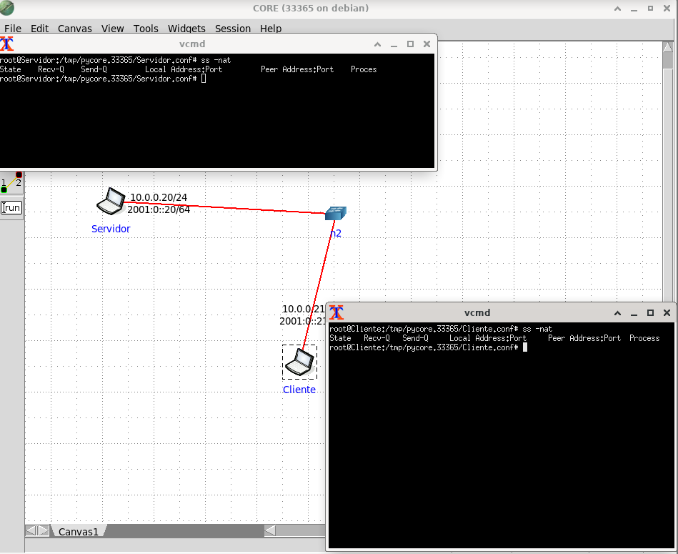
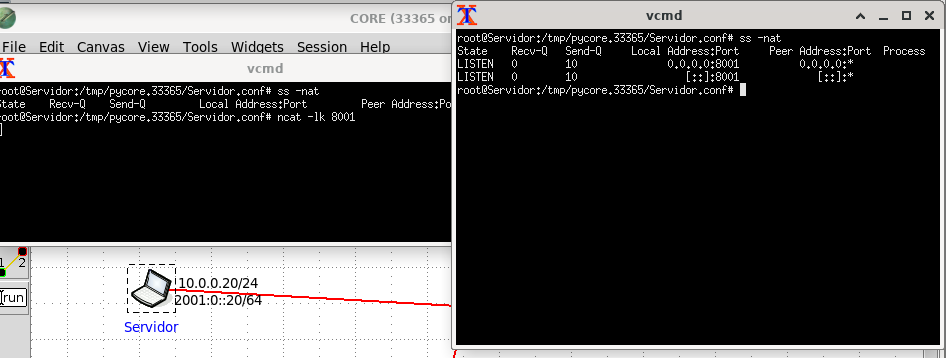
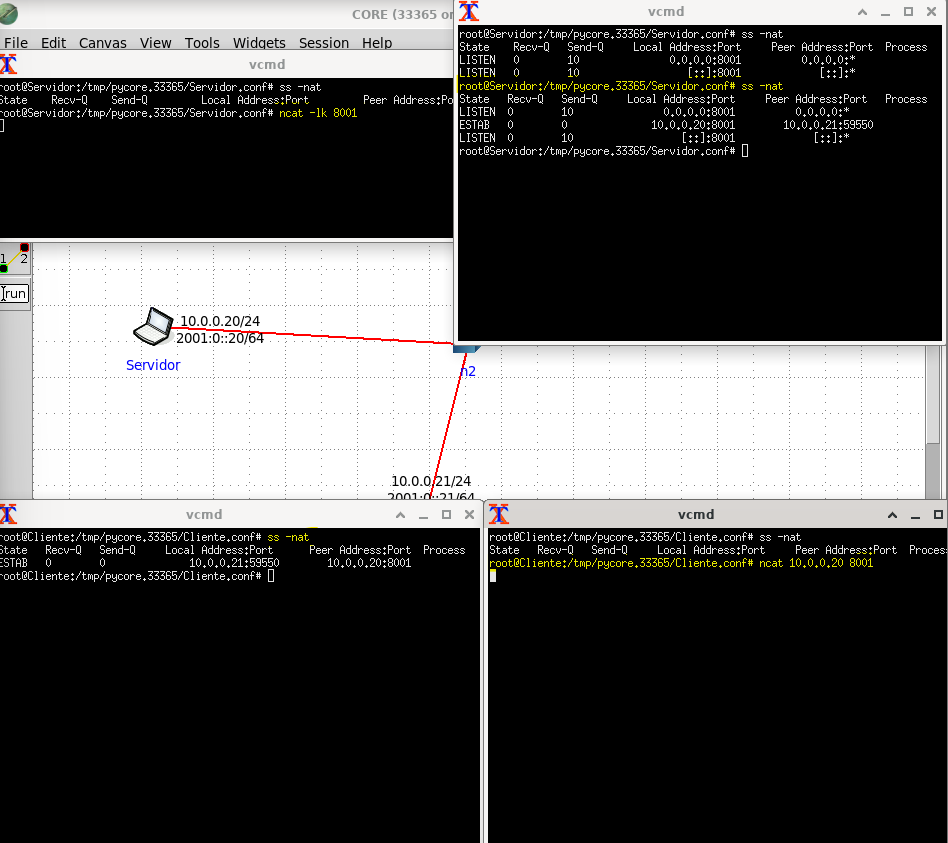
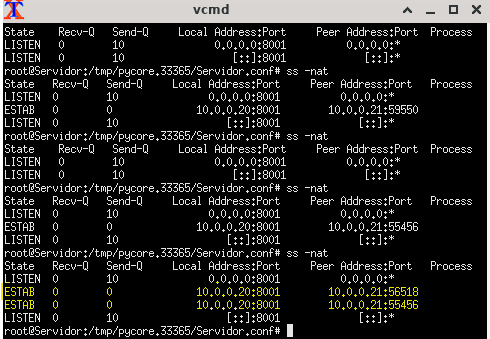

e. Si es posible iniciar más de una conexión desde el cliente al servidor en el mismo puerto destino, esto es posible ya que los clientes tienen distintos puertos de origen y también debido a que cadaa conexión se identfica de manera única por medio de la combinación de la dirección IP y el número de puerto local y remoto.
Cada conexión se gestiona de manera individual y se mantiene separada del resto gracias a esta combinación única de direcciones IP y puertos.
f.
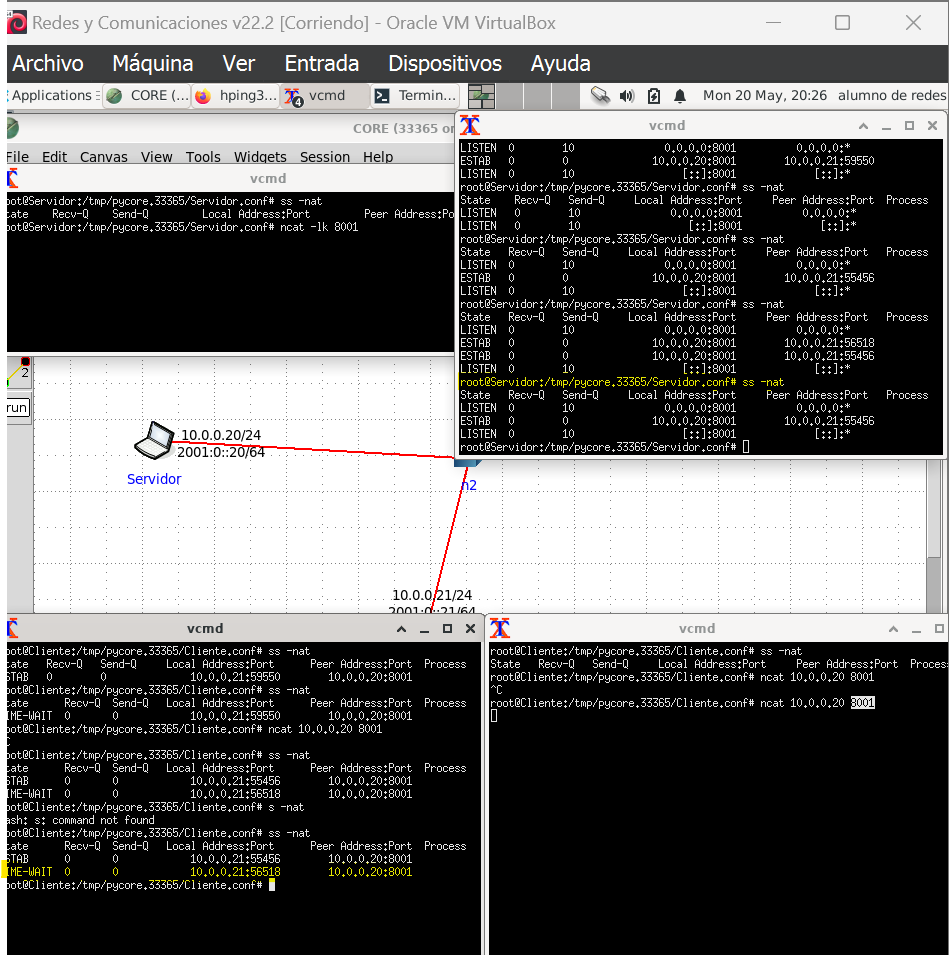
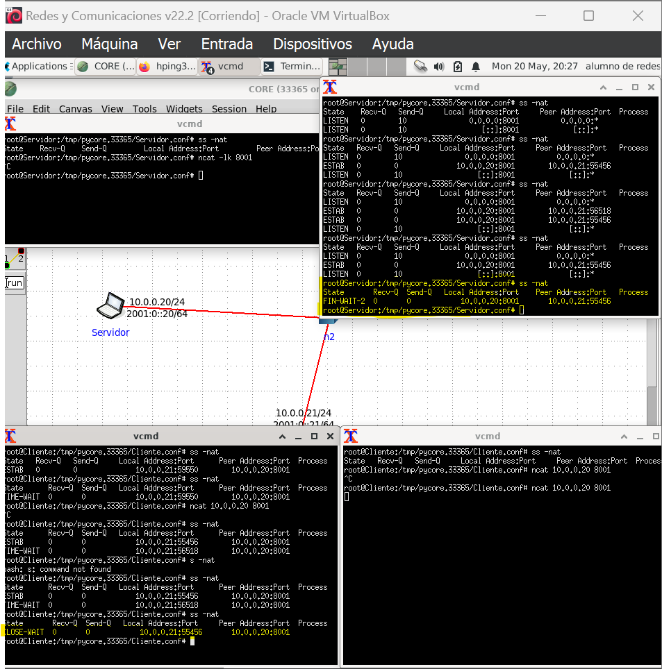
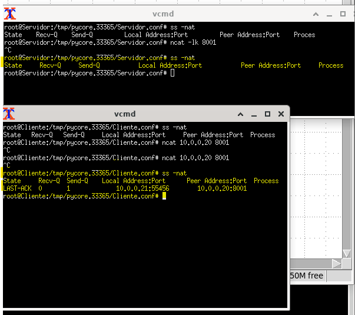

---
