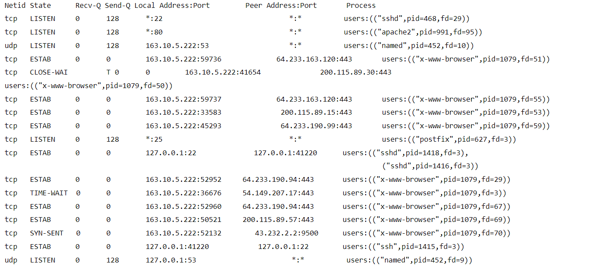
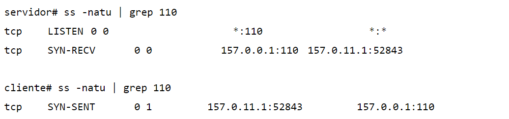
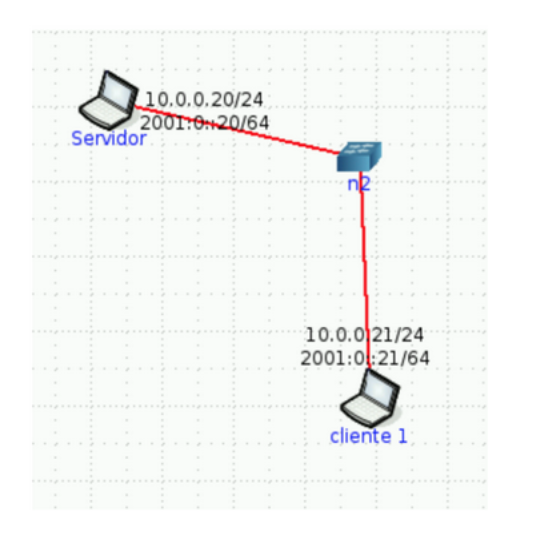

# PRÁCTICA 5 - CAPA DE TRANSPORTE (PARTE 1)

1. ¿Cuál es la función de la capa de transporte?

---
2. Describa la estructura del segmento TCP y UDP.

---
3. ¿Cuál es el objetivo del uso de puertos en el modelo TCP/IP?

---
4. Compare TCP y UDP en cuanto a:
    a. Confiabilidad
    b. Multiplexación.
    c. Orientado a la conexión.
    d. Controles de congestión.
    e. Utilización de puertos.

---
5. La PDU de la capa de transporte es el segmento. Sin embargo, en algunos contextos suele utilizarse el término datagrama. Indique cuando.

---
6. Describa el saludo de tres vías de TCP. ¿UDP tiene esta característica?

---
7. Investigue qué es el ISN (Initial Sequence Number). Relaciónelo con el saludo de tres vías.

---
8. Investigue qué es el MSS. ¿Cuándo y cómo se negocia?

---
9. Utilice el comando ss (reemplazo de netstat) para obtener la siguiente información de su PC:
    a. Para listar las comunicaciones TCP establecidas.
    b. Para listar las comunicaciones UDP establecidas.
    c. Obtener sólo los servicios TCP que están esperando comunicaciones
    d. Obtener sólo los servicios UDP que están esperando comunicaciones.
    e. Repetir los anteriores para visualizar el proceso del sistema asociado a la conexión.
    f. Obtenga la misma información planteada en los items anteriores usando el comando **netstat**.

---
10. ¿Qué sucede si llega un segmento TCP con el flag SYN activo a un host que no tiene ningún proceso esperando en el puerto destino de dicho segmento (es decir, el puerto destino no está en estado LISTEN)?
    a. Utilice hping3 para enviar paquetes TCP al puerto destino 22 de la máquina virtual con el flag SYN activado.
    b. Utilice hping3 para enviar paquetes TCP al puerto destino 40 de la máquina virtual con el flag SYN activado.
    c. ¿Qué diferencias nota en las respuestas obtenidas en los dos casos anteriores? ¿Puede explicar a qué se debe? (Ayuda: utilice el comando ss visto anteriormente).

---
11. ¿Qué sucede si llega un datagrama UDP a un host que no tiene ningún proceso esperando en el puerto destino de dicho datagrama (es decir, que dicho puerto no está en estado LISTEN)?
    a. Utilice hping3 para enviar datagramas UDP al puerto destino 5353 de la máquina virtual.
    b. Utilice hping3 para enviar datagramas UDP al puerto destino 40 de la máquina virtual.
    c. ¿Qué diferencias nota en las respuestas obtenidas en los dos casos anteriores? ¿Puede explicar a qué se debe? *(Ayuda: utilice el comando ss visto anteriormente)*.

---
12. Investigue los distintos tipos de estado que puede tener una conexión TCP. Ver **https://users.cs.northwestern.edu/~agupta/cs340/project2/TCPIP_State_Transition_Diagram.pdf**

---
13. Dada la siguiente salida del comando ss, responda:
    
    a. ¿Cuántas conexiones hay establecidas?
    b. ¿Cuántos puertos hay abiertos a la espera de posibles nuevas conexiones?
    c. El cliente y el servidor de las comunicaciones HTTPS (puerto 443), ¿residen en la misma máquina?
    d. El cliente y el servidor de la comunicación SSH (puerto 22), ¿residen en la misma máquina?
    e. Liste los nombres de todos los procesos asociados con cada comunicación. Indique para cada uno si se trata de un proceso cliente o uno servidor.
    f. ¿Cuáles conexiones tuvieron el cierre iniciado por el host local y cuáles por el remoto?
    g. ¿Cuántas conexiones están aún pendientes por establecerse?

---
14. Dadas las salidas de los siguientes comandos ejecutados en el cliente y el servidor, responder:
    
    a. ¿Qué segmentos llegaron y cuáles se están perdiendo en la red?
    b. ¿A qué protocolo de capa de aplicación y de transporte se está intentando conectar el cliente?
    c. ¿Qué flags tendría seteado el segmento perdido?

---
15. Use CORE para armar una topología como la siguiente, sobre la cual deberá realizar:
    a. En ambos equipos inspeccionar el estado de las conexiones y mantener abiertas ambas ventanas con el comando corriendo para poder visualizar los cambios a medida que se realiza el ejercicio. **Ayuda: watch -n1 ’ss -nat’**.
    b. En Servidor, utilice la herramienta ncat para levantar un servicio que escuche en el puerto 8001/TCP. Utilice la opción -k para que el servicio sea persistente. Verifique el estado de las conexiones.
    
    c. Desde CLIENTE1 conectarse a dicho servicio utilizando también la herramienta ncat. Inspeccione el estado de las conexiones.
    d. Iniciar otra conexión desde CLIENTE1 de la misma manera que la anterior y verificar el estado de las conexiones. ¿De qué manera puede identificar cada conexión?
    e. En base a lo observado en el item anterior, ¿es posible iniciar más de una conexión desde el cliente al servidor en el mismo puerto destino? ¿Por qué? ¿Cómo se garantiza que los datos de una conexión no se mezclarán con los de la otra?
    f. Analice en el tráfico de red, los flags de los segmentos TCP que ocurren cuando:
        i. Cierra la última conexión establecida desde CLIENTE1. Evalúe los estados de las conexiones en ambos equipos.
        ii. Corta el servicio de ncat en el servidor (Ctrl+C). Evalúe los estados de las conexiones en ambos equipos.
        iii. Cierra la conexión en el cliente. Evalúe nuevamente los estados de las conexiones.

---
