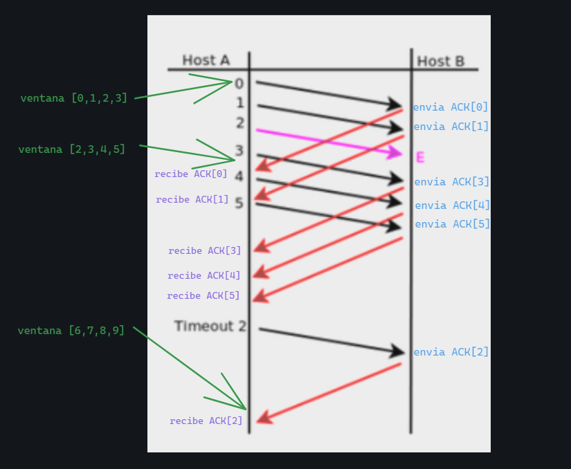
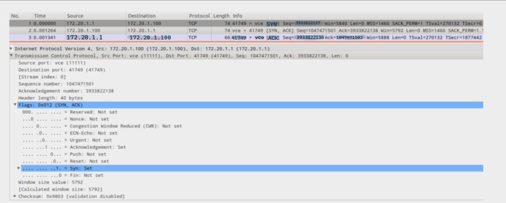
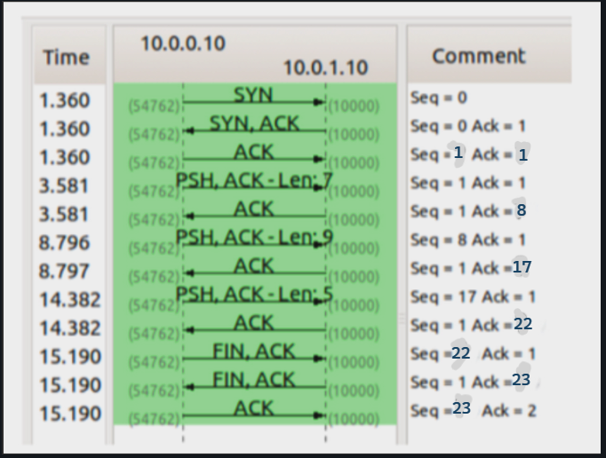

# PRÁCTICA 6 - CAPA DE TRANSPORTE PARTE 2

1. ¿Cuál es el puerto por defecto que se utiliza en los siguientes servicios? Web / SSH / DNS / Web Seguro / POP3 / IMAP / SMTP. Investigue en qué lugar en Linux y en Windows está descrita la asociación utilizada por defecto para cada servicio.

SSH --> puerto 22
DNS --> puerto 53
WebSeguro (HTTPS) --> puerto 443
POP3 --> puerto 110
IMAP --> puerto 143
SMTP --> 25

La asociación utilizda por defecto en Linux, está en la dirección **/etc/services** y en Windows se encuentra en la dirección **C:\Windows\System32\drivers\etc\services**.

---
2. Investigue qué es multicast. ¿Sobre cuál de los protocolos de capa de transporte funciona? ¿Se podría adaptar para que funcione sobre el otro protocolo de capa de transporte? ¿Por qué?

Multicast es un método de comunicación en redes de computadoras que permite enviar datos a múltiples destinatarios a la vez de una sola vez. Esto quiere decir que un solo emisor puede enviar un paquete de datos a varios receptores de manera simultánea, reduciendo el tráfico de red y mejorando la eficiencia en la transmisión de datos.
Funciona sobre el protocolo de transporte UDP. No puede funcionar sobre el protocolo TCP debido a que TCP es un protocolo de comunicación en el cual para poder transmitir datos se tiene que establecer una conexión estable entre el emisor y el receptor (está diseñado para realizar comunicación punto a punto).

---
3. Investigue cómo funciona el protocolo de aplicación FTP teniendo en cuenta las diferencias en su funcionamiento cuando se utiliza el modo activo de cuando se utiliza el modo pasivo ¿En qué se diferencian estos tipos de comunicaciones del resto de los protocolos de aplicación vistos?

FTP es un protocolo utilizado para la transferencia de archivos entre sistemas conectados a una red TCP. Este protocolo permite que desde un equipo cliente se pueda conectar a un servidor para descargar o enviar archivos, sin importar el sistema opertivo utilizado en cada equipo.

FTP Activo: es el modo predeterminado para las conexiones FTP. En este modo, el servidor utiliza el puerto 20 para la transferencia de datos y el puerto 21 para transmitir los comandos. El principal inconveniente que presenta es que la conexión puede ser bloqueada por los firewalls del cliente.

FTP Pasivo: tiene dos canales (control y datos), pero en este caso el cliente es quien se encarga de establecer las dos conexiones. El servidor sigue manteniendo el puerto 21 como puerto de comandos, pero ahora el puerto de datos se encuentra en un rago superior a 1023. El pricnipal inconveniente está asociado con el riesgo extra dado por la apertura de un rango de puertos extra con respecto al modo activo (los puertos deben estar abiertos tanto en el servidor como en el firewall).

---
4. Suponiendo Selective Repeat; tamaño de ventana 4 y sabiendo que E indica que el mensaje llegó con errores. Indique en el siguiente gráfico, la numeración de los ACK que el host B envía al Host A.

Las ventanas van del 0 al 3, del 2 al 5 y del 6 al 9 debido a que el tamaño de la misma siempre debe ser de 4.
Algo que no puede pasar es que se dejen huecos, por lo tanto la ventana no se corre hasta que el segmento 2 se retransmita.

---
5. ¿Qué restricción existe sobre el tamaño de ventanas en el protocolo Selective Repeat?

El tamaño de ventana no debe exceder la mitad del tamaño total del espacio de número de secuencia. Esto se debe a que se tiene que evitar la posibilidad de que un número de secuencia sea reutilizado antes de que haya llegado el ACK correspondiente (esto es porque la ventana se implementa como si fuese un buffer circular). 

---
6. De acuerdo a la captura TCP de la siguiente figura, indique los valores de los campos borroneados.

i. SYN
ii. 3933822137
iii. source: 172.20.1.1
iv. destination: 172.20.1.100
v. 41749 > vce
vi. ACK
vii. seq: 3933822137 (es el ACK del de arriba sin incrementar, porque ya estaba incrementado anteriormente).
viii. ack: 1047471502 (es el SEQ del anterior incrementado en 1)

---
7. Dada la sesión TCP de la figura, completar los valores marcados con un signo de interrogación.

i. 1
ii. 1
iii. 8
iv. 17
v. 22
vi. 22
vii. 23
viii. 23

---
8. ¿Qué es el RTT y cómo se calcula? Investigue la opción TCP timestamp y los campos TSval y TSecr.

RTT (round-trip time - tiempo de ida y vuelta): hace referencia al tiempo que un paquete de datos tarda en volver a su emisor habiendo pasado por su destino. Es decir, es el tiempo entre el envío de un segmento TCP y la confirmación de su recepción. Se calcula sumando el tiempo de envío y el tiempo de vuelta (RTT = tiempo_envio + tiempo_vuelta).
El campo TSvañ (Timestamp Value) es utilizado para distinguir segmentso de mismo número de secuencia y el campo TSecr (Timestamp Echo Reply) almacena una copia del último valor recibido de ese mismo campo. Se usa para calcular el RTT.

---
9. Para la captura tcp-captura.pcap, responder las siguientes preguntas.
    a. ¿Cuántos intentos de conexiones TCP hay?
    b. ¿Cuáles son la fuente y el destino (IP:port) para c/u?
    c. ¿Cuántas conexiones TCP exitosas hay en la captura? ¿Cómo diferencia las exitosas de las que no lo son? ¿Cuáles flags encuentra en cada una?
    d. Dada la primera conexión exitosa responder:
        i. ¿Quién inicia la conexión?
        ii. ¿Quién es el servidor y quién el cliente?
        iii. ¿En qué segmentos se ve el 3-way handshake?
        iv. ¿Cuáles ISNs se intercambian?
        v. ¿Cuál MSS se negoció?
        vi. ¿Cuál de los dos hosts envía la mayor cantidad de datos (IP:port)?
    e. Identificar primer segmento de datos (origen, destino, tiempo, número de fila y número de secuencia TCP).
        i. ¿Cuántos datos lleva?
        ii. ¿Cuándo es confirmado (tiempo, número de fila y número de secuencia TCP)?
        iii. La confirmación, ¿qué cantidad de bytes confirma?
    f. ¿Quién inicia el cierre de la conexión? ¿Qué flags se utilizan? ¿En cuáles segmentos se ve (tiempo, número de fila y número de secuencia TCP)?

---
10.  Responda las siguientes preguntas respecto del mecanismo de control de flujo.
    a. ¿Quién lo activa? ¿De qué forma lo hace?
    b. ¿Qué problema resuelve?
    c. ¿Cuánto tiempo dura activo y qué situación lo desactiva?

El control de flujo es el proceso de gestionar la tasa de transmisión de datos entre dos nodos con el objetivo de prevenir que un transmisor rápido exceda a un receptor lento. Es activado por cada extremo de la comunicación.
Dura durante toda la sesión TCP y lo desactiva el cierre de sesión.

---
11.  Responda las siguientes preguntas respecto del mecanismo de control de congestión.
    a. ¿Quién activa el mecanismo de control de congestión? ¿Cuáles son los posibles disparadores?
    b. ¿Qué problema resuelve?
    c. Diferencie slow start de congestion-avoidance.

El control de congestión hace referencia al control de tráfico de entrada hacia una red con el fin de evitar un colpaso de la misma por congestión. El mecanismo es activado por el emisor, el cual limita la velocidad de transmisión de tráfico a través de su conexión. 
Los posibles disparadores son:
    **Fin de temporización:** expira el temporizador asociado con un envío de un segmento TCP.
    **Recepción de TRES ACK duplicados:** la recepción de ACK duplicados procedentes del receptor se interpreta como un suceso de pérdida.
El cotrol de congestión tiene como objetivo evitar que se desborde la red (evitar que la misma se sobrecrgue) ajustando la tasa de transmisión de datos del emisor para que sea compatible con la capacidad de red.

**Slow Start (Arranque lento):** se utiliza al inicio de una conexión TCP, el tamaño de la ventana de congestión es inicializado con un valor pequeño (1 MSS) y tiene un crecimiento exponencial en donde la ventana de congestión se duplica cada periodo RTT; este crecimiento finaliza cuando se detecta un suceso de pérdida o cunado el valor de VentCongestion alcanza o sobrepasa el umbras de arranque lento.

**Evitación de la Congestión (Congestion Avoidance):** inicia cuando se detecta congestión y se sale del arranque lento, con un tamaño de ventana aproximadamanete de la mitad del valor a cuando se detectó congestión la última vez; este tamaño de ventana crece de forma lineal, se incrementa en un MSS por RTT (es más conservador); este crecimiento finaliza al detectarse un suceso de pérdida, el valor de VentCongestion se fija en 1 MSS y se actualiza el umbral de arranque lento y en caso de pérdida detectada por tres ACK duplicados.

---
12.  Para la captura udp-captura.pcap, responder las siguientes preguntas.
    a. ¿Cuántas comunicaciones (srcIP,srcPort,dstIP,dstPort) UDP hay en la captura?
    b. ¿Cómo se podrían identificar las exitosas de las que no lo son?
    c. ¿UDP puede utilizar el modelo cliente/servidor?
    d. ¿Qué servicios o aplicaciones suelen utilizar este protocolo?¿Qué requerimientos tienen?
    e. ¿Qué hace el protocolo UDP en relación al control de errores?
    f. Con respecto a los puertos vistos en las capturas, ¿observa algo particular que lo diferencie de TCP?
    g. Dada la primera comunicación en la cual se ven datos en ambos sentidos (identificar el primer datagrama):
        i. ¿Cuál es la dirección IP que envía el primer datagrama?,¿desde cuál puerto?
        ii. ¿Cuántos datos se envían en un sentido y en el otro?

---
13.  Dada la salida que se muestra en la imagen, responda los ítems debajo.

* Suponga que ejecuta los siguientes comandos desde un host con la IP 10.100.25.90. Responda qué devuelve la ejecución de los siguientes comandos y, en caso que corresponda, especifique los flags.
    a. hping3 -p 3306 –udp 10.100.25.135
    b. hping3 -S -p 25 10.100.25.135
    c. hping3 -S -p 22 10.100.25.135
    d. hping3 -S -p 110 10.100.25.135

**hping3 -p 3306 -udp 10.100.25.135**
Devuelve un ICMP port unreachable, debido a que el puerto 3306 no está en estado de LISTEN para una conexión UDP.

**hping3 -S -p 25 10.100.25.135**
Devuelve el flag RST/ACK, debido a que no hay ningún proceso en estado de LISTEN para el puerto 25.

**hping3 -S -p 22 10.100.25.135**
Devuelve el flag SYN/ACK, debido a que hay un proceso en estado de LISTEN para dicho puerto.

**hping3 -S -p 110 10.100.25.135**
Devuelve el flag RST/ACK, debido a que no hay ningún proceso en estado de LISTEN para el puerto 110.

* ¿Cuántas conexiones distintas hay establecidas? Justifique.

Hay 5 conexiones establecidas (ESTAB):
127.0.0.1:3306 a 127.0.0.1:34338 (1)
127.0.0.1:48717 a 127.0.0.1:3306 (2)
10.100.25.135:22 a 200.100.120.210:61576

Pero podemos ver que las conexiones:
127.0.0.1:3306 a 127.0.0.1:48717
127.0.0.1:34338 a 127.0.0.1:3306
son (1) y (2) pero con LocalAddress y PeerAddress pero al revés.
