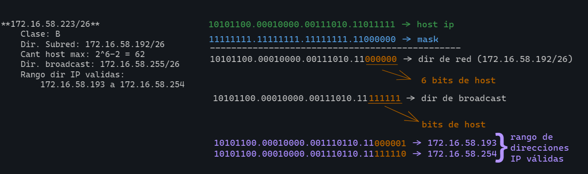
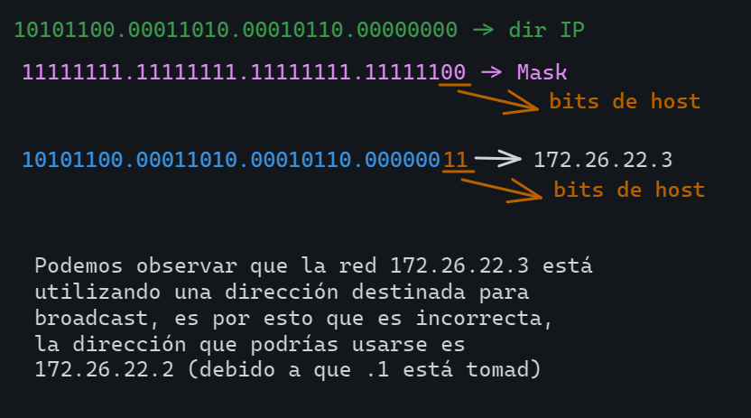
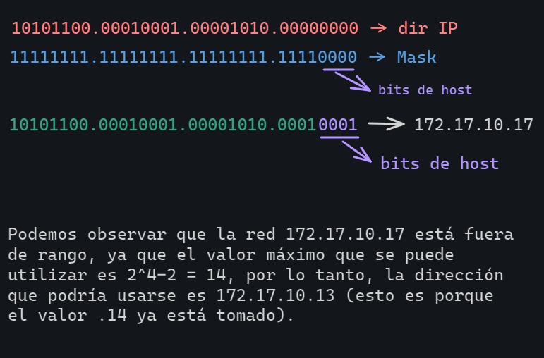
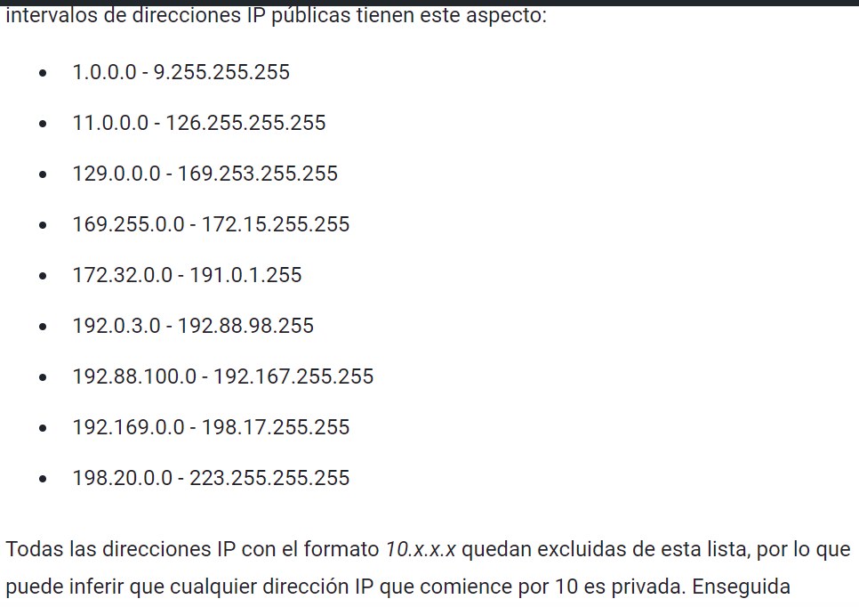
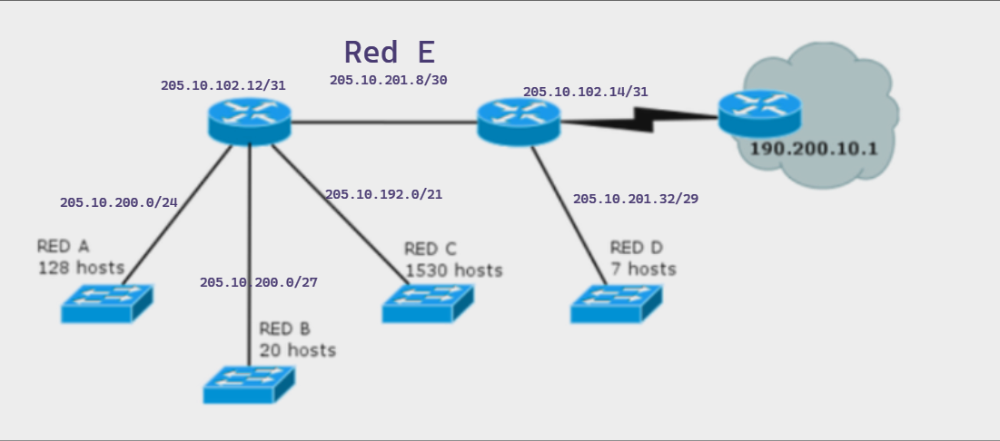
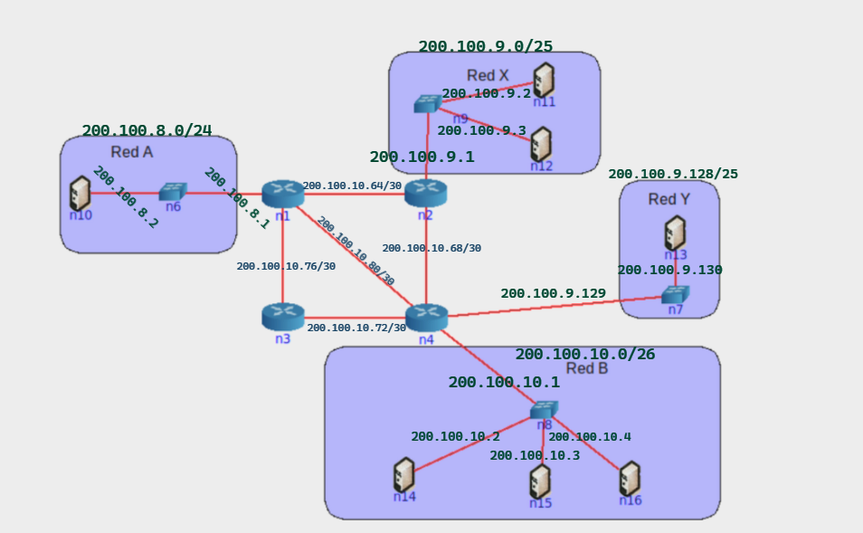
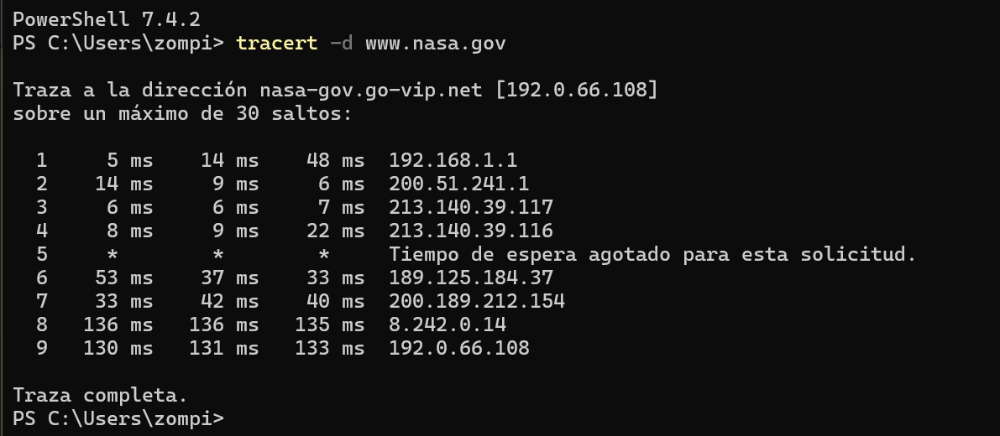
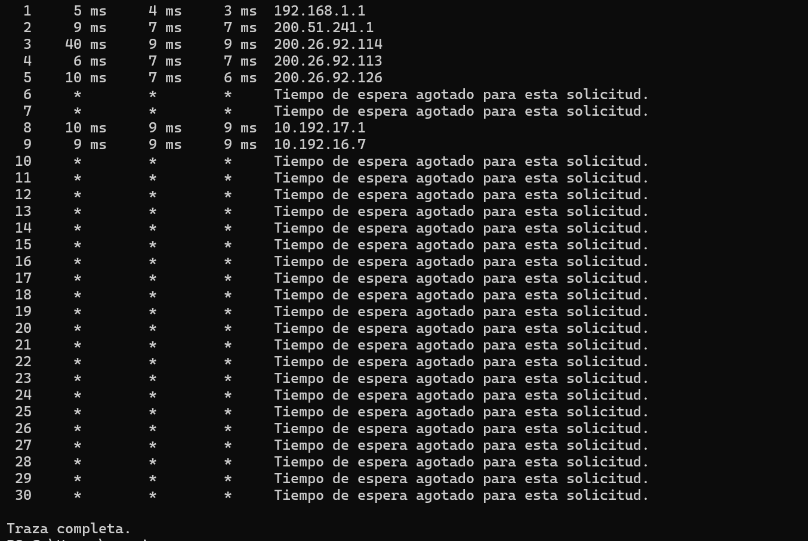

# PRÁCTICA 7 - CAPA DE RED: DIRECCIONAMIENTO

## Introducción
1. ¿Qué servicios presta la capa de red? ¿Cuál es la PDU en esta capa? ¿Qué dispositivo es considerado sólo de la capa de red?

Es una capa la cual proporciona conectividad y selección de ruta entre dos sistemas de hosts que pueden estar ubicados en posiciones geográficas distintas.
Los servicios que ofrece son: direccionamiento, ruteo, (de)multiplexación de las capas superiores y evitar tener paquetes libres que estén dando vueltas por la red.

La PDU de la capa de red es llamada **Paquete o Datagrama** y el dispositivo que es considerado solamente de la capa de red es el **router**.

---
2. ¿Por qué se lo considera un protocolo de mejor esfuerzo?

Esto se debe a que no garantiza que los datos lleguen en el orden que fueron enviados (o que ni siquiera lleguen efecitvamente) a su destino, debod a que los usuarios reciben el mejor servicio posible en ese momento dependiendo el tráfico de red.

---

3. ¿Cuántas redes clase A, B y C hay? ¿Cuántos hosts como máximo pueden tener cada una?

**Redes Clase A (/8):** va desde 0.0.0.0 a 127.255.255.255, su primer octeto inicia con un valor que va del 1 al 126 (por lo tanto tenemos 2^7 = 127 redes) y nos quedan 24 bits dedicados para host, con lo cual tenemos 2^24-2 = 16.777.214 hosts. En el caso de las direcciones 0.0.0.0(1) y la 127.0.0.0(2), son direcciones que se encuentran reservadas, (1) debido a que es una ruta por defecto y (2) hace referencia al equipo local. 

**Redes Clase B (/16):** va desde 128.0.0.0 a 191.255.255.255 (hay 2^14= 16384 redes) y quedan 16 bits dedicados para hosts, con lo que tenemos en total 2^16 - 2 = 65.534 hosts.

**Redes Clase C (/24):** va desde 192.0.0.0 a 223.255.255.255 (hay 2^21 = 2.097.152 redes) y quedan 8 bits dedicados para hosts 2^8-2 = 254 hosts.

---

4. ¿Qué son las subredes? ¿Por qué es importante siempre especificar la máscara de subred asociada?

Las subredes son un métodos ara dividir una red en segmanetos más pequeños, permitiendo que se puedan generar redes dentro de una red y aprovechar de esta forma el espacio de direcciones y el uso de muchos equipos. Es una sección de una red que se defina por una dirección IP y una máscara de subres específicas.

Para poder hacer la división de una red, se toma una parte del hostID.

Es importante que se especifique la máscara de red, ya que la misma determina cuuántos bits se utilizarán para el ID de subred y cuántos para el ID de host.

---
5. ¿Cuál es la finalidad del campo Protocol en la cabecera IP? ¿A qué campos de la capade transporte se asemeja en su funcionalidad? 

El campo Protocol es un campo de 8 bits que, especifica el protocolo de la capa superior al que se le entrega el paquete IP. Es útil para que el dispositvo de destino sepa cómo interpretar y procesar los datos contenidos en el paquete. Puede contener valores numéricos que representan diferentes protocols de la capa de transporte.

---
## División en subredes

6. Para cada una de las siguientes direcciones IP (172.16.58.223/26, 163.10.5.49/27, 128.10.1.0/23, 10.1.0.0/24, 8.40.11.179/12) determine:
    a. ¿De qué clase de red es la dirección dada (Clase A, B o C)?
    b. ¿Cuál es la dirección de subred?
    c. ¿Cuál es la cantidad máxima de hosts que pueden estar en esa subred?
    d. ¿Cuál es la dirección de broadcast de esa subred?
    e. ¿Cuál es el rango de direcciones IP válidas dentro de la subred?

**172.16.58.223/26**

**163.10.5.49/27**
    Clase: B
    Dir. Subred: 165.10.5.32/27 (10100011.00001010.00000101.00100000/27)
    Cant host max: 2^5-2 = 30
    Dir. broadcast: 163.10.5.63/27 (10100011.00001010.00000101.00111111/27)
    Rango dir IP validas: 165.10.5.33/27 a 163.10.5.62/27 
                    (10100011.00001010.00000101.00100001 a 10100011.00001010.00000101.00111110)
**128.10.1.0/23**
    Clase: B
    Dir. Subred: 128.10.0.0 (10000000.00001010.00000000.00000000/23)
    Cant host max: 2^9-2 = 510
    Dir. broadcast: 128.10.1.255 (10000000.00001010.00000001.11111111/23)
    Rango dir IP validas: 128.10.0.1/23 a 128.10.1.254/23
**10.1.0.0/24**
    Clase: A
    Dir. Subred: 10.1.0.0/24 (00001010.00000001.00000000.00000000/24) 
    Cant host max: 2^8-2 = 254
    Dir. broadcast: 10.1.0.255/24 (00001010.00000001.00000000.11111111/24)
    Rango dir IP validas: 10.1.0.1/24 a 10.1.0.254
            (00001010.00000001.00000000.000000001/24 a 00001010.00000001.00000000.11111110/24)
**8.40.11.179/12**
    Clase: A
    Dir. Subred: 8.32.0.0/12 (00001000.00100000.00000000.00000000/12)
    Cant host max: 2^20-2 = 1.048.574
    Dir. broadcast: 8.47.255.255 (00001000.00101111.11111111.11111111/12)
    Rango dir IP validas: 8.32.0.1/12 a 8.47.255.254/12
             (00001000.00100000.00000000.00000001/12 a 00001000.00101111.11111111.11111110/12)

**NOTA: (1)Para conocer la dirección de subred correspondiente, lo que debemos hacer es una operación AND entre la dirección de red dada y su máscara. (2) Para conocer la dirección de broadcast, debemos pasar todos los bits de host al valor 1. (3) La cantidad de host máxima se calcula haciendo (2^bits_de_host - 2) (4) El rango de direcciones IP válidas, lo obtenemos modificando de A UNO y de DERECHA a IZQUIERDA el valor de los bits de host.**

---
7. Su organización cuenta con la dirección de red 128.50.10.0. Indique:
    a. ¿Es una dirección de red o de host?
    b. Clase a la que pertenece y máscara de clase.
    c. Cantidad de hosts posibles.
    d. Se necesitan crear, al menos, 513 subredes. Indique:
        i. Máscara necesaria.
        ii. Cantidad de redes asignables.
        iii. Cantidad de hosts por subred.
        iv. Dirección de la subred 710.
        v. Dirección de broadcast de la subred 710.

Debido a que el ID de host está totalmente en cero, podemos decir, que la dirección es de host.

Dirección dada en binario (128.50.10.0) => 10000000.00110010.00001010.00000000

La dirección dada pertenece a la clase B, y la máscara de dicha clase es 255.255.0.0.
La cantidad de host posibles es 2^16-2 = 65.534

Para poder crear las 513 ssubredes, debemos modificar la máscara, ya que con la máscara acutual, no nos alcanza para poder crearlas. Esto lo hacemos de la siguiente forma:
(1) vemos cuantos bits necesitamos para poder crear las 513 subredes, en este caso serán 10 bits, ya que 2^10 nos permite representar hasta 1024 subredes (no usamos 2^9, porque 9 bits nos permiten representar hasta 512 subredes y en este caso, no nos alcanza). Por lo tanto, la nueva máscara será => 255.255.255.192 (11111111.11111111.11111111.11000000).

*Nota: los números en rojo son los asignados a subred*

Con 10 bits, tenemos hasta 1024 redes asignables.
La cantidad de hosts por subred es 62 (2^6 - 2).

Para poder obtener la dirección de la subred 710, lo que debemos hacer, es pasar a binario el número menos 1, esto se debe a que en binario la primer subred válida es 0, entonces nos quedaría:
    710 - 1 = 709 => 10110001 01
    10000000.00110010.10110001.01000000 => 128.50.177.64
    *Nota: en violeta se pueden ver los bits que obtuvimos de la conversión del número 709 a binario*

Los bits que cambiamos por el valor obtenido del número 709 a binario, en este caso son el 3er octeto y los 2 bits más significativo del 4to octeto, esto se debe a que los únicos bits que podemos modificar, son aquellos que pertenecen a subredes.

Para poder conocer la dirección de broadcast, lo que debemos hacer es los bits restantes (son los que perteneces a host), debemos modificarlos al valor 1, por lo tanto, la dirección de broadcast sería:
10000000.00110010.10110001.01111111 => 128.50.177.127

---
8. Si usted estuviese a cargo de la administración del bloque IP 195.200.45.0/24
    a. ¿Qué máscara utilizaría si necesita definir al menos 9 subredes?
    b. Indique la dirección de subred de las primeras 9 subredes.
    c. Seleccione una e indique dirección de broadcast y rango de direcciones asignables en esa subred.

195.200.45.0 => 11000011.11001000.00101101.00000000
/24 => 11111111.11111111.11111111.00000000

Para poder definir 9 subredes, necesito al menos 4 bits (2^4 = 16), los cuales me permiten definir hasta 16 subredes, no puedo utilizar 3 bits debido a que 2^3 = 8 no me alcanzan.
Por lo tanto, la nueva máscara sería: 11111111.11111111.11111111.11110000

Para poder obtener las drecciones correspondientes a las subredes, lo que debo hacer es modificar de a uno los últimos 4 dígitos que dije que voy a utilizar para las subredes de la siguiente forma:

11000011.11001000.00101101.00000000 => 195.200.45.0
11000011.11001000.00101101.00010000 => 195.200.45.16
11000011.11001000.00101101.00100000 => 195.200.45.32
11000011.11001000.00101101.00110000 => 195.200.45.48
11000011.11001000.00101101.01000000 => 195.200.45.64
11000011.11001000.00101101.01010000 => 195.200.45.80
11000011.11001000.00101101.01100000 => 195.200.45.96
11000011.11001000.00101101.01110000 => 195.200.45.112
11000011.11001000.00101101.10000000 => 195.200.45.128
11000011.11001000.00101101.10010000 => 195.200.45.144

En mi caso la red seleccionada es: 
**195.200.45.64/28** => 11000011.11001000.00101101.01000000

La dirección de broadcast es: 11000011.11001000.00101101.01001111 => 195.200.45.79/28
El rango de direcciones asignables es: 195.200.45.65/28 a 195.200.45.78/28

---
9. Dado el siguiente gráfico:
    <!-- * INSERTAR IMAGEN -->
    
    a. Verifique si es correcta la asignación de direcciones IP y, en caso de no serlo, modifique la misma para que lo sea.
    b. ¿Cuántos bits se tomaron para hacer subredes en la red 10.0.10.0/24? ¿Cuántas subredes se podrían generar?
    c. Para cada una de las redes utilizadas indique si son públicas o privadas.

Las direcciones IP que se encuentran mal asignadas son:

**172.26.22.3**

**172.17.10.17**

Redes Privadas:
172.26.22.0
172.17.10.0
192.168.5.0
10.0.10.0

Redes Públicas:
191.26.145.0

---
## CIDR
10. ¿Qué es CIDR (Classless Interdomain routing)? ¿Por qué resulta útil?

Es un método de asignación de direcciones IP que mejora la eficiencia del enrutamiento de datos en internet, utilizado por las organizaciones para asignar direcciones IP de manera flexible y eficiente en sus redes.

Permite reducir el tamaño de la tabla de rutas, haciendo que el sistema sea más eficiente.

---
11. ¿Cómo publicaría un router las siguientes redes si se aplica CIDR?
    a. 198.10.1.0/24
    b. 198.10.0.0/24
    c. 198.10.3.0/24
    d. 198.10.2.0/24

198.10.0.0/22
11111111.11111111.11111111.00000000 => máscara original /24
11111111.11111111.11111100.00000000 => máscara CIDR /22 

Podemos ver que esta nueva red 198.10.0.0/22 contienen a todas las redes mencionadas anteriormente.

---
12. Listar las redes involucradas en los siguientes bloques CIDR:
    * 200.56.168.0/21
    * 195.24.0.0/13
    * 195.24/13

**200.56.168.0/21**

Red de clase C, su máscara por default es /24

11001000.00111000.10101000.00000000 => 200.56.168.0
11111111.11111111.11111111.00000000 => 255.255.255.0 mask clase C
11111111.11111111.11111000.00000000 => 255.255.248.0 mask CIDR

Para poder saber hasta que red se involucra, lo que debemos hacer, es a esos (en este caso 3 bits) de la máscara CIDR, modificarlos a su valor máximo (todos 1):

11001000.00111000.10101000.00000000 => 200.56.168.0/24
11001000.00111000.10101111.00000000 => 200.56.175.0/24

**195.24.0.0/13**

Red de clase C, máscara por default /24

11000011.00011000.00000000.00000000 => 195.24.0.0
11111111.11111111.11111111.00000000 => 255.255.255.0 mask clase C
11111111.11111000.00000000.00000000 => 255.248.0.0 mas CIDR

Para poder saber hasta que red se involucra, lo que debemos hacer, es a esos (en este caso 11 bits) de la máscara CIDR, modificarlos a su valor máximo (todos 1):

11000011.00011000.00000000.00000000 => 195.24.0.0/24
11000011.00011111.11111111.00000000 => 195.31.255.0/24

**195.24/13**

Es igual que el caso de la red **195.24.0.0/13**, esto se debe a que cuando no tiene ningún número que represente a los dos octetos faltantes, es porque el mismo tiene el valor 0.

---
13. El bloque CIDR 128.0.0.0/2 o 128/2, ¿Equivale a listar todas las direcciones de red de clase B? ¿Cuál sería el bloque CIDR que agrupa todas las redes de clase A?

10000000.00000000.00000000.00000000 => 128.0.0.0
11111111.11111111.00000000.00000000 => 255.255.0.0 mask clase B
11000000.00000000.00000000.00000000 => 192.0.0.0 mask CIDR

Para poder saber hasta que red se involucra, lo que debemos hacer, es a esos (en este caso 14 bits) de la máscara CIDR, modificarlos a su valor máximo (todos 1):

10111111.11111111.00000000.00000000 => 191.255.0.0/16

Bloque para todas las redes de clase A

00000000.00000000.00000000.00000000 => 0.0.0.0
11111111.00000000.00000000.00000000 => 255.0.0.0 mask Clase A
10000000.00000000.00000000.00000000 => 128.0.0.0 mask CIDR

01111111.11111111.11111111.11111111 => 127.255.255.255/8

Por lo tanto, el bloque CIDR que representa a todas las redes de clase A es: 0.0.0.0/1

---

## VLSM

14. ¿Qué es y para qué se usa VLSM?

VLSM (Variable Legth Subnet Mask): es una técnica que permite asignar direcciones IP de manera eficiente dividiendo una red en subredes más pequeñas de diferentes tamaños, permitiendo usar más de una máscara de subred dentro de una misma red o subred, esto hace que las subredes creadas tengan diferentes tamaños y estén adaptadas específicamente a la cantidad de hosts necesarios para cada subred.

---
15. Describa, con sus palabras, el mecanismo para dividir subredes utilizando VLSM.

Para poder dividir subredes utilizando VLSM debemos:
* Tomar el segmento que más hosts requiere y realizar el subneting para él.
* De las subredes obtenidas, asignar todas las que se puedan con el menor desperdicio posible.
* Si quedan segmentos de red sin una subred asginada, volver al primer.
**Copy paste de la teoría**

Básicamente con mis propias palabras, se agarra el segmento que necesita más hosts, hacemos la subdivisión de redes. Una vez que tenemos las subredes, intentamos asignarlas a todas o al menos las que se puedan para no andar teniendo subredes al dope. En caso de que quede algún semgneto sin subred porque hicimos muy pocas, tenemos que volver a tomar el segmento que más hosts requiere y hacer toda la bola de nuevo, hasta que todos los segmentos tengan una subred asignada.

---
16.  Suponga que trabaja en una organización que tiene la red que se ve en el gráfico y debe armar el direccionamiento para la misma, minimizando el desperdicio de direcciones IP. Dicha organización posee la red 205.10.192.0/19, que es la que usted deberá utilizar.

    
    a. ¿Es posible asignar las subredes correspondientes a la topología utilizando subnetting sin VLSM? Indique la cantidad de hosts que se desperdicia en cada subred.
    b. Asigne direcciones a todas las redes de la topología. Tome siempre en cada paso la primera dirección de red posible.
    c. Para mantener el orden y el inventario de direcciones disponibles, haga un listado de todas las direcciones libres que le quedaron, agrupándolas utilizando CIDR.
    d. Asigne direcciones IP a todas las interfaces de la topología que sea posible.

a) Debido a que se tienen 4 redes (Red A, Red B, Red C y Red D) y que además se neceita comunicar con los routers los cuales son 2, necesito en total 6 subredes, con lo cual, debo utilizar 3 bits más de los que quedaban para host.

11111111.11111111.11100000.00000000 => 255.255.224.0 mask de red /19

*Nota: los bits que están en color rojo, son los que se utilizaran para hacer las 6 subredes*
Utilizo 3 bits, ya que como tengo que hacer 6 subredes, 2^3=8.

11111111.11111111.11111100.00000000 => 255.255.224.0 mask de subred /22

Ahora bien, tengo a la Red C que necesita un total de 1530 hosts, para los cuales necesitaría tomar en total 11 bits con los cuales podría hacer hasta 2048 hosts, pero no me alcanzan los bits sobrantes, es por esto, que no puede hacerse.

b) Tenemos la red 205.10.192.0/19 
11001101.00001010.11000000.00000000 => 205.10.192.0
11111111.11111111.11100000.00000000 => Mask de red /19

* Vamos a asignar IP a red C:
Red C necesita 1530 hosts, por lo tanto vamos a necesitar tener 11 bits para host, ya que esto nos permite tener hasta 2048 (2^11 = 2048) hosts. Para lograr esto, debemos modificar la máscara de red y obtener una nueva máscara para esta subred. Tenemos que dejar en 0 únicamente los bits que serán utilizados para host, el resto de los bits (los cuales serán utilizados para subredes) deben tener el valor 1, por lo tanto, la nueva máscara de subred nos quedará:

1111111.1111111.111<strong style="color:blue">11</strong>000.0000000 => Nueva Mask de subred /21
*En rojo están los bits que serán utilizados para host y en azul, aquellos bits que ganamos para hacer subredes*
Por lo tanto, ahora debemos modificar nuestra dirección IP original en los 2 bits que ganamos luego de hacer la actualización de la máscara:

11001101.00001010.11000000.0000000 => Red C 205.10.200.0/21
11001101.00001010.110<strong style="color:blue">01</strong>000.00000000 => red libre que utilizaremos para seguir dividiendo

* Vamos a asignar IP a red A:
Red A necesita 128 hosts, por lo tanto, vamos a necesitar 8 bits para hosts, los cuales nos permiten tener hasta 256 hosts (2^8=256). Para poder lograr esto, ahora debemos modificar la máscara de subred obtenida anteriormente (la que obtuvimos para la red C), en la cual ahora, nos deben quedar solamente 8 bits en 0:

1111111.1111111.1111000.0000000 => Mask de subred anterior /21
1111111.1111111.11111<strong style="color:blue">111</strong>.0000000 => Nueva Mask de subred /24
*En rojo están los bits que serán utilizados para host y en azul, aquellos bits que ganamos para hacer subredes*
En este caso, vemos que ganamos 3 bits para poder hacer subredes (combinaciones obtenidas: 000,001,010,011,100,101,110,111), ahora hacemos la actualización:

11001101.00001010.11001<strong sytle="color:blue">000</strong>.0000000 => Red A 205.10.200.0/24
11001101.00001010.11001<strong sytle="color:blue">001</strong>.0000000 => 205.10.201.0/24 red libre que utilizaremos para seguir dividiendo

* Vamos a asignar IP a red B:
Red B necesita 20 hosts, por lo tanto, vamos a necesitar 5 bits para hosts, los cuales nos permiten tener hasta 32 hosts (2^5=32). Para poder lograr esto, modificamos la máscara de subred obtenida para la red A, y ahora nos deben quedar únicamente 5 bits en 0:

11111111.11111111.11111111.<strong style="color:blue">111</strong><strong style="color:red">00000</strong> => /27
*En rojo están los bits que serán utilizados para host y en azul, aquellos bits que ganamos para hacer subredes*
En este caso, podemos ver que igual que nos pasó para la red A, ganamos 3 bits para hacer subredes, ahora hacemos la actualización:

11001101.00001010.11001001.<strong style="color:blue">000</strong>00000 => Red B 205.10.201.0/27
11001101.00001010.11001001.<strong style="color:blue">001</strong>00000 => 205.10.201.32/27 red libre que utilizaremos para seguir dividiendo

* Vamos a asignar IP a red D:
Para la Red D, la cual necesita 7 hosts, vamos a necesitar 3 bits para host, los cuales nos permiten tener hasta 8 hosts (2^3=8). Modificamos la máscara de subred obtenida de la red B y nos deben quedar únicamente 3 bits en 0:

11111111.11111111.11111111.111<strong style="color:blue">11</strong><strong style="color:red">000</strong> => /29
*En rojo están los bits que serán utilizados para host y en azul, aquellos bits que ganamos para hacer subredes*
Podemos ver que al igual que nos pasó para la Red C, ganamos 2 bita para hacer subredes (combinaciones: 00,01,10,11), hacemos la actualización: 

11001101.00001010.11001001.000<strong style="color:blue">00</strong>000 => Red D 205.10.201.0/29

* Red E (red punto a punto)
Necesita 4 hosts, por lo tanto utilizamos 2 bits, los cuales generarían un total de 4 hosts (2^2=4).

11001101.00001010.11001001.00001000 => 205.10.201.8/29
11111111.11111111.11111111.11111000 => Máscara de subred anteriord /29
11111111.11111111.11111111.11111100 => Máscara de subred nueva /30

11001101.00001010.11001001.00001<strong>0</strong>00 => 205.10.201.8/30 Red E
11001101.00001010.11001001.00001<strong>1</strong>00 => 205.10.201.12/30 red para subdividir

Como me queda un segmento sin IP, lo que hago es dividir nuevamente la red que me quedó disponible en la asignación de Red E:

11001101.00001010.11001001.00001100 => 205.10.201.12/30
11111111.11111111.11111111.11111100 => Máscara de subred anterior /30
11111111.11111111.11111111.11111110 => Máscara de subred nueva /31

11001101.00001010.11001001.00001100 => 205.10.102.12/31
11001101.00001010.11001001.00001110 => 205.10.102.14/31

<!-- ! Inciso C) CONSULTAR SOBRE CIDR -->

---
17.  Utilizando la siguiente topología y el bloque asignado, arme el plan de direccionamiento IPv4 teniendo en cuenta las siguientes restricciones:
    <!-- * INSERTAR IMAGEN -->
    
    a. Utilizar el bloque IPv4 200.100.8.0/22.
    b. La red A tiene 125 hosts y se espera un crecimiento máximo de 20 hosts.
    c. La red X tiene 63 hosts.
    d. La red B cuenta con 60 hosts
    e. La red Y tiene 46 hosts y se espera un crecimiento máximo de 18 hosts.
    f. En cada red, se debe desperdiciar la menor cantidad de direcciones IP posibles. En este sentido, las redes utilizadas para conectar los routers deberán utilizar segmentos de red /30 de modo de desperdiciar la menor cantidad posible de direcciones IP.

Partimos del bloque 200.100.8.0/22 => 11001000.01100100.00001000.00000000
b) Para la red A, la cual necesita un total de 145 hosts (125+20), se necesitarán en total 8 bits para hosts (2^8=256), por lo tando, debemos modificar la máscara:

11111111.11111111.11111100.0000000 => mask /22
11111111.11111111.111111<strong style="color:red">11</strong>.0000000 => nueva mask /24
Ganamos 2 bits para hacer subredes, los mismos se encuentran marcados en rojo.

11001000.01100100.000010<strong style="color:blue">00</strong>.00000000 => Red A 200.100.8.0/24
11001000.01100100.000010<strong style="color:blue">01</strong>.0000000 => 200.100.9.0/24 red disponible para seguir dividiendo
11001000.01100100.000010<strong style="color:blue">10</strong>.0000000 => 200.100.10.0/24 red disponible para seguir dividiendo

c y e) Para la red X se necesitan 63 hosts y para la red Y se necesitan 64 hosts (46+18), por lo tanto vamos a necesitar 7 bits para hosts (2^7=128), por lo tanto tenemos:

Partimos de una de las redes disponibles para dividir que obtuvimos en A:
11001000.01100100.000010<strong style="color:blue">01</strong>.0000000 => 200.100.9.0/24

Modificamos la máscara para que nos queden únicamente 7 bits en 0, son los que se van a utilizar para hosts:
1111111.11111111.11111111.<strong style="color:blue">1</strong><strong style="color:red">0000000</strong> => Nueva mask /25
*En azul está el bit que ganamos para hacer subredes y en rojo los bits que se utilizarán para host*

11001000.01100100.00001001.00000000 => 200.100.9.0/25 Red X
11001000.01100100.00001001.10000000 => 200.100.9.128/25 Red Y

No me quedan redes para seguir subdividiendo.

d) Para la red B necesitamos 60 hosts, con lo cual necesitaremos 6 bit para hosts (2^6=64):

Partimos de otra de las redes disponibles para dividir que obtuvimos en A, ya que en el inciso anterior, no nos quedaron redes disponibles para dividir:
11001000.01100100.000010<strong style="color:blue">10</strong>.0000000 => 200.100.10.0/24

Modificamos la máscara para que nos queden únicamente 6 bits en 0:
11111111.11111111.11111111.<strong style="color:blue">11</strong><strong style="color:red">000000</strong> => Nueva mask /26
*En azul están los bits que ganamos para hacer subredes y en rojo los bits que se utilizarán para host*

11001000.01100100.00001010.00000000 => 200.100.10.0/26 Red B

11001000.01100100.00001010.01000000 => 200.100.10.64/26 => red disponible para seguir siendo dividia
11001000.01100100.00001010.10000000 => 200.100.10.128/26
11001000.01100100.00001010.11000000 => 200.100.10.192/26

f) Ahora tenemos que generar las direcciones IP para conectar los routers, como nos indica en el enunciado, debemos utilizar /30 para desperdiciar la menor cantidad de hosts posbiles, esto se debe a que necesita únicamente 4 hosts, los cuales los podemos obtener con solamente 2 bits (2^2=4):

Partimos de una de las redes disponibles para dividir que obtuvimos en Red B:
11001000.01100100.00001010.01000000 => 200.100.10.64/26

Modificamos la máscara para que nos quede /30:
11111111.11111111.11111111.11<strong style="color:blue">1111</strong><strong style="color:red">00</strong>
*En azul están los bits que ganamos para hacer subredes y en rojo los bits que se utilizarán para host*

11001000.01100100.00001010.01 0000 00 => N1-N2 200.100.10.64/30
11001000.01100100.00001010.01 0001 00 => N2-N4 200.100.10.68/30
11001000.01100100.00001010.01 0010 00 => N4-N3 200.100.10.72/30
11001000.01100100.00001010.01 0011 00 => N3-N1 200.100.10.76/30
11001000.01100100.00001010.01 0100 00 => N1-N4 200.100.10.80/30

Redes disponible para seguir dividiendo:
11001000.01100100.00001010.01 0101 00 => 200.100.10.84/30
11001000.01100100.00001010.01 0110 00 => 200.100.10.88/30
11001000.01100100.00001010.01 0111 00 => 200.100.10.92/30

---
18. Asigne direcciones IP en los equipos de la topología según el plan anterior.

---
## ICMP y Configuraciones IP
19. Describa qué es y para qué sirve el protocolo ICMP.
    a. Analice cómo funciona el comando ping.
        i. Indique el tipo y código ICMP que usa el ping.
        ii. Indique el tipo y código ICMP que usa la respuesta de un ping
    b. Analice cómo funcionan comandos como traceroute/tracert de Linux/Windows y cómo manipulan el campo TTL de los paquetes IP.
    c. Indique la cantidad de saltos realizados desde su computadora hasta el sitio www.nasa.gov. Analice:
        i. Cómo hacer para que no muestre el nombre del dominio asociado a la IP de cada salto.
        ii. La razón de la aparición de * en parte o toda la respuesta de un salto.
    d. Verifique el recorrido hacia los servidores de nombre del dominio unlp.edu.ar. En base al recorrido realizado, ¿podría confirmar cuál de ellos toma un camino distinto?

El protocolo ICMP es un protocolo de red que se utiliza para comunicar problemas con la transmisión de datos en una red. Se utiliza para:
* Informar errores de transmisión de datos.
* Realizar diagnósticos de red.
* Realizar pruebas de red.

a) El comando *ping* es una herramienta de diagnóstico que permite hacer una verificación del estado de una determinada conexión (permite saber si una dirección IP específica es accesible o no desde la red).
Básicamente envía un mensaje de solicitud y espera una respuesta, con esto mide el tiempo que tarda en viajar la solicitud y regresar la respuesta.
Muestra el RTT mínimo, máximo, promedio y la desviación estándar, y también la pérdida de paquetes, con lo cual permite diagnosticar problemas de conectividad.
    i) El comando ping envía un paquete ICMP tipo 8 (Echo Request) con código 0 (el cual especifica que es una solicitud estándar). Dicho paquete contiene un mensaje de solicitud echo.
    ii) El host que recibió la solicitud responde con un paquete ICMP tipo 0 con código 0 (respuesta estándar sin código específico).

b) Los comandos *traceroute* y *tracert* rastrean la ruta de un paquete IP ajustando el campo TTL del paquete (inician con un TTL bajo y lo van aumentando). Cada salto de red reduce el TTL y envía una respuesta ICMP.
El comando registra las direcciones IP de los saltos intermedios, con lo cual podemos ver la ruta desde el oriigen hasta el destino. 

c)
    i) Para que no se muestre el nombre del dominio asociado a la IP en cada salto, se le puede agregar la opción **-d** al comando tracert.
    ii)El asterísico (*) indica que ese enrutador o dispositivo de red no respondió a la solicitud hecha. Puede ser también una medida de seguridad, configuración o simplemente es que el enrutador no responde a las solicitudes.
d) 
No se puede verificar el recorrido, debido a que todas las respuestan dan como resultado "Tiempo de espera agotado para esta solicitud"..

---
20. ¿Para que se usa el bloque 127.0.0.0/8? ¿Qué PC responde a los siguientes  comandos?
    a. ping 127.0.0.1
    b. ping 127.0.54.43

El bloque 127.0.0.0/8 es un rango de direcciones IP reservadas para direcciones de loopback, también conocidas como direcciones locales o localhost. Se utiliza para permitir que un dispositivo pueda comunicarse consigo mismo, esto es útil para la prueba de aplicaciones y servicios de red sin necesidad de acceder a una red real.

Ambos comandos *ping* recibibiran una respuesta de la propia computadora.

---
21. Investigue para qué sirven los comandos ifconfig y route. ¿Qué comandos podría utilizar en su reemplazo? Inicie una topología con CORE, cree una máquina y utilice en ella los comandos anteriores para practicar sus diferentes opciones, mínimamente:
    * Configurar y quitar una dirección IP en una interfaz.
    * Ver la tabla de ruteo de la máquina.

El comando *ifconfig* se utiliza para configurar y visualizar información de interfaces de red en sistemas Linux. Se recomienda utilizar IP como alternativa para una funcionalidad más avanada.

El comando *route* muestra y modifica la tabla de enrutamiento en sistemas Linux. En sistemas más recientes se puede utilizar *ip route* o *netstat -r* para ver la tabla de enrutamiento, e *ip route add* para agregar rutas e *ip route del* para eliminar rutas.