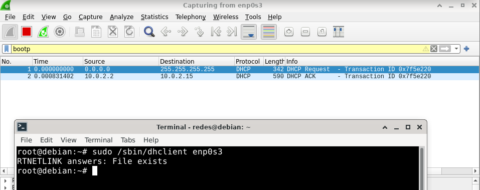
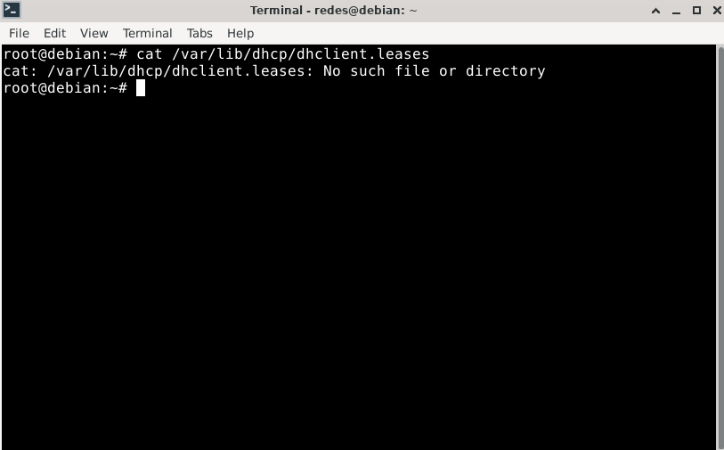
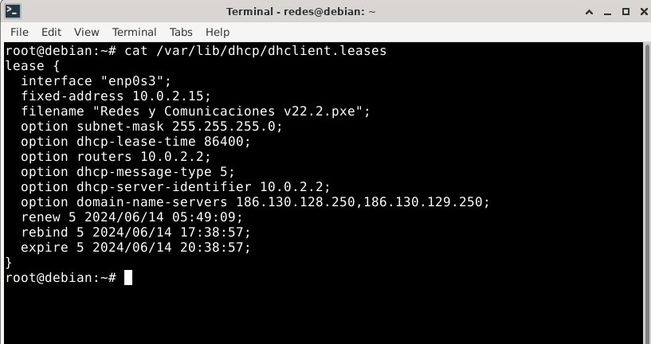
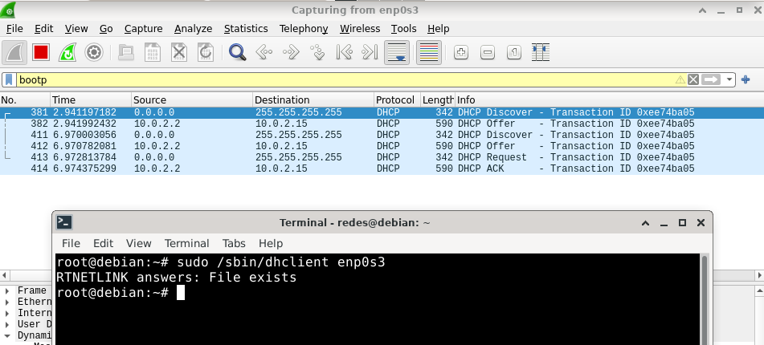

# PRÁCTICA 8 - CAPA DE RED: FRAGMENTACIÓN - RUTEO

## Fragmentación
1. Se tiene la siguiente red con los MTUs indicados en la misma. Si desde pc1 se envía un paquete IP a pc2 con un tamaño total de 1500 bytes (cabecera IP más payload) con el campo Identification = 20543, responder:

* Indicar IPs origen y destino y campos correspondientes a la fragmentación cuando el paquete sale de pc1
* ¿Qué sucede cuando el paquete debe ser reenviado por el router R1?
* Indicar cómo quedarían los paquetes fragmentados para ser enviados por el enlace entre R1 y R2.
* ¿Dónde se unen nuevamente los fragmentos? ¿Qué sucede si un fragmento no llega?
* Si un fragmento tiene que ser reenviado por un enlace con un MTU menor al tamaño del fragmento, ¿qué hará el router con ese fragmento? Ruteo

a) 
```
    IP origen: 10.0.0.20
    IP destino: 10.0.2.20
    Identificación: 20543
    Longitud total: 1500
    Flag DF: 0 (false)
    Flag MF: 0 (false)
    Offset de fragmento: 0
```

b y c)
Para poder hacer este ejercicio, tenemos que tener en cuenta ciertas cosas:
* El header de identificación siempre es 20543
* Se pone el flag MF en true, salvo en el último fragmento.
* Como el MTU es de 600 bytes (20 son headers), tenemos que dividir el paquete en diferentes fragmentos, cada uno tiene que tener un tamaño menor o igual a 600 bytes. Esto lo logramos de la siguiente forma:
  * tomamos 600 bytes, a los cuales les restamos 20 bytes (headers) => 600 - 20 = 580, el problema que tenemos con 580 es que no es múltiplo de 8, con lo cual, tenemos que buscar el siguiente número más bajo que sí lo sea, en este caso 576.
  * Debido a que el campo Total Length incluye la longitud de los headers será de 576 + 20 = 596
  * Por lo tanto faltarán por enviarse 1480 - 576 = 904 bytes


```
Fragmento 1
    Header: 20
    Tamaño total: 596
    Identificación: 20543
    DF Flag: 0
    MF Flag: 1
    Fragment Offset: 0

Fragmento 2
    Header: 20
    Tamaño total: 596
    Identificación: 20543
    DF Flag: 0
    MF Flag: 1
    Fragment Offset: 72

Fragmento 3
    Header: 20
    Tamaño total: 348
    Identificación: 20543
    DF Flag: 0
    MF Flag: 0
    Fragment Offset: 144
```

* El fragment offset se calcula de la siguiente forma:
   sumatoria(tamaño_fragmento_anterior)/8
   Ej. En el caso del fragmento 2, sería 576 (596-20, ya que el tamaño total toma en cuenta a los headers (20 bytes)) => 576/8 = 72 => frgment Offset = 72

   En el caso del fragmento 3, sería (576+576)/8 = 144 (es 576 por lo mismo que en el ej anterior 596-20). 

d) Los fragmentos vuelven a unirse en el host destino (PC2). En caso de que un fragmento no llegue, dependientdo del protocolo de la capa de transporte, es posible que se deba volver a transmitir todos los fragmentos del paquete.

e) En ese caso, el router volverá a fragmentar ese fragmento, para poder enviarlo.

---
2. ¿Qué es el ruteo? ¿Por qué es necesario?

El ruteo es el proceso para determinar la ruta que deben seguir los datos o paquetes para llegar de un origen a un destino por medio de la red. Es decir, es la función de seleccionar la interfaz mediante la cual voy a enviar un dato, el cual será recibido por otro router (que también seleccionará la interfaz por donde lo va a recibir).

Es necesario ya que permite formar caminos entre el host origen y el host destino pasando por los nodos intermedios.

---
3. En las redes IP el ruteo puede configurarse en forma estática o en forma dinámica. Indique ventajas y desventajas de cada método.


| Estática  | Dinámica |
| :-------- | :------- |
| Simplicidad: es fácil de configurar y enteder.| Adaptabilidad: se ajusta automáticamente a cambios en la red (enlaces caídos, nuevas rutas,...). Mejora la resiliencia de la red.|
| Control Total: el administrador ded red tiene un control total sobre las rutas y puede diseñar la red según sus necesidades específicas.| Escalabilidad: es más adecuado para redes grandes y complejas, ya que la configuración se propaga automáticamente a través de la red.|
| Menos carga en la red: generalmente genera menos tráfico de enrutamiento en la red, debido a que las rutas se configuran manualmente y no cambian automáticamente.| Eficiendia de recursos: puede encontrar rutas óptimas en función de métricas como la velocidad o la carga de los enlaces, lo que mejora la eficiencia del tráfico.|


| Estática  | Dinámica |
| :-------- | :------- |
| No se adapta a cambios: no se ajusta automáticamente a cambios en la topología de la red, esto quiere decir que si una ruta falla o cambia, se tiene que actualizar manualmente.| Mayor complejidad: requiere un conocimiento más profundo, debido a que la configuración y el mantenimiento puede ser más complejo que cuando es estático.|
| No es escalable: en redes grandes y complejas, la gestión manual de rutas puede ser abrumadora y propensa a errores.| Mayor tráfico de enrutamiento: genera más tráfico de enrutamiento en la red, esto debido a que los routers intercambian información sobre las ruts, lo que puede consumir ancho de banda.|
| Menos eficiente en términos de tiempo: puede ser más demorado que utilizar enrutamiento dinámico en redes grandes.| Posible inestabilidad: si la configuración no se realiza de manera adecuada, el enrutamiento dinámico puede causar problemas de estabilidad en la red.|

---
4. Una máquina conectada a una red pero no a Internet, ¿tiene tabla de ruteo?

Si, esto se debe a que al estar conectada a una red local, tiene la tabla de enrutamiento que le permite gestionar la comunicación dentro de dicha red local. Esta tabla es necesaria para determinar cómo enviar datos entre los dispositivos que se encuentran conectados dentro de dicha red local.

---
5. Observando el siguiente gráfico y la tabla de ruteo del router D, responder:
    
    a. ¿Está correcta esa tabla de ruteo? En caso de no estarlo, indicar el o los errores   encontrados. Escribir la tabla correctamente (no es necesario agregar las redes que conectan contra los ISPs)
    b. Con la tabla de ruteo del punto anterior, Red D, ¿tiene salida a Internet? ¿Por qué? ¿Cómo lo solucionaría? Suponga que los demás routers están correctamente configurados, con salida a Internet y que Rtr-D debe salir a Internet por Rtr-C.
    c. Teniendo en cuenta lo aplicado en el punto anterior, si Rtr-C tuviese la siguiente entrada en su tabla de ruteo, ¿qué sucedería si desde una PC en Red D se quiere acceder un servidor con IP 163.10.5.15? Red Destino Mask Next-Hop Iface 163.10.5.0 /24 10.0.0.9 eth1
    d. ¿Es posible aplicar sumarización en la tabla del router Rtr-D? ¿Por qué? ¿Qué debería suceder para poder aplicarla?
    e. La sumarización aplicada en el punto anterior, ¿se podría aplicar en Rtr-B? ¿Por qué?
    f. Escriba la tabla de ruteo de Rtr-B teniendo en cuenta lo siguiente:
        * Debe llegarse a todas las redes del gráfico
        * Debe salir a Internet por Rtr-A
        * Debe pasar por Rtr-D para llegar a Red D
        * Sumarizar si es posible
    g. Si Rtr-C pierde conectividad contra ISP-2, ¿es posible restablecer el acceso a Internet sin esperar a que vuelva la conectividad entre esos dispositivos?

a) la tabla de ruteo no es correcta, podemos ver ciertos errores, como:
* La dirección de Next-Hop 10.0.0.5/30 no es correcta, debido a que la misma no debe tener la máscara.
* Falta la dirección 10.0.0.8 la cuál conecta el Rtr D con el Rtr C.
* La dirección de red 205.10.128.0 no existe en el gráfico.
* La dirección de red 205.20.0.128 no es válida, debido a que es una dirección de host, no de red.

|Red Destino | Mask | Next-Hop | iface |
|:-----------|:-----|:---------|:------|
|153.10.20.128 | /27 | - | eth1 |
|10.0.0.4 | /30 | - | eth0 |
|10.0.0.0 | /30 | - | eth5 |
|10.0.0.8 | /30 | - | eth3 |
|10.0.0.12 | /30 | 10.0.0.5 | eth0 |
|10.0.0.16 |/30 | 10.0.0.10 | eth3 |
|205.20.0.192| /26 | 10.0.0.5 | eth0 |
|205.20.0.128 | /26 | 10.0.0.5 | eth0 |
|163.10.5.64 | /27 | 10.0.0.10 | eth3 |
---
b) No tiene salida a internet, esto debidoa que a Rtr D le falta el gateway default (ninguna de sus entradas lleva a un ISP). Esto podría solucionarse usando a Rtr A o Rtr C como default gateway de la siguiente forma:

|Red Destino | Máscara | Sig. Gateway | Interfaz |
|:-----------|:--------|:-------------|:---------|
|0.0.0.0  | /0 | 10.0.0.10 | eth3 |

c) Se daría la siguiente secuencia:
* Rtr-D
    (1) recibe el paquete y decrementa el TTL
    (2) aplica la máscara de red y reconoce que el paquete se dirige a la red 0.0.0.0/0
    (3) para que siga su camino, lo envía al destino 10.0.0.10/30 a través de la interfaz eth3.

* Rtr-C 
    (1) recibe el paquete y decrementa el TTL
    (2) aplica la máscara de red y reconoce que el paquete se dirige a la red 163.10.5.0/24
    (3) para que siga su camino, lo envía al destino 10.0.0.9/30 a través de la interfaz eth1.

Los dos routers van a seguir haciendo lo descripto anteriormente, hasta que el TTL llegue a 0, cuando esto pase uno de los dos routers va a descartar el paquete.

d) Es posible realizar la sumarización en el caso de las redes 205.20.0.192/26 y 205.20.0.128/26, debido a que tienen el mismo salto, la misma máscara y la misma interfáz.

En este caso los primeros 25 bits son iguales en ambas cadenas, con lo cual, la red resultante (sumarizada) será:

| Dirección  | Mask| Next-Hop |iface |
|:-----------|:----|:---------|:-----|
| 205.20.0.1 | /25 | 10.0.0.5 | eth0 |

11001101.00010100.00000000.11000000 => 205.20.0.192/26
11001101.00010100.00000000.10000000 => 205.20.0.128/26

11111111.11111111.11111111.11000000 => Mask /26

Como tienen los primeros 25 bits iguales, lo que hacemos es restringir la máscara a /25.

e) Debido a que ambas redes se encuentran interconectadas (conectadas por medio del mismo router) y que tienen distinta interfáz, no se puede aplicar la sumarización en el Rtr-B.

f)

|Red Destino | Mask | Next-Hop | iface |
|:-----------|:-----|:---------|:------|
|205.20.0.192 | /26 | - | eth0 |
|205.20.0.128 | /36 | - | eth2 |
|10.0.0.12 | /30 | - | eth3 |
|10.0.0.4 | /30 | - | eth1 |
|10.0.0.8 | /30 | 10.0.0.6 | eth1 |
|10.0.0.16 |/30 | 10.0.0.13 | eth3 |
|10.0.0.0| /30 | 10.0.0.13 | eth3 |
|153.10.20.120 | /27 | 10.0.0.6 | eth1 |
|163.10.5.64 | /27 | 10.0.0.6 | eth1 |
|205.10.0.128 | /25 | 10.0.0.13 | eth3 |
|120.0.0.0| /30 | 10.0.0.13 | eth3 |
|130.0.10.0 | /30 | 10.0.0.13 | eth3 |
|0.0.0.0 | /0 | 10.0.0.13 | eth3 |

g) En caso de que eso pase, el acceso a internet podría ser reestablecido si los routers tienen en su tabla de ruteo la red ISP-1 (120.0.0.0/39), para la cual se debe pasar por Rtr-A.

---
6. Evalúe para cada caso si el mensaje llegará a destino, saltos que tomará y tipo de respuesta recibida en el emisor.

* Un mensaje ICMP enviado por PC-B a PC-C.
* Un mensaje ICMP enviado por PC-C a PC-B.
* Un mensaje ICMP enviado por PC-C a 8.8.8.8.
* Un mensaje ICMP enviado por PC-B a 8.8.8.8.

a) **PC-B envía mensaje ICMP a PC-C**
PC-B -> n7 -> router 2 -> 0.0.0.0 (salto)
router 2 -> router 1 -> 10.0.0.0 (salto)
router 1 -> router 3 -> 10.0.7.1 (salto)
router 3 -> n6 -> PC-C

Si o si para envíar el mensaje ICMP a la PC-C lo debe hacer por medio del router 1, esto se debe a que router 2 no tiene en la columna Gateway de su tabla la dirección de router 4. 
Por lo tanto el mensaje pasa de PC-B a n7 y luego a router 2, en la tabla de router 2, podemos ver que conocer a router 1 dado que la dirección de destino 0.0.0.0 con gateway en 10.0.0.1, coincide con la dirección de router 1 (10.0.0.1). Una vez en router 1, podemos ver en su tabla que la dirección de destino 10.0.0.0 con gateway en 10.0.3.1, coincide con la dirección correspondiente al router 3, por lo tanto envía el mensaje hacia el router 3 y una vez ahí, el mensaje pasa por n6 y luego llega finalmente a PC-C.

b) **PC-C envía mensaje ICMP a PC-B**
PC-C -> n6 -> router 3 -> 0.0.0.0 (salto)
router 3 -> router 4 -> 10.0.0.0 (salto)
router 4 -> router 2 -> 10.0.5.1 (salto)
router 2 -> n7 -> PC-B

Para poder enviar un mensaje ICMP desde PC-C a PC-B, el envío se debe hacer por medio del router 4, esto se debe a que la dirección de destino 0.0.0.0 del router 3, con gateway en 10.0.2.1, coincide con la dirección del router 4 (10.0.2.1). Y desde el router 4, se envía al router 2, ya que el router 4 en su dirección de destino 10.0.0.0 con gateway en la dirección 10.0.1.1, coincide con la dirección del router 2 (10.0.1.1).

c) **PC-C envía mensaje ICMP a 8.8.8.8**

Al realizar este envío, vemos que toma la dirección por default de router 3 (0.0.0.0 - 10.0.2.1), con lo cual envía el mensaje al router 4. Podemos ver que router 4 no tiene una dirección por default a la cual realizar el envío y tampoco tiene cargada en su tabla de ruteo a la dirección 8.8.8.8, por lo cual descartará el mensaje ICMP y devolverá un mensaje *ICMP Destination Network Unreachable* (ICMP tipo 3 y código 0 - Red inalcanzable).

d) **PC-B envía mensaje ICMP a 8.8.8.8**

Al realizar este envío, el mensaje toma la dirección por default de router 2, con lo cual el mensaje se envía hacia router 1; como en router 1 no se encuentra cargada la dirección 8.8.8.8, también toma la dirección por default, con lo cual el mensaje vuelve a ser enviado a router 2, esto ocurre repetidas veces hasta que el TTL sea igual a 0 (ICMP tipo 11 y código 0 - TTL agotado). 

## DHCP y NAT
7. Con la máquina virtual con acceso a Internet realice las siguientes observaciones respecto de la autoconfiguración IP vía DHCP:
    a. Inicie una captura de tráfico Wireshark utilizando el filtro bootp para visualizar únicamente tráfico de DHCP.
    b. En una terminal de root, ejecute el comando $ sudo /sbin/dhclient eth0 y analice el intercambio de paquetes capturado.
    c. Analice la información registrada en el archivo /var/lib/dhcp/dhclient.leases, ¿cuál parece su función?  
    d. Ejecute el siguiente comando para eliminar información temporal asignada por el servidor DHCP. $ rm /var/lib/dhcp/dhclient.leases
    e. En una terminal de root, vuelva a ejecutar el comando $ sudo /sbin/dhclient eth0 y analice el intercambio de paquetes capturado nuevamente ¿a que se debió la diferencia con lo observado en el punto “b”?
    f. Tanto en “b” como en “e”, ¿qué información es brindada al host que realiza la petición DHCP, además de la dirección IP que tiene que utilizar?






**Archivo dhclient.leases:** es un archivo de configuración utilizado por el cliente DHCP (DHCP client) en sistemas operativos Linux, en el cual se almacena la información de los alquileres de direcciones IP asignadas por un servidor DHCP. Este archivo es utilizado por el cliente DHCP para recordar los alquileres de direcciones IP asignados por el servidor DHCP.
Lo que sucede en caso de que se elimine dicho archivo (como hacemos en el inciso "d"), lo que sucede, es que DHCP se queda sin registro de las direcciones IP anteriores ni de los parámetros de configuración, por lo tanto al iniciar una conexión, se inicia una solicitud DHCP desdde cero, como si fuera la primera vez que se conecta a la red, con lo cual hay un nuevo intercambio de paquetes DHCP entre el cliente y el servidor.

f) La información que brinda el host es la siguiente:
* Dirección IP asignada.
* Máscara de subred
* Puerta de enlace predeterminada
* Servidores DNS
* Configuración proxy por WPAD (Web Proxy Auto-Discovery Protocol)
* Dirección IP del servidor DHCP que atendió la solicitud
* Dirección IP del servidor DHCP que atendió la solicitud
* Duración del arrendamiento/alquier (lease time)

---
8. ¿Qué es NAT y para qué sirve? De un ejemplo de su uso y analice cómo funcionaría en ese entorno. *Ayuda: analizar el servicio de Internet hogareño en el cual vario dispositivos usan Internet simultáneamente.*

NAT (Network Address Translation): es una tecnología que permite a un disposito, actuar como un router entre internet y una red local; con lo cual con una única dirección IP se puede representar a un grupo entero de computadoras.
La NAT se encarga de traducir la dirección IP pública de internet en una dirección IP privada de la red local, permitiendo de esta forma que los dispositivos de la red local se comuniquen con internet sin necesidad de tener direcciones IP públicas individuales.

En el caso de un servicio de internet de un hogar, el router tendrá una IP pública y los dispositivos que se encuentren conectados, cada una de sus interfaces tendrá una IP privada. En este caso la NAT perrmite que los paquetes entrantes desde internet (con destino a la IP pública) sean redirigidos a los distintos dispositivos (que tienen la IP privada) y viceversa.

---
9. ¿Qué especifica la RFC 1918 y cómo se relaciona con NAT?

Esta RFC define los rangos de direcciones IP privadas que son asignables a hosts internos a una red, según la cantidad de bits de la máscara (la cual puede ser de 24,20 o 16 bits).
La NAT en este caso, permite que sea viable utilizar las direcciones privadas definidas en esa RFC.

---
10. En la red de su casa o trabajo verifique la dirección IP de su computadora y luego acceda a www.cualesmiip.com. ¿Qué observa? ¿Puede explicar qué sucede?

Lo que ocurre es que las direcciones IP son distintas entre sí debiso a que la NAT del router convierte la IP privada en pública y la pública en privada.

---
11. Resuelva las consignas que se dan a continuación.
    a. En base a la siguiente topología y a las tablas que se muestran, complete los datos que faltan.
    
    ```
    PC-A (ss)
    Local Address:Port Peer Address:Port
    192.168.1.2:49273 __190.50.10.63:80__
    __192.168.1.2:37484__ 190.50.10.63:25
    192.168.1.2:51238__ 190.50.10.81:8080

    PC-B (ss)
    Local Address:Port Peer Address:Port
    192.168.1.3:52734 __190.50.10.81:8081__
    192.168.1.3:39275 __190.50.10.81:8080__

    RTR-1 (Tabla de NAT)
    Lado LAN          Lado WAN
    192.168.1.2:49273 205.20.0.29:25192
    192.168.1.2:51238 __205.20.0.29:16345__
    192.168.1.3:52734 205.20.0.29:51091
    192.168.1.2:37484 205.20.0.29:41823
    192.168.1.3:39275 205.20.0.29:9123

    SRV-A (ss)
    Local Address:Port Peer Address:Port
    190.50.10.63:80 205.20.0.29:25192
    190.50.10.63:25 205.20.0.29:41823

    SRV-B (ss)
    Local Address:Port Peer Address:Port
    190.50.10.81:8080 205.20.0.29:16345
    190.50.10.81:8081 205.20.0.29:51091
    190.50.10.81:8080 205.20.0.29:9123
    ```
    b. En base a lo anterior, responda:
        i. ¿Cuántas conexiones establecidas hay y entre qué dispositivos?
        ii. ¿Quién inició cada una de las conexiones? ¿Podrían haberse iniciado en sentido inverso? ¿Por qué? Investigue qué es port forwarding y si serviría como solución en este caso.

---
## EJERCICIO DE PARCIAL


1. Asigne las redes que faltan utilizando los siguientes bloques y las consideraciones debajo:
        <strong style="color: red">
            226.10.20.128/27 200.30.55.64/26 127.0.0.0/24 192.168.10.0/29
            224.10.0.128/27 224.10.0.64/26 192.168.10.0/24 10.10.10.0/27
        </strong>
        * Red C y la Red D deben ser públicas.
        * Los enlaces entre routers deben utilizar redes privadas.
        * Se debe desperdiciar la menor cantidad de IP posibles.
        * Si va a utilizar un bloque para dividir en subredes, asignar primero la red con más cantidad de hosts y luego las que tienen menos.
        * Las redes elegidas deben ser válidas.


<strong style="color:orange">226.10.20.128/27</strong> -> Red utilizada para multicast
<strong style="color:yellow">200.30.55.64/26</strong> -> Red pública
<strong style="color:lightgreen">127.0.0.0/24</strong> -> Red utilizada para loopback
<strong style="color:violet">192.168.10.0/29</strong> -> Red Privada
<strong style="color:orange">224.10.0.128/27</strong> -> Red utilizada para multicast
<strong style="color:orange">224.20.0.64/26 </strong>-> Red utilizada para multicast
<strong style="color:violet">192.168.10.0/24</strong> -> Red Privada
<strong style="color:violet">10.10.10.0/27</strong> -> Red Privada

#### <strong sytle="color:red">RED C y RED D</strong>
Ambas redes necesitan una IP que sea pública, por lo tanto como podemos ver del listado, el único bloque que tenemos disponible para utilizar es el bloque **200.50.55.64/26**.

RED D -> necesita 16 hosts >> 2^5 = 32-2 hosts disponibles. Por lo tanto necesitaremos 5 bits para host.

11001000.00011110.00110111.01000000 -> 200.30.55.64
11111111.11111111.11111111.11000000 -> Mask /26
11111111.11111111.11111111.11<strong style="color:lightblue">1</strong><strong style="color:salmon">00000</strong> -> Nueva Mask /27

*Podemos ver en color celest el bit que ganamos para poder hacer redes y en color naranja claro (salmón) los bits que nos qedarán disponibles para host.*

<strong style="color:yellow">11001000.00011110.00110111.01<strong style="color:lightblue">0</strong>00000 -> 200.30.55.64/27 (ASIGNADA A RED D)</strong>
11001000.00011110.00110111.01<strong style="color:lightblue">1</strong>00000 -> 200.30.55.96/27 (Disponible para seguir dividiendo)

RED C -> necesita 14 hosts >> 2^4=16-2 hosts disponibles. Por lo tanto necesitamos 4 bits par host.

Partimos del bloque que nos quedó disponible de la asignación de Red D:

11001000.00011110.00110111.01100000 -> 200.30.55.96/27 
11111111.11111111.11111111.11100000 -> Mask /27
11111111.11111111.11111111.111**10000** -> Mask /28

*Podemos ver que ganamos 1 bit para hacer redes y nos quedan 4 bits para hosts.*

<strong style="color:yellow">11001000.00011110.00110111.01100000 -> 200.30.55.96/28 (ASIGNADA A RED C) </strong>
11001000.00011110.00110111.01110000 -> 200.30.55.112/28 (Disponible para seguir dividiendo).

Ahora en el caso de las redes A y B, necesitamos que las direcciones IP sean privadas, por lo cual debemos tomar alguno de los bloques que dijimos que son privados. A simple vista, podemos ver que necesitaremos que nos queden al menos 7 bits libres para hosts (ya que la Red A necesita 100 hosts y eso lo logramos de la siguiente forma 2^7=128-2 hosts disponibles). Por lo tanto el bloque que tomaremos es: 192.168.10.0/24

Red A -> necesita 100 hosts >> 2^7=128-2 hosts disponibles. Por lo tanto necesitamos 7 bits de host.

11000000.10101000.00001010.00000000 -> 192.168.10.0
11111111.11111111.11111111.00000000 -> Mask /24
11111111.11111111.11111111.10000000 -> Nueva mask /25

*Ganamos 1 bit para hacer redes y nos quedan 7 bits disponibles para hosts.*

<strong style="color:violet">11000000.10101000.00001010.00000000 -> 192.168.10.0/25 (ASIGNADA A RED A)</strong>
11000000.10101000.00001010.10000000 -> 192.168.10.128/25 (Disponible para seguir dividiendo)

Red B -> necesita 70 hosts >> 2^7=128-2 hosts disponibles. Por lo tanto necesitamos 7 bits para host.

Utilizamos la red que nos quedó disponible luego de la asginación de Red A.

<strong style="color:violet">11000000.10101000.00001010.10000000 -> 192.168.10.128/25 (ASIGNADA A RED B)</strong>

<strong style="color:red">WARNING</strong>

**Esta parte que es la asignación de direcciones entre routers fue consultada en el foro, todavía no fue respondida, así que lo que esté acá puede estar mal o no tener sentido**

RTR-A - RTR-B - RTRE -> se necesitan 3 hosts, por lo tanto tenemos 2^3=8-2 hosts disponibles, con lo cual necesitaremos utilizar 3 bits para host.

Utilizo el bloque 10.10.10.0/27 debido a que es privado y me evito ciertas colisiones, no utilizo el bloque 192.168.10.0/29 debido a que se produce colisión con la dirección asignada en la RED A.

00001010.00001010.00001010.00000000 -> 10.10.10.0
11111111.11111111.11111111.11100000 -> Mask /27
11111111.11111111.11111111.111<strong style="color:violet">11</strong><strong style="color:orange">000</strong> -> Nueva mask /29
*En violeta están los bits que ganamos para hacer subredes y en naranja los bits que nos quedan para host.*

<strong style="color:yellow">10.10.10.000<strong style="color:violet">00</strong>000 -> 10.10.10.0/29 (RTR-A)</strong>

10.10.10.1/29 -> rtrA - rtrB
10.10.10.2/29 -> rtrB - rtrA
10.10.10.3/29 -> swtc5 - rtrE
10.10.10.4/29 -> rtrE - swtc5

*Nota: pongo swtc5 para no repetir rta,rtrb porque me da paja nada más, es para simplificar la escritura*

10.10.10.000<strong style="color:violet">01</strong>000 -> 10.10.10.8/29 RTRB
10.10.10.000<strong style="color:violet">10</strong>000 -> 10.10.10.16/29 RTRE
10.10.10.000<strong style="color:violet">11</strong>000 -> 10.10.10.24/29

RTR-C - RTR-D -> necesitan 2 hosts por lo tanto vamos tener 2 bits para host, debido a que 2^2=4-2 hosts disponibles.

Partimos de la red 10.10.10.8/29 obtenida en el inciso anterior (rtrA-rtrB-rtrE):

00001010.00001010.00001010.00001000 -> 10.10.10.8
11111111.11111111.11111111.11111000 -> Mask /29
11111111.11111111.11111111.11111<strong style="color:violet">1</strong><strong style="color:orange">00</strong> -> Nueva mask /30
*En violeta están los bits que ganamos para hacer subredes y en naranja los bits que nos quedan para host.*

<strong style="color:yellow">10.10.10.00001<strong style="color:violet">0</strong>00 -> 10.10.10.8/30 (asignada a routerC - routerD)</strong>

<span style="color:yellow">10.10.10.8/30 -> rtrC - rtrD</span>
<span style="color:red">10.10.10.9/30 -> no disponible</span>
<span style="color:red">10.10.10.10/30 -> no disponible</span>
<span style="color:yellow">10.10.10.11/30 -> rtrD - rtrC</span>
10.10.10.12/30
<span style="color:red">10.10.10.13/30 -> no disponible</span>
<span style="color:red">10.10.10.14/30 -> no disponible</span>
10.10.10.15/30

10.10.10.00001<strong style="color:violet">1</strong>00 -> 10.10.10.12/30 (disponible para seguir dividiendo)


---
2. Asigne IP a todas las interfaces de las redes listadas a continuación. **Nota: Los routers deben tener asignadas las primeras IP de la red. Para enlaces entre routers, asignar en el siguiente orden: RouterA, RouterB, RouterC, RouterD y RouterE.**
    * Red A, Red B, Red C y Red D.
    * Red entre RouterA-RouterB-RouterE.
    * Red entre RouterC-RouterD.


---
3. Realice las tablas de rutas de RouterE y BORDER considerando:
    * Siempre se deberá tomar la ruta más corta.
    * Sumarizar siempre que sea posible.
    * El tráfico de Internet a la Red D y viceversa debe atravesar el RouterC.
    * Todos los hosts deben poder conectarse entre sí y a Internet

<strong>Border</strong>

| Destination | Mask | Next-Hop | Iface |
| :---------- | :--- | :------- | :---- |
| 10.10.10.4  | /29  |    -     | eth0  |
| 172.16.0.0  | /24  |    -     | eth1  |
| 10.10.10.4  | /30  |10.10.10.5| eth2  |
|

<strong>RouterE</strong>
